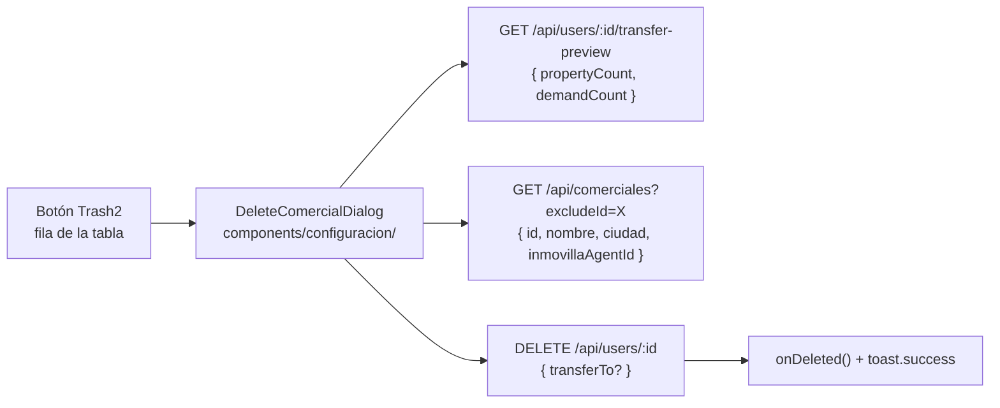

# Fase 2 — UI: Modal de transferencia al eliminar Comercial

## Contexto de arquitectura

La UI vive en la pestaña **Usuarios** de `/platform/configuracion`, implementada
en `components/configuracion/user-management.tsx`. El `AlertDialog` de borrado
(líneas 604–641) es demasiado simple: no informa cuántas propiedades y demandas
quedan huérfanas ni ofrece transferencia. El plan extrae esa lógica en un
componente dedicado y añade un endpoint de preview.



---

## Archivos a crear/modificar

### 1. `app/api/users/[userId]/transfer-preview/route.ts` (nuevo)

Endpoint ligero que devuelve los conteos de registros que quedarían afectados
si se elimina el comercial. Solo accesible para CEO/admin.

```typescript
// GET /api/users/:userId/transfer-preview
// Respuesta: { ok: true, propertyCount: number, demandCount: number }
```

Lógica:
- Auth: `getSession` + `role === "ceo" || "admin"`
- Buscar `User` por `userId`, extraer `comercialId`
- Si `comercialId` es null → `{ propertyCount: 0, demandCount: 0 }`
- `prisma.propertyCurrent.count({ where: { comercialId } })`
- `prisma.demandCurrent.count({ where: { comercialId } })`
- Devolver ambos counts

---

### 2. `components/configuracion/delete-comercial-dialog.tsx` (nuevo)

Componente controlado por el padre (`open` + `onOpenChange` + `user`).
Sigue estrictamente `ux-patterns.mdc` y `docs/saas-ux-guide.md`.

**Props:**
```typescript
interface DeleteComercialDialogProps {
  open: boolean;
  onOpenChange: (open: boolean) => void;
  user: { id: string; name: string; email: string; comercialId: string | null } | null;
  onDeleted: () => void;
}
```

**Estados internos:**
```
idle → loading → ready → deleting → (done via onDeleted) / error
```

**Estructura visual del diálogo cuando `ready`:**

```
┌─────────────────────────────────────────────────────┐
│ 🗑 Eliminar comercial                                │
│ ─────────────────────────────────────────────────── │
│ Se eliminará a <nombre> (<email>).                  │
│ Esta acción no se puede deshacer.                   │
│                                                      │
│ ┌── Info box (bg-muted rounded-md p-3) ────────────┐│
│ │ Este comercial tiene:                             ││
│ │   • N propiedades asignadas                       ││
│ │   • M demandas asignadas                          ││
│ │ Selecciona un comercial destino para              ││
│ │ transferirlas, o elimina sin transferir.          ││
│ └───────────────────────────────────────────────────┘│
│                                                      │
│ Transferir registros a (opcional)                    │
│ [Combobox — nombre + ciudad]                         │
│                                                      │
│ [warning si seleccionado sin inmovillaAgentId]:      │
│ ⚠ Sin agente en Inmovilla. Los registros se          │
│   transferirán en BD pero no se sincronizarán        │
│   automáticamente.                                   │
│                                                      │
│ ─────────────────────────────────────────────────── │
│ [ Cancelar ]            [ Eliminar / Transferir y eliminar ] │
└─────────────────────────────────────────────────────┘
```

**Reglas de UX obligatorias:**

- **Loading:** `<Skeleton />` con la forma del info box y el combobox.
- **Combobox:** usar `<Combobox />` de `components/ui/combobox.tsx` con búsqueda
  por nombre y ciudad. Label visible: `"Transferir registros a"`.
- **Botón:**
  - Sin selección: `"Eliminar"` con `variant="destructive"`.
  - Con selección: `"Transferir y eliminar"` con `variant="destructive"`.
  - Durante `deleting`: `<Loader2 animate-spin />` y `disabled`.
- **Warning Inmovilla:** `bg-urus-warning-bg text-urus-warning` con
  `<AlertTriangle className="h-4 w-4" />`. Solo visible cuando el comercial
  seleccionado tiene `inmovillaAgentId === null`.
- **Error:** inline debajo del footer, `text-destructive text-sm` con `<XCircle />`.
  Nunca en toast.
- **Info box vacío:** si `propertyCount === 0 && demandCount === 0`, mostrar
  "Este comercial no tiene propiedades ni demandas asignadas." en tono neutro
  y **no mostrar el combobox** (no hay nada que transferir).
- Tokens obligatorios: `bg-muted`, `text-destructive`, `bg-urus-warning-bg`,
  `text-urus-warning`. Ningún color hex ni clase cruda de Tailwind.

**Fetch al abrir el diálogo:**
```typescript
// en useEffect cuando open && user
const [preview, candidates] = await Promise.all([
  fetch(`/api/users/${user.id}/transfer-preview`).then(r => r.json()),
  fetch(`/api/comerciales?excludeId=${user.comercialId ?? ""}`).then(r => r.json()),
]);
```

**handleDelete:**
```typescript
const body = selectedComercialId ? { transferTo: selectedComercialId } : {};
const res = await fetch(`/api/users/${user.id}`, {
  method: "DELETE",
  headers: { "Content-Type": "application/json" },
  body: JSON.stringify(body),
});
// success → onDeleted() + toast.success(mensajeContextual) + onOpenChange(false)
// error → setError(data.error)
```

**Toast de éxito contextual** (3 variantes):
1. Sin transferencia: `"Comercial eliminado correctamente."`
2. Con transferencia + `inmovilla.synced === true`:
   `"Comercial eliminado. ${N} propiedades y ${M} demandas transferidas a ${nombre} y sincronizándose con Inmovilla."`
3. Con transferencia + `inmovilla.synced === false` (reason=`no_agent_id`):
   `"Comercial eliminado. Registros transferidos. Sincronización con Inmovilla pendiente (el comercial destino no tiene agente configurado)."`

---

### 3. `components/configuracion/user-management.tsx` — Modificaciones

**a)** Importar el nuevo diálogo.

**b)** Eliminar el bloque `<AlertDialog>` de borrado de usuario (líneas 604–641)
y reemplazar por:
```tsx
<DeleteComercialDialog
  open={deleteTarget !== null}
  onOpenChange={(open) => { if (!open) setDeleteTarget(null); }}
  user={deleteTarget}
  onDeleted={() => { void fetchData(); }}
/>
```

**c)** Eliminar los estados `deleteError` y `deletingUserId` del padre (ahora
los gestiona el diálogo internamente).

El botón Trash2 en la fila de la tabla (líneas 577–592) no cambia.

---

## Estados del sistema cubiertos

| Estado | Qué muestra el diálogo |
|---|---|
| `loading` | Skeleton del info box + Skeleton del combobox |
| `ready`, 0 registros | Info neutro, sin combobox |
| `ready`, N>0 registros | Info box con counts + combobox |
| Combobox seleccionado, sin `inmovillaAgentId` | Warning amarillo |
| `deleting` | Botón con spinner, disabled |
| `error` | Texto rojo inline con XCircle |
| `success` | onDeleted() + toast contextual + cierre |

---

## Checklist ux-patterns.mdc antes de marcar como hecho

- [ ] Usa tokens semánticos, sin hex ni clases crudas.
- [ ] Los 4 estados: loading (Skeleton), empty (info neutro), error (inline), success (toast).
- [ ] Combobox con label visible y búsqueda.
- [ ] Botón destructivo con texto explícito (no "OK").
- [ ] Acción asíncrona con loading state inmediato.
- [ ] Trap focus y Esc garantizados por shadcn AlertDialog.
- [ ] `aria-label` en botón Trash2 (ya existe en el padre).
- [ ] Texto en lenguaje humano, sin jerga técnica.
- [ ] Funciona en modo claro y oscuro (tokens, no colores fijos).
