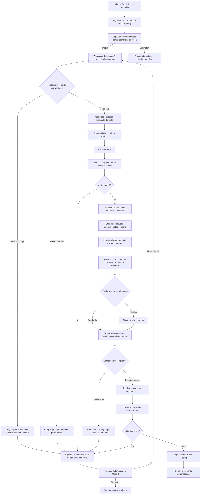
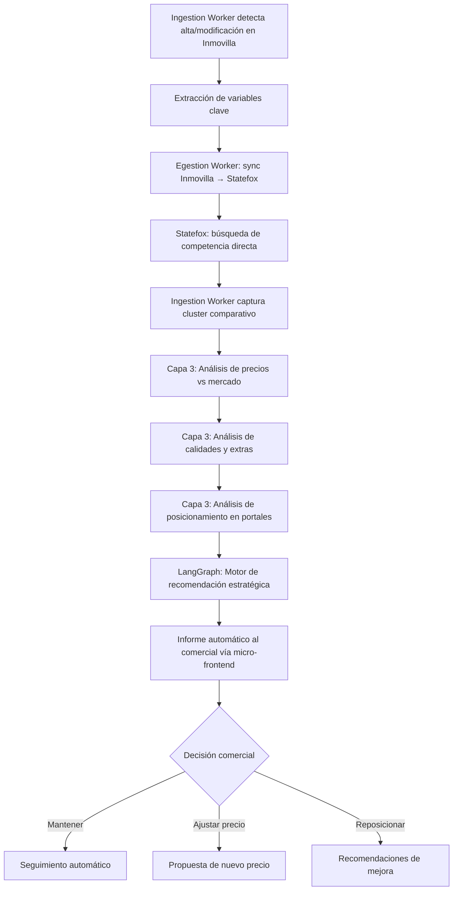
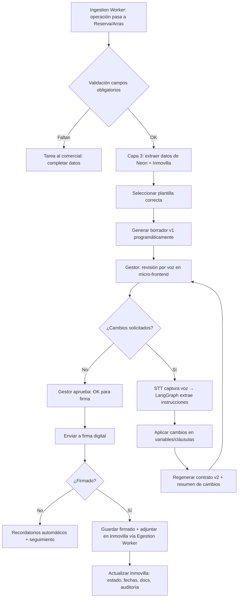

# Sistema de Automatización — Urus Capital Group

> **Real Estate & Investments** · Automatización total con Inmovilla + Statefox

---

## Estado del repo (M0 + M1 + M2)

Infraestructura base y workers de Inmovilla implementados según el plan (Semana 1–2):

- **Event Store (Neon/PostgreSQL)**: tabla `events` (Prisma `Event`) + API en `lib/event-store/` (`appendEvent`, `getEventsByAggregate`, `getEventsSince`) con tests en `lib/event-store/__tests__/`.
- **Job Queue (Neon/PostgreSQL)**: tabla `job_queue` (Prisma `JobQueue`) + API en `lib/job-queue/` (`enqueueJob`, `dequeueJob`, `markCompleted`, `markFailed`) con reintentos, idempotencia y tests de ciclo completo en `lib/job-queue/__tests__/`.
- **Ingestion Worker (M1)**: lectura de propiedades y demandas desde Inmovilla vía `lib/inmovilla/api/` (paginación, normalización). Cron/scripts: `ingestion:properties`, `ingestion:demands`. Documentación: `docs/workers/inmovilla-endpoints.md`.
- **Egestion Worker / escritura (M2)**: módulo `lib/inmovilla/write/` con `writeToInmovilla(operation, payload)` — operaciones tipadas (`createDemand`, `updateDemandEmail`, `updateDemandPriority`), parsing de respuestas legacy, verificación post-escritura y reintento por sesión expirada. Script: `egestion:write`.

Documentación de decisiones:

- `docs/adr/001-event-sourcing-sobre-crud.md`
- `docs/adr/002-neon-como-job-queue.md`

Escenario de migración a API REST (contactos, propiedades, propietarios) documentado en `docs/plan.md` — estrategia de transición sin romper el flujo actual.

### Comandos útiles

- **Tests**: `npm test` (requiere `DATABASE_URL` configurada en el entorno).
- **Build**: `npm run build`
- **Inmovilla — login**: `npm run inmovilla:login` (requiere `INMOVILLA_USER`, `INMOVILLA_PASSWORD`, `INMOVILLA_OFFICE_KEY` y Composio/Gmail para 2FA).
- **Inmovilla — lectura propiedades**: `npm run inmovilla:read-properties`
- **Egestion — escritura en Inmovilla**: `npm run egestion:write -- <operation> [--headless] [--no-verify] [--json]` — operaciones: `createDemand`, `updateDemandEmail`, `updateDemandPriority` (ver variables/args en el script).
- **Ingestion — propiedades**: `npm run ingestion:properties`
- **Ingestion — demandas**: `npm run ingestion:demands`

## Tabla de Contenidos

1. [Visión General de la Arquitectura](#visión-general-de-la-arquitectura)
2. [Flujo de Vida en Producción](#flujo-de-vida-en-producción)
3. [Módulo 1 — Subida de Propiedad y Cruce Automático](#módulo-1--subida-de-propiedad-y-cruce-automático-de-demandas)
4. [Módulo 2 — Notificación Automática al Comprador](#módulo-2--notificación-automática-al-comprador)
5. [Módulo 3 — Respuesta del Comprador y Ajuste de Demanda](#módulo-3--respuesta-del-comprador-y-ajuste-automático-de-la-demanda)
6. [Módulo 4 — Visita y Afinado Humano](#módulo-4--visita-y-afinado-humano)
7. [Módulo 5 — Sincronización con Statefox](#módulo-5--sincronización-inmovilla--statefox)
8. [Módulo 6 — Búsqueda Automática en Statefox](#módulo-6--búsqueda-automática-en-statefox-y-generación-de-enlace)
9. [Módulo 7 — Validación del Comercial](#módulo-7--validación-del-comercial)
10. [Módulo 8 — Envío al Comprador y Feedback Loop](#módulo-8--envío-del-enlace-al-comprador-y-feedback-loop)
11. [Resultado Final del Sistema Base](#resultado-final-del-sistema-base)
12. [Diagrama de Flujo End-to-End](#diagrama-de-flujo-end-to-end)
13. [SOPs Internos](#sops-internos)
14. [Motor de Pricing y Posicionamiento](#motor-inteligente-de-pricing-y-posicionamiento-inmobiliario)
15. [Smart Closing — Contratos y Revisión por Voz](#smart-closing--contratos-autorrellenables-y-revisión-por-voz)
16. [Sistema de Gobierno del CEO](#sistema-de-gobierno-estratégico-del-ceo)
17. [Dashboard de Rentabilidad por Comercial](#dashboard-de-rentabilidad-por-comercial)
18. [Motor de Decisión y Priorización de Leads](#motor-de-decisión-para-la-gestión-y-priorización-de-leads)
19. [Control de Colaboradores Externos](#sistema-de-control-de-colaboradores-externos)
20. [Automatización Post-Venta](#automatización-post-venta)
21. [Soporte Mental y Alto Rendimiento](#sistema-de-soporte-mental-y-alto-rendimiento-para-comerciales)
22. [Stack Técnico Consolidado](#stack-técnico-consolidado)
23. [Conclusión Estratégica](#conclusión-estratégica)

---

## Visión General de la Arquitectura

### Orquestador Híbrido: Event Sourcing + Server-Side RPA

El principio fundacional de esta arquitectura es la **Segregación de Responsabilidades**. Se acepta que Inmovilla es un sistema cerrado, rígido y sin capacidades de tiempo real (sin webhooks ni APIs modernas de escritura). Por lo tanto, se relega a ser una **"Bóveda"**, mientras se construye un ecosistema moderno, asíncrono y orientado a eventos que lo envuelve y controla desde fuera.

El sistema se compone de **cuatro capas principales** que interactúan en un flujo continuo.

---

### Capa 1 — La Bóveda (Inmovilla CRM)

Es la **fuente de verdad inamovible**. Su única función es almacenar los datos finales y legales:

- Propiedades activas
- Historiales de clientes
- Facturas y contratos
- Demandas y cruces

**Ningún dato vive de forma definitiva fuera de Inmovilla.** Sin embargo, Inmovilla no toma decisiones, no mide tiempos y no dispara automatizaciones. Actúa como un **repositorio pasivo** que nuestro sistema lee y escribe de forma programática.

---

### Capa 2 — Intercepción y RPA (Workers de Sincronización)

Dado que Inmovilla no emite notificaciones cuando algo ocurre, ni dispone de una API abierta para escrituras complejas, se construye una red de **workers server-side** que absorben toda la fricción técnica heredada.

#### Ingestion Worker (Lectura / Polling)

Un proceso en segundo plano (`cron-job` en Node.js) que monitorea Inmovilla constantemente mediante:

- **Orquestación de cron-jobs**: todos los cron-jobs del sistema se disparan con **Upstash QStash**.
- **Polling programático**: consultas regulares a los endpoints de lectura disponibles.
- **Scraping headless**: cuando no existe endpoint, un navegador headless (Playwright) extrae datos del DOM.

Su trabajo: detectar cambios (por ejemplo, "el comercial cambió el estado a Reserva") y **emitir un evento** inmutable hacia la Capa 3.

#### Egestion Worker (Escritura / Network Interception)

Cuando la inteligencia artificial decide que hay que actualizar un dato en Inmovilla (subir un precio, crear un lead, modificar una demanda o cambiar un estado), este worker entra en acción. Mediante código TypeScript puro:

1. Hace **login silente** con credenciales almacenadas.
2. Obtiene el **código 2FA** por correo: la integración con **Composio** dispara una acción sobre Gmail (listar/buscar correos de Inmovilla) y se extrae el código de 6 dígitos del último correo recibido (ver `docs/workers/inmovilla-endpoints.md`).
3. Captura las **Session Cookies** y el **token de sesión** (`l`) tras completar el login en dos pasos (credenciales + verificación 2FA).
4. Raspa el DOM si hace falta para **tokens dinámicos** adicionales.
5. Dispara **peticiones HTTP clonadas** (XHR/Fetch) directamente a los endpoints internos de Inmovilla.

Es una ejecución **determinista, centralizada y server-side**, a prueba de los fallos que tendría una extensión de navegador o una herramienta no-code.

---

### Capa 3 — Plano de Control y Orquestación IA (El Cerebro)

Aquí reside la verdadera propiedad intelectual y la lógica de negocio. Es un entorno moderno, escalable y 100% bajo nuestro control.

| Componente | Tecnología | Función |
|---|---|---|
| **Framework** | Next.js (App Router) + TypeScript | API Routes, SSR, micro-frontends |
| **Base de datos** | Neon (PostgreSQL serverless) | Event Sourcing, Job Queue, estado transaccional |
| **Motor IA** | LangGraph + modelos o3 | Flujos agénticos, razonamiento profundo |
| **Cola de trabajo** | Neon (tabla `job_queue`) | Reintentos, idempotencia, resiliencia |

#### Event Sourcing

En lugar de guardar fotos estáticas del estado, se registra **cada evento inmutable**:

- `LEAD_INGESTADO`
- `SLA_INICIADO`
- `DEMANDA_ACTUALIZADA`
- `PREAPROBACION_SUBIDA`
- `CONTRATO_GENERADO`

Si Inmovilla se cae, las órdenes de escritura se acumulan en la **Job Queue** de Neon y se reintentan automáticamente sin perder un solo dato.

#### Motor de Inteligencia (LangGraph)

Se orquestan flujos agénticos avanzados donde modelos de razonamiento profundo ejecutan el trabajo:

- Interpretan respuestas de WhatsApp para afinar demandas (**Smart Matching**).
- Procesan audios de los gestores (Speech-to-Text) para mutar cláusulas (**Smart Closing**).
- Calculan el **Score** de rentabilidad y urgencia de cada nuevo lead.
- Generan recomendaciones de pricing basadas en análisis de mercado.

---

### Capa 4 — Interfaces Satélite y Omnicanalidad (Las Ventanillas)

Para evitar que clientes, colaboradores externos o comerciales peleen con la interfaz del CRM, el Orquestador genera **ventanillas de interacción efímeras y sin fricción**.

| Canal | Implementación |
|---|---|
| **WhatsApp** | WhatsApp Business API (integración directa vía código) para precalificar compradores, seguimiento post-venta y notificaciones de matches |
| **Micro-Frontends** | Rutas dinámicas en Next.js para flujos propios que Inmovilla no modela bien, como estados tipo kanban de colaboradores, subida documental y validaciones rápidas del equipo |
| **Notificaciones internas** | Webhooks propios hacia Slack/WhatsApp del equipo |

Una vez que el usuario interactúa con la interfaz ligera, la información viaja a la **Capa 3** para ser procesada y, finalmente, escrita en Inmovilla por la **Capa 2** cuando sea necesario persistir el resultado final en el CRM.

Esto es especialmente importante en el flujo de colaboradores: como Inmovilla está especializado para procesos inmobiliarios tradicionales y no ofrece una forma flexible de modelar tableros tipo kanban, hitos operativos y movimientos de estado personalizados, ese flujo vive en un **micro-frontend propio** con Neon como fuente operativa. Inmovilla queda como sistema de persistencia final, no como interfaz principal del proceso.

---

## Flujo de Vida en Producción

Ejemplo 100% automatizado, de principio a fin:

1. **Ingestión**: Entra un lead de Idealista. El `Ingestion Worker` lo captura por polling.
2. **Orquestación**: La API en Next.js lo recibe. LangGraph evalúa el texto, extrae que busca un piso de 350k€ y le asigna un **Score de 85/100**. Neon inicia un **SLA de 5 minutos**.
3. **Interacción**: El sistema enruta el lead al mejor comercial y le avisa por **WhatsApp Business API**.
4. **Egestión**: Inmediatamente, el `Egestion Worker` inyecta el lead perfilado en Inmovilla simulando una petición de red perfecta (login → cookies → CSRF → XHR).

Todo ocurre en milisegundos, en el servidor, sin intervención humana.

---

## Módulo 1 — Subida de Propiedad y Cruce Automático de Demandas

### Alta de inmueble en Inmovilla

El agente introduce:

- Datos completos del propietario (nombre, DNI, contacto)
- Autorizaciones
- Variables duras del inmueble:
  - Precio
  - Zona
  - Metros
  - Tipología
  - Estado
  - Extras

### Automatización: Cruce inmediato

El `Ingestion Worker` detecta la nueva alta mediante polling. La Capa 3 ejecuta el cruce contra **todas las demandas activas** almacenadas en Neon:

- Se generan **matches reales**, no sugerencias.
- LangGraph aplica un scoring semántico que pondera zona, precio, tipología y preferencias históricas del comprador.
- Los resultados se persisten como eventos (`MATCH_GENERADO`) y se propagan a los módulos siguientes.

---

## Módulo 2 — Notificación Automática al Comprador

A cada comprador compatible se le envía automáticamente un mensaje vía **WhatsApp Business API** (integración directa por código, sin intermediarios no-code):

> "Hola [Nombre], somos **U Capital Group**.
> Hace tiempo trabajaste con nosotros y hemos captado una nueva propiedad que encaja con lo que buscabas.
>
> Ver inmueble: [enlace ficha]
>
> ¿Te encaja?
> 1. Me encaja
> 2. No me encaja
> 3. Busco algo diferente"

El agente **no interviene**. El mensaje se genera con plantillas aprobadas y se envía desde una API Route de Next.js que conecta directamente con el proveedor de WhatsApp Business (360dialog / Twilio / MessageBird).

---

## Módulo 3 — Respuesta del Comprador y Ajuste Automático de la Demanda

### La clave del sistema: Smart Matching

El webhook de WhatsApp Business API entrega la respuesta del comprador a una API Route de Next.js. LangGraph interpreta respuestas de texto libre como:

- "No me cuadra, es caro"
- "Quiero otra zona"
- "Más metros"
- "Con terraza"
- "Subo presupuesto"

### Acción directa en Inmovilla (vía Egestion Worker)

Automáticamente:

1. LangGraph extrae las variables modificadas (precio, zona, características).
2. Se emite un evento `DEMANDA_ACTUALIZADA` en Neon.
3. El `Egestion Worker` escribe los cambios en Inmovilla mediante network interception (login silente → CSRF → XHR clonado).
4. Se guarda histórico del cambio como evento inmutable.
5. La demanda queda **más afinada**.

El CRM aprende. El comercial no reescribe nada.

---

## Módulo 4 — Visita y Afinado Humano

Aquí entra el agente, pero con rol **limitado y claro**.

### El agente SOLO hace:

- Marcar:
  - Visitado
  - Nivel de interés (alto / medio / bajo)
- Ajustar manualmente 1–2 variables estratégicas si el cliente lo verbaliza.
- Nota cualitativa breve (máx. 2 líneas).

**Nada más.** Todo lo demás ya está automatizado. Los datos del agente se recogen mediante un micro-frontend en Next.js (formulario rápido post-visita) que alimenta la Capa 3 directamente.

---

## Módulo 5 — Sincronización Inmovilla → Statefox

Cuando una demanda cumple las condiciones:

- Está activa
- Está perfilada (variables afinadas)
- Ha mostrado interés real (visita completada o score alto)

El sistema dispara la sincronización automática:

1. La Capa 3 emite un evento `SYNC_STATEFOX_INICIADO`.
2. El `Egestion Worker` (adaptado para Statefox) envía los datos de la demanda:
   - Presupuesto
   - Zonas
   - Tipología
   - Prioridades reales del comprador

La sincronización se ejecuta mediante llamadas programáticas a los endpoints de Statefox (API o network interception según disponibilidad), de forma análoga al patrón de escritura en Inmovilla.

---

## Módulo 6 — Búsqueda Automática en Statefox y Generación de Enlace

### Statefox ejecuta:

- Rastreo de propiedades de particulares.
- Rastreo de stock de otras agencias.
- Filtrado inteligente según la demanda sincronizada.
- Generación de **enlace privado personalizado** (microsite de selección).

El `Ingestion Worker` (adaptado para Statefox) detecta la generación del enlace por polling y emite un evento `ENLACE_STATEFOX_GENERADO` hacia la Capa 3.

---

## Módulo 7 — Validación del Comercial

El comercial recibe una notificación automática (vía WhatsApp Business API o el micro-frontend interno):

> "Demanda [Nombre] — Enlace generado en Statefox.
> Pendiente de validación."

**El comercial revisa en 30–60 segundos:**

- Que no aparezca marca de otra agencia.
- Que el precio esté bien presentado.
- Ajusta texto si hace falta.

Al aprobar, el sistema registra el evento `ENLACE_VALIDADO` y continúa automáticamente. Si el SLA de validación (2 horas) se incumple, se escala al jefe de zona.

---

## Módulo 8 — Envío del Enlace al Comprador y Feedback Loop

El sistema envía el enlace Statefox al comprador vía WhatsApp Business API para que:

- Seleccione propiedades.
- Descarte las que no encajan.
- Pida ajustes.

### Feedback Loop (Sistema Vivo)

El feedback del comprador (capturado por webhook de WhatsApp):

1. Se procesa en la Capa 3 (LangGraph interpreta, extrae variables).
2. Actualiza la demanda en Neon (evento `FEEDBACK_PROCESADO`).
3. El `Egestion Worker` escribe los cambios en Inmovilla.
4. Se reactivan búsquedas en Statefox si procede.

**Ciclo cerrado, limpio y continuo.**

---

## Resultado Final del Sistema Base

### Ahorro de tiempo real

| Métrica | Mejora estimada |
|---|---|
| Gestión manual | –60/70% |
| Mensajes repetitivos | –80% |
| Visitas inútiles | –50% |

### Inteligencia comercial acumulativa

- Demandas cada vez más precisas.
- Menos desgaste del equipo.
- Mayor ratio visita → oferta → cierre.

### Nuevo rol del comercial

| Antes | Después |
|---|---|
| Teclear, perseguir y filtrar | Validar, decidir y cerrar |

---

## Diagrama de Flujo End-to-End



---

## SOPs Internos

### Roles del sistema

| Código | Rol | Descripción |
|---|---|---|
| **AP** | Agente de Propiedades / Captación | Alta y calidad de fichas |
| **AD** | Agente de Demandas / Comercial | Validación, visitas y cierres |
| **BO** | Backoffice / Coordinación | Documentación y formalización |
| **SYS** | Sistema (automatizaciones) | Workers + Capa 3 + Capa 4 |

---

### SOP 1 — Alta de Propiedad (AP)

**Objetivo:** cargar bien una vez para que el sistema haga el resto.

1. En Inmovilla, crear ficha de inmueble con:
   - Propietario completo (DNI, contacto, autorización, cuenta para señal si aplica).
   - Características (precio, zona, metros, extras, estado).
   - Material (fotos, notas, llaves, disponibilidad).
2. Publicar anuncio (Idealista u otros) desde Inmovilla si procede.
3. **Checklist de calidad** (obligatorio):
   - [ ] Precio correcto
   - [ ] Dirección/zona correcta
   - [ ] Tipología correcta
   - [ ] Extras bien marcados (terraza, ascensor, parking...)

Al guardar, el `Ingestion Worker` detecta el alta y la Capa 3 dispara el cruce + mensajes.

---

### SOP 2 — Gestión Automática de Match y Mensajes (SYS)

**Objetivo:** notificar sin intervención humana.

1. Si la Capa 3 detecta match:
   - Envía WhatsApp al comprador con enlace y 3 respuestas guiadas (vía WhatsApp Business API).
2. Registra en Neon:
   - Fecha/hora del envío.
   - Propiedad enviada.
   - Estado `PENDIENTE_RESPUESTA`.

---

### SOP 3 — Respuesta del Comprador y Perfilado Automático (SYS + AD)

**Objetivo:** que el sistema aprenda y el AD solo supervise.

- **SYS (automático):**
  - Interpreta respuesta con LangGraph.
  - Si cambia preferencias → actualiza demanda en Inmovilla (vía `Egestion Worker`).
- **AD (solo cuando el sistema marque "ambigua"):**
  - 1 llamada o 3 preguntas por WhatsApp (máx. 2 min).
  - Ajusta 1–2 variables si el comprador lo deja claro.

---

### SOP 4 — Visita a Propiedad (AD)

**Objetivo:** convertir "me encaja" en visita con mínimo trabajo.

1. Si el comprador responde "Me encaja":
   - Enviar link de agenda (micro-frontend Next.js con integración calendario) o 2 opciones de hora.
   - Confirmar y registrar la cita (evento `VISITA_AGENDADA` en Neon, sincronizado con Inmovilla).
2. Tras la visita (máximo 3 minutos):
   - Marcar interés (alto/medio/bajo) en el micro-frontend post-visita.
   - 1–2 notas cualitativas.
   - Si hay cambios de criterio → el sistema actualiza demanda.

---

### SOP 5 — Activación Statefox (AD + SYS)

**Disparador:** demanda con interés real o visita hecha + búsqueda activa.

1. **SYS:** sync Inmovilla → Statefox (demanda perfilada, vía `Egestion Worker`).
2. **Statefox:** rastrea stock externo, genera enlace privado.
3. **AD** (validación 30–60s):
   - Revisa branding (nada de marcas de otras agencias).
   - Ordena/oculta 1–2 fichas si hace falta.
   - Aprueba.
4. **SYS:** envía enlace al comprador, registra `ENLACE_ENVIADO`.

---

### SOP 6 — Selección del Comprador (SYS + AD)

- **SYS:**
  - Recoge selección (clics/guardados/descartes) vía `Ingestion Worker`.
  - Actualiza demanda en Inmovilla.
- **AD** solo actúa si:
  - "Elige inmuebles" → agenda visitas.
  - "Pide cambios" → valida 1 ajuste si es necesario.

---

### SOP 7 — Oferta, Arras y Cierre (BO + AD)

**Objetivo:** documentación semi-automática con plantillas + Smart Closing.

1. **SYS** genera contrato desde plantillas con campos rellenados automáticamente (datos extraídos de Neon + Inmovilla).
2. **BO** revisa y ajusta con revisión por voz (ver módulo Smart Closing).
3. **AD** negocia y cierra.
4. **BO** formaliza y archiva.

---

## Stack Técnico del Sistema Base

### Orquestación y Backend

| Componente | Tecnología | Detalles |
|---|---|---|
| Framework principal | **Next.js (App Router) + TypeScript** | API Routes como orquestador central |
| Workers (Ingestion/Egestion) | **Node.js + Playwright** | Cron-jobs, polling, scraping headless, network interception |
| Scheduler de cron-jobs | **Upstash QStash** | Disparo y orquestación de todos los cron-jobs del sistema |
| Base de datos | **Neon (PostgreSQL serverless)** | Event store, job queue, estado transaccional |
| Motor IA | **LangGraph + modelos o3** | Flujos agénticos: scoring, clasificación, recomendaciones |

### Canal de Mensajería (WhatsApp)

| Requisito | Implementación |
|---|---|
| Proveedor | **360dialog / Twilio / MessageBird** (WhatsApp Business API) |
| Plantillas aprobadas | Para primer contacto (obligatorio por política de Meta) |
| Mensajes interactivos | Botones de respuesta rápida (1/2/3) |
| Webhooks de entrada | Captura de respuestas → API Route en Next.js |

### Interpretación de Texto (NLU)

| Caso | Implementación |
|---|---|
| Clasificación de intención | **LangGraph** con modelos o3 |
| Extracción de variables | Zona, precio, metros, extras → campos estructurados |
| Fallback por baja confianza | Tarea al agente: "respuesta ambigua" |

### Calendario / Agenda

| Componente | Implementación |
|---|---|
| Booking | Micro-frontend Next.js con integración Google Calendar API |
| Confirmación | Automática vía WhatsApp Business API |
| Registro en CRM | `Egestion Worker` escribe cita en Inmovilla |

### Autenticación Inmovilla (login automático y 2FA)

| Componente | Implementación |
|---|---|
| Login en dos pasos | POST a `comprueba.php` (credenciales) + POST a `login2Fa/verifyCode` (código 2FA). Ver `docs/workers/inmovilla-endpoints.md`. |
| Código 2FA por correo | **Composio**: conexión Gmail (OAuth), acción de listado/búsqueda de correos filtrada por remitente Inmovilla; extracción del código de 6 dígitos del último correo; envío al endpoint de verificación. Permite login totalmente automatizado sin intervención manual. |

### Documentación y Plantillas

| Componente | Implementación |
|---|---|
| Motor de plantillas | Generación programática en TypeScript (docx/PDF) con variables y bloques condicionales |
| Almacenamiento | S3-compatible o sistema de archivos del servidor |
| Versionado | Naming estándar: `OP-2026-XXXX_Arras_v1.pdf` |

### Tracking y Observabilidad

| Componente | Implementación |
|---|---|
| Dashboard | Micro-frontend Next.js con datos de Neon |
| Alertas | Cron-jobs que evalúan SLAs y emiten notificaciones vía WhatsApp/Slack |
| Métricas | Tablas de Neon con queries analíticas |

---

## Motor Inteligente de Pricing y Posicionamiento Inmobiliario

> Bot estratégico de comparación automática de mercado y recomendación comercial.

### Principio

- **Inmovilla** ordena y decide.
- **Statefox** observa el mercado y compara.
- **El sistema recomienda, el comercial decide.**

### Objetivo

Cuando se sube o modifica un inmueble en Inmovilla, el sistema:

1. Detecta el cambio vía `Ingestion Worker`.
2. Vuelca las características a Statefox (vía `Egestion Worker`).
3. Analiza el mercado real (particulares + agencias + portales).
4. Compara precio, calidades, posicionamiento y visibilidad.
5. Devuelve al comercial un **diagnóstico claro**.

> No es una tasación. Es **inteligencia comercial en tiempo real**.

### Disparadores (Triggers)

El `Ingestion Worker` detecta cualquiera de estos eventos en Inmovilla:

| Evento | Descripción |
|---|---|
| Alta de inmueble | Nuevo inmueble creado |
| Cambio de precio | Modificación del precio de venta |
| Cambio de estado | Publicado / relanzado |
| Sin leads X días | Inmueble sin interacción prolongada |
| Visitas sin ofertas | Muchas visitas pero ninguna oferta |

### Diagrama de Flujo



### Datos que se vuelcan desde Inmovilla

Variables mínimas del inmueble:

- Precio
- Zona / distrito / barrio
- Metros construidos y útiles
- Tipología
- Estado (obra nueva, reformado, origen)
- Planta / ascensor
- Extras (terraza, parking, trastero)
- Año de construcción (si existe)

> Si faltan datos, el sistema avisa al agente en lugar de analizar con información incompleta.

### Análisis de Statefox + Capa 3

#### Búsqueda de comparables reales

Statefox rastrea automáticamente propiedades de particulares, agencias y stock activo en portales. LangGraph crea **clusters comparativos**:

- Misma zona/distrito
- ±15–20% metros
- Tipología similar
- Estado comparable

#### Análisis automatizado

**Precio:**
- Precio medio €/m² del cluster.
- Rango bajo / medio / alto.
- Desviación del inmueble vs mercado (%).

**Calidades:**
- Extras del inmueble vs competencia.
- Qué falta para justificar el precio.
- Qué tiene de más (argumento comercial).

**Posicionamiento en portales:**
- Tramo de aparición (alto, medio, bajo).
- Si compite con inmuebles "mejor percibidos".
- Si queda enterrado por precio/fotos/orden.

### Motor de Recomendación (LangGraph)

El sistema no solo analiza, **recomienda**. Ejemplos reales de output:

**Diagnóstico automático:**
> "El inmueble está un 8,7% por encima del precio medio del mercado para su zona y tipología."

**Recomendaciones estratégicas:**
> "Para competir con los 5 primeros anuncios del portal, el precio óptimo sería –5%."
>
> "Si se mantiene el precio actual, el inmueble pasará a competir con propiedades reformadas."
>
> "Bajar 3.000–5.000€ mejora visibilidad sin devaluar."

**Alternativas (no solo bajar precio):**
> "Reposicionar el anuncio destacando terraza + orientación."
>
> "Cambiar orden de fotos y primera imagen."
>
> "Subir ligeramente el precio (+2%) para reposicionar en otro tramo menos saturado."

### Entrega al Comercial

El comercial recibe automáticamente (vía micro-frontend o WhatsApp):

- **Informe resumen** (1 página).
- **Semáforo:**
  - `VERDE` — Bien posicionado.
  - `AMARILLO` — Riesgo comercial.
  - `ROJO` — Fuera de mercado.
- **Recomendación accionable:** mantener / ajustar precio (con rango) / reposicionar anuncio.

Todo queda registrado en Neon como evento y se sincroniza con Inmovilla como nota estratégica (vía `Egestion Worker`).

### SOP del Motor de Pricing

**Comercial:**
1. Revisa el informe (2–3 min).
2. Decide: seguir igual / proponer ajuste al propietario.
3. Usa el informe como argumento objetivo, no como opinión.

**Dirección / Coordinación:**
- Detecta inmuebles "quemándose".
- Decide relanzamientos estratégicos.
- Controla pricing del stock total.

### Tiempo Ahorrado

| Proceso | Manual | Automatizado |
|---|---|---|
| Buscar competencia | 20–40 min | 0 (sistema) |
| Comparar precios y calidades | 15–30 min | 0 (sistema) |
| Preparar argumento para propietario | 10–20 min | 3–5 min (revisión) |
| **Total** | **45–90 min** | **3–5 min** |

**Ahorro: ~70%–85% por inmueble.**

---

## Smart Closing — Contratos Autorrellenables y Revisión por Voz

### Objetivo

Cuando una operación pasa a "Reserva/Señal / Arras / Cierre acordado" en Inmovilla, el sistema:

1. Extrae datos (comprador + vendedor + inmueble + comercial + precio).
2. Genera contrato(s) desde plantillas programáticas.
3. El gestor revisa hablando (modo conversación) y pide modificaciones.
4. El sistema aplica cambios, genera nueva versión y vuelve a presentar.
5. Se envía a firma digital.
6. Se archiva y se actualiza Inmovilla con estados y documentos.

### Disparador

El `Ingestion Worker` detecta un cambio de estado/fase a:

- "Reserva/Señal"
- "Arras"
- "Operación aceptada / lista documentación"

**Condición mínima para disparar:**

| Dato | Campos requeridos |
|---|---|
| Comprador | DNI/NIE, domicilio, email/teléfono |
| Vendedor | DNI/NIE, domicilio, contacto |
| Inmueble | Dirección + referencia interna |
| Operación | Precio, importes (señal/arras), plazos y forma de pago |
| Agencia | Comercial asignado, honorarios/comisión |

> Si faltan campos, el sistema no genera el contrato y crea una tarea `DATOS_INCOMPLETOS` para el comercial.

### Diagrama de Flujo



### Pipeline de Revisión por Voz

El sistema utiliza tres piezas ejecutadas en código puro:

| Pieza | Tecnología | Función |
|---|---|---|
| **Speech-to-Text** | OpenAI Whisper API (llamada desde Next.js API Route) | Transcribe la voz del gestor a texto |
| **Intérprete de instrucciones** | LangGraph + modelos o3 | Convierte lo verbal en acciones estructuradas |
| **Motor de plantillas** | Generación programática en TypeScript | Aplica variables, bloques condicionales, anexos dinámicos |

**Ejemplo de interpretación:**

| Instrucción verbal | Variable/bloque afectado |
|---|---|
| "Cambia honorarios a 3% + IVA" | `honorarios = 3% + IVA` |
| "Arras penitenciales" | `tipo_arras = penitenciales` |
| "Plazo para firma ante notario: 45 días" | `plazo_escritura = 45 días` |
| "Incluye anexo de mobiliario" | `clausula_mobiliario = sí` |

Si hay ambigüedad (confidence score bajo), el sistema pregunta al gestor: "¿quieres 45 días naturales o hábiles?"

### Firma Digital

Integración programática con servicios de firma electrónica:

- **Signaturit** (habitual en España) / DocuSign / Dropbox Sign.
- Envío y seguimiento automatizado desde API Routes de Next.js.
- Recordatorios automáticos si no se firma.

### Control de Versiones y Auditoría

Naming estándar:

```
OP-2026-000123_Arras_v1_Borrador.pdf
OP-2026-000123_Arras_v2_CambiosGestor.pdf
OP-2026-000123_Arras_Firmado.pdf
```

Registro en Neon (evento `CONTRATO_VERSIONADO`): versión, fecha, autor (gestor), resumen de cambios. Sincronizado con Inmovilla vía `Egestion Worker`.

### Qué se autorellena (regla de oro)

No es "editar texto a mano". Es editar **variables** y **bloques**:

- **Variables:** importes, plazos, honorarios, domicilios, DNIs, cuentas.
- **Bloques condicionales:**
  - Arras penitenciales vs confirmatorias.
  - Condición hipotecaria sí/no.
  - Entrega de llaves en firma vs en fecha posterior.
  - Mobiliario incluido (anexo).

El gestor dice "modifica X", el sistema cambia variable/bloque, regenera el documento entero sin romper formato y deja trazabilidad.

### SOP del Smart Closing

**Comercial (mínimo):**
- Cambia el estado a "Reserva/Arras".
- Completa campos faltantes si el sistema lo pide.

**Gestor (control legal y calidad — modo voz):**
1. Abre el borrador v1 en el micro-frontend.
2. Habla con el sistema para solicitar cambios.
3. El sistema aplica cambios, genera v2, muestra resumen.
4. El gestor confirma: "OK para firma".

**SYS:**
- Genera borradores, versiona y registra cambios.
- Interpreta voz y transforma en instrucciones estructuradas.
- Envía a firma digital y archiva.
- Actualiza Inmovilla con todo (incluyendo auditoría).

### Tiempo Ahorrado

| Proceso | Manual | Automatizado |
|---|---|---|
| Preparar contrato señal/arras | 20–45 min | 2–3 min (sistema) |
| Revisar y ajustar | 10–25 min | 5–12 min (gestor por voz) |
| Versiones + enviar + perseguir firma | 10–20 min | 2–5 min (sistema) |
| Archivar y actualizar CRM | 5–10 min | 0 (automático) |
| **Total humano** | **45–100 min** | **7–20 min** |

**Ahorro: ~60%–85% por operación.**

> En operaciones complejas (cargas, herencias, varios compradores), el ahorro se acerca a 40–60% por mayor intervención del gestor.

---

## Sistema de Gobierno Estratégico del CEO

> Control Total · Decisión · Escalado Nacional

### Para qué sirve

Este sistema existe para que el CEO:

- Vea la empresa completa en **tiempo real**.
- No tenga que "preguntar cómo vamos".
- Sepa qué funciona, qué se está rompiendo y qué **va a romperse pronto**.
- Tome decisiones **antes** de que el mercado las fuerce.
- Escale con método, no con intuición.
- Convierta la empresa en un **sistema replicable a nivel nacional**.

> Sin este sistema: el CEO reacciona.
> Con este sistema: el CEO **dirige con anticipación**.

### Estructura del Sistema (6 Capas)

Integra todos los módulos anteriores y añade inteligencia estratégica. Todos los datos provienen de Neon (Event Store) y se visualizan en micro-frontends de Next.js.

---

#### CAPA 1 — Visión Ejecutiva en Tiempo Real

**Objetivo:** que el CEO sepa en 2 minutos cómo está la empresa.

**Métricas clave globales:**

- Facturación mensual / trimestral / anual
- Objetivo vs real
- EBITDA estimado
- Coste operativo total
- Margen por operación
- Cash disponible
- Capacidad de reinversión

**Estado visual** (semáforo verde/amarillo/rojo) por: facturación, equipo, expansión, costes.

> El CEO no interpreta datos, **ve estado**.

---

#### CAPA 2 — Rendimiento Comercial por Ciudad y Persona

**Objetivo:** entender dónde se genera y dónde se pierde dinero.

**Vista por ciudad** (Córdoba / Málaga / Sevilla):

- N.º comerciales activos
- Carga media por comercial
- Propiedades activas
- Operaciones/mes
- Facturación/mes
- Rentabilidad por comercial
- Coste de oportunidad

**Vista por comercial:** ranking de rentabilidad, conversión real, carga actual, saturación/infrautilización.

El sistema responde automáticamente: ¿faltan comerciales? ¿Sobran? ¿Dónde?

---

#### CAPA 3 — Estado Psicológico y Sostenibilidad del Equipo

**Objetivo:** proteger el activo humano de alto rendimiento.

Sin mostrar conversaciones privadas, el sistema agrega:

- Nivel de uso del bot de soporte mental.
- Patrones de bloqueo.
- Fatiga por zona.
- Presión sostenida.

**Indicadores:** riesgo de burnout, riesgo de caída de rendimiento, estabilidad emocional media por equipo.

> El CEO ve riesgos **estructurales**, no intimidades.

---

#### CAPA 4 — Diagnóstico Automático y Recomendaciones

Aquí el sistema deja de mostrar datos y **empieza a pensar** (LangGraph).

Ejemplos de recomendaciones automáticas:

- "Córdoba: carga media por comercial > umbral → **contratar 1–2 comerciales**."
- "Málaga: conversión alta, carga baja → **aumentar captación**."
- "Sevilla: buen volumen, bajo cierre → **intervenir proceso**."

También: redistribución de leads, refuerzo de formación, ajuste de incentivos, intervención de jefe de zona.

> El sistema le dice al CEO **qué hacer** y **por qué**.

---

#### CAPA 5 — Motor de Expansión Geográfica

**Objetivo:** decidir CUÁNDO y DÓNDE expandirse.

**Métricas que habilitan expansión:**

- Facturación estable ≥ X meses.
- Margen operativo ≥ X%.
- Cash disponible ≥ X.
- Procesos estables.
- Capacidad de liderazgo interna.

**Análisis por ciudad candidata:** demanda potencial, ticket medio esperado, coste de implantación, break-even estimado, número óptimo de comerciales iniciales.

> "Valencia cumple criterios. Lanzamiento recomendado en 90 días con 3 comerciales."

La expansión no es una apuesta, es una **consecuencia lógica**.

---

#### CAPA 6 — Control Financiero, Costes y Reinversión

**Objetivo:** que el CEO sepa cuánto puede arriesgar sin poner en peligro la empresa.

**Control automático de:** costes fijos, costes variables, coste por comercial, coste por operación, ROI de automatizaciones.

**Recomendaciones:** cuánto reinvertir, en qué (tecnología, equipo, ciudad), cuándo frenar, cuándo acelerar.

> El CEO invierte con seguridad, no con fe.

### Desarrollo Técnico del Gobierno CEO

1. **Integrar todos los módulos previos:** CRM, dashboard de rentabilidad, colaboradores externos, bot de soporte mental, finanzas. Todo converge en la Capa 3 de Neon como Event Store unificado.
2. **Definir umbrales estratégicos:** carga máxima por comercial, facturación mínima por ciudad, margen mínimo para expansión, riesgo psicológico tolerable. El sistema actúa cuando se superan.
3. **Motor de recomendaciones:** LangGraph aplica reglas + IA. Cada recomendación se justifica con datos. Histórico de decisiones tomadas.
4. **Panel CEO (micro-frontend Next.js):** lectura rápida, foco estratégico, cero microgestión.

### Qué decisiones habilita

- Contratar / no contratar.
- Expandir / esperar.
- Invertir / proteger caja.
- Intervenir equipos.
- Cambiar estrategia por ciudad.
- Preparar rondas internas de crecimiento.

### Comunicación a Jefes de Zona

El CEO baja: decisiones claras, objetivos concretos, plazos, métricas de control.
No baja dudas. **Baja dirección.**

---

## Dashboard de Rentabilidad por Comercial

> Control · Optimización · Escalado

### Para qué sirve

No es un dashboard informativo, es un **sistema de gobierno del negocio**:

- Medir rentabilidad real por persona, no solo facturación.
- Detectar ineficiencias ocultas (mucho trabajo, poco resultado).
- Identificar top performers replicables.
- Justificar decisiones de formación, redistribución, incentivos o desvinculación.
- Gestión objetiva, no emocional.

> Sin dashboard: se gestiona por sensaciones.
> Con dashboard: **se gestiona por datos**.

### Estructura (5 Capas)

---

#### CAPA 1 — Captura Automática de Datos

**Objetivo:** el dashboard se alimenta solo, sin manipulación humana.

Datos que entran automáticamente (el `Ingestion Worker` los extrae de Inmovilla y la Capa 3 los procesa):

- N.º de leads asignados
- Origen del lead
- N.º de contactos realizados
- N.º de visitas
- N.º de ofertas
- N.º de cierres
- Facturación generada
- Tiempo medio por operación
- Estado de cada lead

> **Regla clave:** si no está en CRM, no existe.

---

#### CAPA 2 — Normalización y Cálculo de Métricas

**Objetivo:** convertir actividad en indicadores económicos.

Se calculan automáticamente (queries analíticas sobre Neon):

| Métrica | Descripción |
|---|---|
| Conversión lead → visita | % de leads que llegan a visita |
| Conversión visita → cierre | % de visitas que terminan en cierre |
| Tiempo medio de cierre | Días desde lead hasta firma |
| Facturación por operación | Ingresos medios por cierre |
| Facturación mensual por comercial | Ingresos totales/mes |
| Ingresos por lead asignado | Eficiencia de asignación |
| % leads perdidos por falta de seguimiento | Oportunidades desperdiciadas |
| Rentabilidad ponderada por tiempo | Rendimiento ajustado al esfuerzo |

---

#### CAPA 3 — Dashboard Visual por Niveles

**Objetivo:** cada rol ve solo lo que necesita (micro-frontends con control de acceso).

| Vista | Contenido |
|---|---|
| **CEO** | Ranking rentabilidad por comercial y ciudad, coste de oportunidad, comparativa entre equipos |
| **Jefe de zona** | Rendimiento individual del equipo, cuellos de botella, alertas de bajo rendimiento, evolución mensual |
| **Comercial** | Su rendimiento vs media, objetivo mensual, qué métrica concreta debe mejorar |

---

#### CAPA 4 — Clasificación Automática del Comercial

**Objetivo:** segmentar para actuar. Clasificación **matemática**, no subjetiva.

| Perfil | Características |
|---|---|
| **Top performer** | Alta conversión, alta facturación, buen uso del sistema |
| **Productivo ineficiente** | Mucha actividad, baja conversión |
| **Dependiente del lead caliente** | Solo cierra leads muy buenos |
| **Bajo rendimiento estructural** | Mala conversión, mala gestión, mal seguimiento |

---

#### CAPA 5 — Recomendaciones Automáticas

El sistema deja de ser un "panel" y pasa a ser una **herramienta de mejora** (LangGraph genera recomendaciones):

- **Top performers:** asignar leads de mayor valor, replicar su método.
- **Ineficiencia detectada:** revisar tipo de lead asignado, ajustar cadencias.
- **Bajo rendimiento:** intervención del jefe de zona, plan de mejora con KPIs claros, decisión a 30–60 días.

### Desarrollo Técnico

1. **Definir KPIs obligatorios:** leads asignados/mes, % contacto efectivo, % conversión a visita, % conversión a cierre, facturación total, facturación por lead, tiempo medio de cierre.
2. **Automatizar la recogida desde CRM:** el `Ingestion Worker` extrae cada cambio de estado. Los eventos en Neon alimentan las métricas sin inputs manuales.
3. **Reglas de clasificación:** conversión < X% → alerta; tiempo de cierre > media + 30% → ineficiencia; facturación/lead < mínimo → mala asignación.
4. **Dashboard dinámico:** datos diarios, comparativas mensuales, tendencias trimestrales. El CEO no espera al cierre de mes.
5. **Alertas automáticas:** comercial cae 2 semanas seguidas, SLA incumplido, leads calientes sin contacto, desviación grave vs media. Notificaciones vía WhatsApp Business API o Slack.

### Comunicación al Comercial

No se dice: "Tienes que vender más."
Se dice:

- "Tu tasa de contacto está por debajo del equipo."
- "Estás perdiendo leads por no llamar en las primeras 2 horas."
- "Tu cierre mejora cuando el lead viene de X origen."

El comercial sabe: qué falla, cómo mejorarlo, cómo se le va a medir.

---

## Motor de Decisión para la Gestión y Priorización de Leads

### Arquitectura del Motor (6 Capas)

---

#### Capa A — Captura Unificada de Entradas

Fuentes:

- Portales (Idealista / Fotocasa / Habitaclia)
- Web (formularios)
- WhatsApp / Instagram / Facebook
- Llamadas (call tracking)
- Referidos / base de datos

El `Ingestion Worker` captura todas las entradas y las normaliza en Neon como eventos `LEAD_INGESTADO` con:

- Origen
- Ciudad (Córdoba / Málaga / Sevilla)
- Tipo (propietario / comprador / inversor)
- Timestamp
- Datos mínimos

---

#### Capa B — Normalización y Enriquecimiento

La Capa 3 convierte texto "sucio" en campos útiles:

| Proceso | Tecnología |
|---|---|
| Parseo de mensaje | Reglas + expresiones regulares (rápido y barato) |
| Clasificación de texto libre | LangGraph con modelos o3 |
| Geolocalización | Detección de zona/barrio |
| Detección de intención | Vender ya / solo curiosear / inversión |
| Detección de calidad | ¿Aporta datos o es genérico? |

---

#### Capa C — Scoring (0–100)

El motor de priorización devuelve:

- **Score total**
- **Motivo del score** (explicable)
- **Siguiente mejor acción** (NBA: Next Best Action)

Fórmula:

```
Score = 0.55 × Pclose + 0.30 × Value + 0.15 × Urgency
```

Donde:
- `Pclose` = Probabilidad de cierre
- `Value` = Valor económico esperado
- `Urgency` = Urgencia / SLAs

**Reglas rápidas (MVP):**

| Criterio (comprador) | Puntos |
|---|---|
| Preaprobación hipotecaria | +25 |
| Presupuesto definido | +15 |
| Plazo ≤ 30 días | +20 |
| Mensaje con detalles (zona, tipología) | +10 |
| Referido | +15 |
| "Solo estoy mirando" | −20 |

| Criterio (propietario) | Puntos |
|---|---|
| Urgencia de venta | +20 |
| Precio cercano a mercado | +15 |
| Exclusiva aceptable / motivación | +15 |
| Documentación disponible | +10 |
| "Quiero probar sin agencia" | −25 |

Con reglas se logra el 80% del valor. LangGraph refina el 20% restante con análisis semántico.

---

#### Capa D — Enrutado y SLA Automáticos

Con el score, la Capa 3 ejecuta:

| Score | SLA | Acción |
|---|---|---|
| ≥ 80 | < 5 min | Notificación inmediata al comercial vía WhatsApp |
| 60–79 | < 30 min | Notificación prioritaria |
| 40–59 | < 2 h | Tarea en cola |
| < 40 | Cadencia automática | Sin gasto de tiempo humano |

Asignación por: ciudad + especialidad + carga actual + conversión histórica.

---

#### Capa E — Seguimiento y Recirculación

Si no contesta / no avanza:

- Cadencias automáticas (D+1, D+3, D+7) ejecutadas por cron-jobs.
- Cambio de estado (eventos en Neon).
- Re-asignación si SLA incumplido.
- Recirculación a otro comercial si se enfría.

---

#### Capa F — Aprendizaje (Feedback Loop)

Cada lead que cierre o no cierre alimenta el modelo en Neon:

- Qué origen convierte mejor.
- Qué copy/guion funciona.
- Qué perfil de lead realmente compra.
- Qué comercial cierra mejor en cada segmento.

LangGraph usa estos datos para recalibrar los pesos del scoring periódicamente.

### Panel de Control de Priorización

KPIs imprescindibles:

- Tiempo medio de primera respuesta por score.
- Conversión por rango de score (80+, 60–79, etc.).
- Cierre por origen.
- Cierre por comercial y por segmento.
- Leads "perdidos por SLA".

Si el score no predice cierres, se ajusta.

### Orden de Implementación

1. Scoring por reglas + routing + SLA (rápido, robusto).
2. Cadencias automáticas (para no gastar tiempo humano).
3. LangGraph para extracción/clasificación semántica (mejorar precisión).
4. Aprendizaje con datos de cierre (para afinar y escalar).

---

## Sistema de Control de Colaboradores Externos

> Eficiencia · Rentabilidad · Escalado

### Para qué sirve

Este sistema es **gobierno del ecosistema externo** de la agencia:

- Eliminar cuellos de botella invisibles ("está en el banco", "lo ve el abogado").
- Medir rendimiento real por colaborador.
- Detectar colaboradores que restan rentabilidad.
- Priorizar a los que aceleran cierres.
- Profesionalizar la relación (menos dependencia personal).

> Sin sistema: retrasos, excusas, pérdida de cierres.
> Con sistema: **tiempos controlados, decisiones objetivas**.

### Estructura (5 Capas)

---

#### CAPA 1 — Captura Automática de Actividad

**Objetivo:** toda interacción con colaboradores queda registrada en Neon.

Se registra automáticamente:

- Colaborador asignado a operación.
- Tipo (banco, abogado, tasador, arquitecto, inversor, proveedor).
- Fecha de asignación.
- Hitos del proceso.
- Tiempos de respuesta.
- Resultado final (aprobado / rechazado / retrasado).

Los datos se capturan principalmente por los **micro-frontends de Next.js** donde los colaboradores suben documentos, avanzan hitos y cambian estados. El `Ingestion Worker` queda para reconciliar o leer cambios finales ya persistidos en Inmovilla cuando aplique.

> **Regla clave:** ningún colaborador trabaja fuera del sistema.

---

#### CAPA 2 — Normalización y Métricas de Rendimiento

Se calculan automáticamente (queries sobre Neon):

| Métrica | Descripción |
|---|---|
| Tiempo medio de respuesta | Desde solicitud hasta primera acción |
| Tiempo medio hasta resolución | Desde solicitud hasta cierre del hito |
| % operaciones desbloqueadas | Cuántas avanzaron gracias al colaborador |
| % operaciones bloqueadas | Cuántas se atascaron por el colaborador |
| Impacto en tiempo de cierre | Días añadidos/ahorrados vs media |
| Impacto en facturación | Correlación con velocidad de cierre |
| Ratio de retrabajo | Cuántas veces hay que repetir/corregir |

---

#### CAPA 3 — Dashboard por Niveles

| Vista | Contenido |
|---|---|
| **CEO** | Ranking de colaboradores por impacto en facturación, coste de oportunidad, dependencias excesivas, comparativa entre ciudades |
| **Jefe de zona** | Qué colaborador bloquea operaciones, alertas por retrasos, recomendaciones de cambio |
| **Comercial** | Estado de cada colaboración, qué está pendiente y de quién, próxima acción sugerida |

---

#### CAPA 4 — Clasificación Automática

| Perfil | Características |
|---|---|
| **Partner estratégico** | Rápido, fiable, alto impacto positivo |
| **Colaborador funcional** | Cumple, no destaca, no bloquea |
| **Colaborador lento** | Genera retrasos, aumenta tiempo de cierre |
| **Colaborador crítico** | Bloquea operaciones, genera incidencias, daña conversión |

Clasificación basada en datos, no en afinidad personal.

---

#### CAPA 5 — Recomendaciones Automáticas

LangGraph genera recomendaciones para el CEO:

- **Partners estratégicos:** concentrar operaciones, negociar mejores condiciones.
- **Colaboradores lentos:** reducir asignaciones, renegociar SLA.
- **Colaboradores críticos:** cortar colaboración, sustituir, redistribuir operaciones.

### Desarrollo Técnico

1. **Definir colaboradores como entidades en Neon:** tipo, ciudad, especialidad, SLA esperado, operaciones asociadas, métricas históricas.
2. **Definir hitos estándar por tipo:**
   - Banco: documentación enviada → estudio iniciado → preaprobación → aprobación final.
   - Abogado: revisión contrato → observaciones → validación final.
3. **Tracking de tiempos:** cada cambio de estado registra timestamp en Neon, el sistema calcula retrasos.
4. **Reglas de alerta (cron-jobs):** banco supera SLA → alerta jefe de zona; abogado genera incidencias repetidas → alerta CEO.
5. **Dashboard dinámico (micro-frontend Next.js):** rendimiento semanal, tendencias mensuales, impacto económico acumulado.

---

## Automatización Post-Venta

### Para qué sirve

La post-venta no es "cortesía", es un **activo económico**. Bien automatizada:

1. Cierra el ciclo profesionalmente (experiencia premium).
2. Reduce incidencias y reclamaciones.
3. Genera reseñas públicas positivas.
4. Activa referidos sin pedirlos directamente.
5. Re-capta al cliente como vendedor/inversor.
6. Crea base de datos de alto valor (clientes reales).

> Sin sistema: se olvida al cliente.
> Con sistema: **el cliente sigue generando ingresos**.

### Estructura (5 Capas Temporales)

Se activan automáticamente cuando Neon registra el evento `OPERACION_CERRADA` (detectado por el `Ingestion Worker` al cambiar el estado en Inmovilla).

---

#### CAPA 1 — Cierre Inmediato (Día 0)

**Objetivo:** cerrar emocional y operativamente la operación.

- Mensaje automático de agradecimiento (personalizado, vía WhatsApp Business API).
- Email resumen de la operación: fecha de firma, partes, documentación clave.
- Checklist interno de "operación cerrada correctamente" (evento en Neon).

---

#### CAPA 2 — Soporte Temprano (Día 3–7)

**Objetivo:** evitar fricción post-firma.

- Mensaje automático: "¿Todo correcto con la entrega, llaves, suministros…?"
- Enlace a mini-guía (micro-frontend Next.js): cambio de suministros, empadronamiento, IBI/comunidad.
- Detección de incidencias: botón "Todo OK" / botón "Necesito ayuda" → crea tarea interna en Neon.

> Un problema no resuelto = mala reseña futura.

---

#### CAPA 3 — Reputación Online (Día 10–14)

**Objetivo:** generar reseñas cuando el cliente está satisfecho.

- Solicitud automática de reseña (Google / portal / redes) vía WhatsApp Business API.
- Copy emocional breve + directo.
- Recordatorio suave si no responde (cadencia automática).

**Regla:** solo se envía si **no hay incidencias abiertas** (verificación automática en Neon).

---

#### CAPA 4 — Activación de Referidos (Día 21–30)

**Objetivo:** nuevos leads sin "pedir favores".

- Mensaje: "Si conoces a alguien que esté pensando en comprar o vender, estaremos encantados de ayudarle como hicimos contigo."
- Enlace directo a WhatsApp / formulario de referido (micro-frontend).
- Posible incentivo (opcional y legal).

> Se pide cuando la satisfacción es alta, no en frío.

---

#### CAPA 5 — Re-captación y Relación a Largo Plazo (90–180 días)

**Objetivo:** convertir cliente en activo recurrente.

Segmentación automática (basada en eventos en Neon):

| Segmento | Comunicación |
|---|---|
| **Comprador residencial** | "¿Cómo va la vivienda?" / "¿Te planteas vender en X años?" |
| **Inversor** | Oportunidades off-market, rentabilidades |
| **Vendedor** | Valoración actualizada, evolución de precios |

### Desarrollo Técnico

1. **Evento disparador:** `OPERACION_CERRADA` en Neon activa la cadena completa.
2. **Workflows temporales:** cron-jobs que evalúan "días desde cierre" y ejecutan la capa correspondiente.
3. **Sistema de incidencias:** si el cliente indica problema → se pausa el flujo, se crea tarea, se reanuda solo al marcar "resuelto".
4. **Plantillas dinámicas:** mensajes y emails generados con variables (nombre, tipo de operación, ciudad, agente, fecha de firma) desde código TypeScript.
5. **Panel de control post-venta (micro-frontend):** % operaciones con post-venta completada, % incidencias, % reseñas obtenidas, n.º referidos por cliente, facturación derivada.

### Qué NO debe hacer el sistema

- Pedir reseñas con incidencias abiertas.
- Mensajes genéricos sin personalización.
- Saturar al cliente.
- No cerrar tickets de problemas.
- No medir resultados.

### Impacto Económico

| Métrica | Mejora estimada |
|---|---|
| Reseñas | +20–30% |
| Operaciones vía referidos | +10–20% |
| Coste de captación | –15% |
| LTV por cliente | Mayor |

---

## Sistema de Soporte Mental y Alto Rendimiento para Comerciales

> Mentalidad · Performance · Sostenibilidad

### Para qué sirve

Cuando se automatiza todo lo operativo, el comercial pasa a ser un **closer puro** con más presión, más dinero en juego y más exposición emocional. Este sistema:

- Sostiene el rendimiento alto en el tiempo.
- Evita bloqueos mentales (miedo a cerrar, autosabotaje).
- Convierte estrés en foco.
- Reduce burnout y rotación silenciosa.
- Crea comerciales emocionalmente profesionales.

> Sin sistema: el rendimiento sube y luego cae.
> Con sistema: **el rendimiento se estabiliza y escala**.

### Estructura (5 Capas)

---

#### CAPA 1 — Acceso Conversacional 24/7 (Bot Confidencial)

**Objetivo:** soporte inmediato sin fricción.

Implementado como agente conversacional con LangGraph, accesible vía WhatsApp Business API (canal privado):

- Conversación natural.
- Tono profesional, no motivacional vacío.
- **Confidencial** (clave para que se use).

El comercial puede escribir:

- "Estoy bloqueado con un cierre"
- "Tengo miedo de decir el precio"
- "Me noto desconectado"
- "Quiero mejorar mi cierre"

---

#### CAPA 2 — Diagnóstico Automático del Estado Mental

**Objetivo:** identificar en qué punto mental está el comercial.

LangGraph detecta:

| Dimensión | Ejemplos |
|---|---|
| Tipo de bloqueo | Miedo, inseguridad, presión, ego, fatiga |
| Nivel de energía | Alto / medio / bajo |
| Foco vs dispersión | Centrado / disperso / errático |
| Perfil operativo | Patrón de conversación + respuestas guiadas |

> No se juzga, se diagnostica.

---

#### CAPA 3 — Intervención Personalizada

**Objetivo:** desbloquear y mejorar rendimiento en el momento.

El agente LangGraph propone:

- Ejercicios de enfoque (2–5 minutos).
- Reencuadre mental para cierres.
- Simulaciones de conversación.
- Preguntas de claridad.
- Anclajes de seguridad antes de llamadas.
- Micro-rutinas pre-cierre.

Ejemplos:

> "Vamos a preparar este cierre en 3 pasos."
>
> "Te voy a hacer 5 preguntas para ordenar la llamada."
>
> "Ensayemos la objeción de precio."

No teoría. **Acción inmediata.**

---

#### CAPA 4 — Programas de Desarrollo Continuo

**Objetivo:** elevar el nivel base del comercial.

Programas automáticos ejecutados por LangGraph con cadencia:

- Mentalidad de alto ticket.
- Gestión del rechazo.
- Identidad de closer.
- Disciplina emocional.
- Toma de decisiones bajo presión.
- Desapego del resultado.

**Formato:** micro-ejercicios diarios, retos semanales, reflexiones guiadas, autoevaluaciones rápidas.

---

#### CAPA 5 — Feedback Estratégico (Sin Invadir)

**Objetivo:** mejorar rendimiento sin exponer vulnerabilidades.

El sistema **NO** reporta emociones al CEO. Solo reporta (datos agregados en Neon):

- Uso del sistema.
- Patrones agregados (nunca conversaciones).
- Alertas de riesgo operativo: caída de energía prolongada, bloqueo recurrente, sobrecarga.

Esto permite: intervención del jefe de zona, ajuste de carga, apoyo puntual.

> Se protege la confianza del comercial.

### Desarrollo Técnico

1. **Definir momentos críticos:** antes de llamadas importantes, después de objeción dura, tras una pérdida, antes de cierre grande, días de bajo rendimiento. Estos momentos activan sugerencias proactivas.
2. **Árbol de conversación (LangGraph):** flujos de bloqueo, preparación, simulación, descarga emocional, enfoque, crecimiento. Cada flujo con preguntas cortas, respuestas guiadas y acciones concretas.
3. **Integración con CRM (sin invadir):** el bot puede saber que hoy tiene cierres, que está en racha o que ha perdido una operación. Pero no accede a facturación individual ni métricas duras visibles al comercial.
4. **Aprendizaje:** el sistema aprende qué ejercicios funcionan mejor, qué bloqueos son más frecuentes, en qué momentos se usa más. Mejora intervenciones, timing y personalización.

### Recomendaciones Automáticas al CEO

El sistema ofrece lectura **estratégica**, no psicológica:

- **Alto uso del bot:** indica presión elevada (normal en alto rendimiento). Reforzar cultura.
- **Bajo uso + caída de rendimiento:** posible desconexión. Revisar carga o rol.
- **Patrones por zona:** problema estructural, no individual.

> El CEO gestiona contexto, no emociones.

---

## Stack Técnico Consolidado

### Core

| Componente | Tecnología | Función |
|---|---|---|
| Framework | **Next.js (App Router)** | API Routes, SSR, micro-frontends |
| Lenguaje | **TypeScript** | Tipado estricto en todo el stack |
| Base de datos | **Neon (PostgreSQL serverless)** | Event Store, Job Queue, analítica |
| Motor IA | **LangGraph** | Orquestación de flujos agénticos |
| Modelos LLM | **Familia o3 (OpenAI)** | Razonamiento profundo, clasificación, generación |
| STT | **OpenAI Whisper API** | Speech-to-Text para Smart Closing |

### Workers Server-Side

| Worker | Tecnología | Función |
|---|---|---|
| Ingestion Worker | **Node.js + Playwright** (cron-job con **Upstash QStash**) | Polling + scraping headless de Inmovilla/Statefox |
| Egestion Worker | **Node.js + fetch** (job queue) | Login silente, CSRF, XHR clonado hacia Inmovilla/Statefox |

### Integraciones Externas

| Servicio | Proveedor | Integración |
|---|---|---|
| **Autenticación Inmovilla (2FA)** | **Composio + Gmail** | Obtención automática del código de verificación por correo: acción Composio sobre Gmail (listar/buscar correos de Inmovilla), extracción del código de 6 dígitos, envío al endpoint `login2Fa/verifyCode`. Ver `docs/workers/inmovilla-endpoints.md`. |
| WhatsApp Business | **360dialog / Twilio / MessageBird** | API directa desde código (webhooks + envíos) |
| Firma digital | **Signaturit / DocuSign** | API REST desde Next.js |
| Calendario | **Google Calendar API** | Micro-frontend de booking |
| Almacenamiento | **S3-compatible** | Documentos, contratos, adjuntos |

### Interfaces

| Interfaz | Tecnología | Usuarios |
|---|---|---|
| Dashboard CEO | **Micro-frontend Next.js** | CEO, dirección |
| Dashboard comercial | **Micro-frontend Next.js** | Comerciales, jefes de zona |
| Portal colaboradores | **Micro-frontend Next.js** | Bancos, abogados, tasadores |
| Formularios post-visita | **Micro-frontend Next.js** | Comerciales en campo |
| Bot de soporte | **LangGraph + WhatsApp** | Comerciales (canal privado) |

### Patrones Arquitectónicos

| Patrón | Implementación |
|---|---|
| **Event Sourcing** | Todos los cambios se registran como eventos inmutables en Neon |
| **Job Queue** | Tabla `job_queue` en Neon con reintentos y idempotencia |
| **Server-Side RPA** | Workers que simulan interacción humana con sistemas cerrados |
| **Network Interception** | Captura de cookies + CSRF + clonación de XHR para escritura en Inmovilla |
| **CQRS** | Lectura (queries analíticas) separada de escritura (eventos) |

---

## Conclusión Estratégica

Esta arquitectura **aísla el código legacy y asume su fragilidad**, protegiendo las reglas de negocio en un ecosistema moderno. Le da al CEO:

- **Telemetría real** sobre toda la operación.
- **Capacidades de IA avanzadas** que ningún CRM tradicional puede ofrecer.
- **Resiliencia total:** si Inmovilla se cae, las órdenes se acumulan en Neon y se ejecutan al volver.
- **Escalabilidad nacional** sin multiplicar los cuellos de botella técnicos o humanos.

Inmovilla se mantiene como el **sistema de registro legal** (la Bóveda). Todo lo demás — inteligencia, automatización, experiencia de usuario, decisiones — vive en el ecosistema propio.

> Es la única forma de escalar la agencia a nivel nacional sin multiplicar los cuellos de botella técnicos o humanos.

### Por Qué Automatizar (Resumen Ejecutivo)

La automatización no sustituye personas. **Libera a las personas de tareas que no generan ingresos.**

| Antes | Después |
|---|---|
| Comerciales multitarea (vender + gestionar + perseguir) | El sistema prioriza, asigna y hace seguimiento |
| Leads perdidos por falta de seguimiento | El sistema nunca olvida un cliente |
| Decisiones por intuición | Decisiones por datos |
| Escalar = contratar más sin control | Escalar = **replicar un sistema probado** |

### Tiempo Liberado por Perfil

| Perfil | Ahorro semanal | Se destina a... |
|---|---|---|
| **Comercial** | 15–20 horas | Llamadas de calidad, visitas, cierres |
| **Jefe de equipo** | 15–20 horas | Mejorar al equipo, detectar problemas, optimizar |
| **CEO** | Sale de microgestión | Control global, expansión, estrategia, reinversión |

### Bloques del Sistema

| Bloque | Función principal |
|---|---|
| **1. Captación y priorización** | Centraliza leads, clasifica por calidad/urgencia, prioriza |
| **2. Asignación y seguimiento** | Asigna por ciudad/carga, cadencias automáticas, recirculación |
| **3. Documentación y procesos** | Smart Closing, plantillas, firma digital |
| **4. Post-venta** | Seguimiento, reseñas, referidos, re-captación |
| **5. Dashboard de rentabilidad** | Métricas por comercial, clasificación automática |
| **6. Colaboradores externos** | Control de bancos, abogados, tasadores |
| **7. Bot de soporte mental** | Coaching automatizado, sostenibilidad del rendimiento |
| **8. Gobierno del CEO** | Visión global, diagnóstico, expansión, finanzas |
