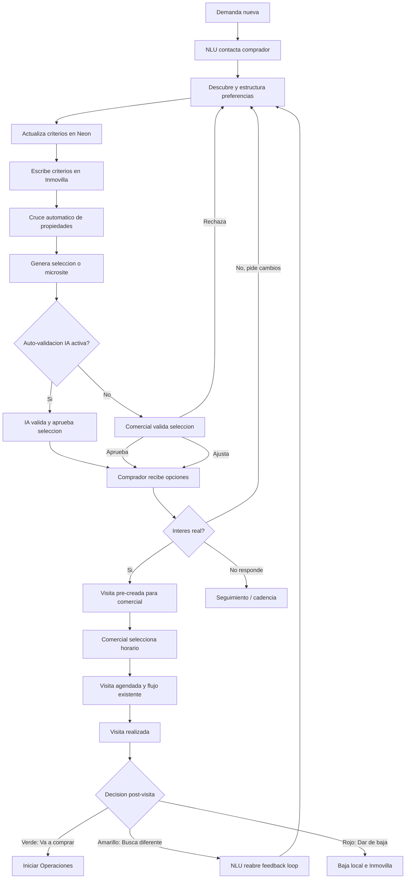

# Analisis del Flujo NLU de Demanda y Cruces Automaticos

## Objetivo

Este documento define el flujo canonico para gestionar demandas de compradores con el agente NLU y el motor de cruces automaticos.

La premisa de negocio es que una demanda no se convierte en compra de forma magica ni instantanea. En la operativa real, el comercial inicia y coordina la relacion con el comprador, pero el cuello de botella aparece cuando el comprador no compra tras una visita y empieza el ciclo repetitivo de: preguntar de nuevo, entender cambios, buscar propiedades, proponer opciones y volver a organizar visitas.

El sistema debe automatizar ese ciclo repetitivo sin eliminar el rol comercial. El comercial sigue gestionando la relacion, las visitas y el cierre; el NLU se encarga de descubrir preferencias, actualizar criterios y generar nuevas opciones accionables.

## Problema que se resuelve

El enfoque anterior trataba el NLU como un mecanismo de descubrimiento y ajuste de demanda asociado a matches, microsites o respuestas sueltas del comprador. Eso automatiza partes del proceso, pero no ataca el problema principal: el feedback loop posterior a una visita fallida.

En la realidad:

1. Entra una demanda con criterios iniciales: ubicaciones, presupuesto, habitaciones, tipologia, intereses y restricciones.
2. El comercial la gestiona inicialmente.
3. Si es una demanda nueva, el comercial normalmente propone o genera una primera visita manualmente.
4. Si al comprador no le encaja, el comercial debe preguntar mas, reinterpretar la demanda y buscar nuevas propiedades.
5. Repetido sobre decenas o cientos de compradores, ese ciclo consume la mayor parte del tiempo operativo.

La automatizacion debe concentrarse en ese punto: convertir el feedback del comprador en criterios estructurados, actualizar la demanda, recruzar propiedades y entregar al comercial una visita lista para coordinar.

## Principios del nuevo flujo

- El comprador conversa por WhatsApp con un agente inmobiliario personalizado de Urus.
- El NLU no sustituye al comercial en la negociacion, visita ni cierre.
- El NLU si sustituye el trabajo repetitivo de preguntar, interpretar, buscar y rearmar opciones.
- Inmovilla conserva los datos CRM de la demanda y sus criterios comerciales.
- Neon conserva el estado operativo del pipeline, eventos, historial conversacional, selecciones, visitas y trazabilidad.
- El estado del pipeline no se escribe en `keysitu` de Inmovilla; vive en `DemandCurrent.leadStatus`.
- Los criterios de demanda que cambien por NLU si se escriben en Inmovilla: presupuesto, zonas, habitaciones, metros, tipologia, extras u otros campos soportados por la operacion legacy de demandas.
- La baja de una demanda debe ejecutarse tanto en Urus como en Inmovilla. Al no existir REST para demandas, la baja en Inmovilla requiere operacion legacy/RPA.

## Actores

| Actor           | Responsabilidad                                                                                                                                   |
| --------------- | ------------------------------------------------------------------------------------------------------------------------------------------------- |
| Comprador       | Responde por WhatsApp, visita propiedades y comunica si compra, busca otra cosa o abandona.                                                       |
| Comercial       | Gestiona la relacion, coordina horarios, ejecuta visitas, decide el estado post-visita y activa operaciones si hay compra.                        |
| Propietario     | Debe estar identificado y localizable para coordinar visitas, confirmar disponibilidad y mantenerlo informado de la actividad sobre su propiedad. |
| Agente NLU      | Conversa con el comprador, extrae variables, detecta interes por propiedades y decide si hay que buscar nuevas opciones.                          |
| Motor de cruces | Compara demandas activas contra propiedades internas y/o stock externo segun criterios actualizados.                                              |
| Urus / Neon     | Orquesta eventos, jobs, sesiones, pipeline, visitas, seleccion de propiedades y trazabilidad.                                                     |
| Inmovilla       | Sistema CRM donde quedan persistidos los criterios finales de la demanda y la baja cuando corresponda.                                            |

## Flujo Canonico End-to-End

### 1. Entrada de una demanda

**Disparador:** se crea o ingesta una demanda desde Inmovilla o desde un canal conectado.

**Datos minimos esperados:**

- Identificador de demanda.
- Comprador: nombre, telefono y comercial asignado si existe.
- Criterios iniciales: presupuesto, zona o zonas, habitaciones, tipologia, metros, extras e intereses declarados.
- Ciudad o ambito geografico suficiente para cruzar propiedades.

**Acciones del sistema:**

1. Registra o actualiza la demanda en Neon.
2. Inicializa el pipeline interno en `NUEVO`.
3. Crea contexto conversacional para WhatsApp si hay telefono valido.
4. Dispara el primer contacto del NLU.

**Mensaje inicial del NLU:**

El comprador recibe un WhatsApp proactivo, mediante plantilla aprobada si aplica por politicas de Meta, con un mensaje equivalente a:

> Hola [Nombre], soy tu agente inmobiliario personalizado de Urus. Voy a ayudarte a encontrar una propiedad que encaje con lo que necesitas. Para afinar la busqueda te hare unas preguntas y te ire mostrando opciones concretas.

### 2. Descubrimiento inicial por NLU

**Objetivo:** convertir intereses iniciales, texto libre y respuestas del comprador en criterios estructurados de demanda.

El NLU debe preguntar solo lo necesario para completar o mejorar la busqueda. No debe hacer una entrevista infinita antes de mostrar propiedades.

**Variables que puede descubrir o actualizar:**

- Presupuesto minimo y maximo.
- Zonas aceptadas, incluyendo multiples zonas por demanda.
- Zonas descartadas.
- Habitaciones minimas y alternativas aceptables.
- Metros minimos o rango aproximado.
- Tipologia: piso, casa, chalet, atico, local, inversion, etc.
- Extras: terraza, ascensor, garaje, trastero, exterior, obra nueva, reforma, piscina.
- Prioridades: precio, zona, tamano, estado, rentabilidad, urgencia.
- Restricciones: financiacion, plazo de compra, disponibilidad para visitar, no contactar, etc.

**Regla de negocio:**

Una preferencia no tiene que ser unica. Si el comprador dice que le encajan propiedades de 4 habitaciones, pero tambien aceptaria 3 si la zona o precio son buenos, la demanda debe guardar ambas posibilidades de forma util para el cruce, no sobrescribir una con otra sin contexto. Tambien no siempre tiene que descubrir todas las variables, debe ser exactamente igual a una conversación humana con un agente inmobiliario, sonar natural, ser inteligente, oportuno, y concreto.

### 3. Generacion de opciones y cruces

**Disparadores:**

- Demanda nueva con criterios suficientes, que son Zona, Precio y habitaciones, no debe ser tan estricto
- NLU completa o modifica criterios.
- Comprador pide ver mas opciones.
- Comercial marca post-visita como "Busca algo diferente".
- Nueva propiedad entra o cambia en Inmovilla.

**Acciones del sistema:**

1. Ejecuta cruce contra propiedades internas sincronizadas desde Inmovilla.
2. Si aplica, consulta stock externo de mercado mediante Statefox.
3. Ordena propiedades por compatibilidad.
4. Genera una seleccion/microsite con un conjunto manejable de opciones.
5. Registra los matches y deja la seleccion pendiente de validacion comercial.

**Criterio de salida:**

El sistema no debe entregar al comprador una lista infinita. Debe preparar un bloque de opciones concretas y medibles para que el comercial lo valide antes de enviarlo.

### 4. Validacion del microsite

Antes de enviar propiedades al comprador, la seleccion generada por el sistema debe pasar por una validacion. Esa validacion puede ser manual por el comercial o automatica por IA si el comercial tiene activada la auto-validacion de microsites en `Configuracion > Microsites`.

**Objetivo:**

Evitar que el comprador reciba propiedades que, aunque puntuen bien por datos, no sean convenientes comercialmente por contexto que el sistema no conoce: disponibilidad real, relacion con propietario, estado de negociacion, calidad de ficha, conflicto de agenda, prioridad interna o criterio profesional del comercial.

**Acciones del sistema:**

1. Genera el microsite o seleccion de propiedades en estado `PENDING_VALIDATION`.
2. Comprueba la configuracion `autoValidateMicrosite` del comercial asignado.
3. Si la auto-validacion esta desactivada, notifica al comercial con un link interno de validacion.
4. Si la auto-validacion esta activada, encola `AUTO_VALIDATE_MICROSITE`.
5. Solo cuando la seleccion queda `APPROVED`, por validacion manual o por auto-validacion IA, se envia el microsite al comprador.

**Camino manual:**

- Aprobar la seleccion completa.
- Quitar propiedades que no deben mostrarse.
- Reordenar o priorizar propiedades si aplica.
- Rechazar la seleccion si no tiene sentido comercial.

**Camino automatico con IA:**

Cuando `autoValidateMicrosite` esta activo para el comercial:

1. La IA revisa la seleccion generada.
2. Genera o mejora descripciones comerciales para las propiedades.
3. Sustituye referencias a otras agencias por la marca de Urus cuando aparezcan en las descripciones.
4. Marca la seleccion como `APPROVED` con origen `auto_validation`.
5. Encola el envio del microsite al comprador sin esperar validacion manual.

**Regla de negocio:**

El comprador no debe recibir un microsite ni una seleccion de propiedades en estado `PENDING_VALIDATION`. La compuerta existe siempre, pero puede resolverla el comercial manualmente o la IA si la auto-validacion esta activada para ese comercial por CEO/Admin. Si la auto-validacion esta desactivada, el flujo vuelve al comportamiento manual: el comercial aprueba, ajusta o rechaza antes del envio.

**Estados de la seleccion:**

| Estado | Significado |
| --- | --- |
| `PENDING_VALIDATION` | El sistema genero opciones y espera resolucion de la validacion, manual o automatica. |
| `APPROVED` | La seleccion fue aprobada manualmente por el comercial o automaticamente por IA. |
| `REJECTED` | El comercial rechazo; no se envia al comprador. |

### 5. Presentacion de propiedades al comprador

El comprador recibe propiedades por WhatsApp y/o un microsite de seleccion propio solo despues de que la seleccion quede aprobada, ya sea por el comercial o por la auto-validacion IA configurada para ese comercial.

El canal canonico de feedback es WhatsApp. El microsite es la interfaz visual para ver fichas, imagenes y detalles; la interpretacion real del feedback ocurre cuando el comprador responde al agente.

El NLU debe poder entender respuestas como:

- "Me gusta la segunda, pero se pasa de precio."
- "La de 4 habitaciones me encaja."
- "No quiero esa zona."
- "Prefiero algo mas nuevo aunque tenga una habitacion menos."
- "Ensename mas como la primera."

### 6. Deteccion de interes y pre-creacion de visita

Cuando el NLU detecta interes real por una o varias propiedades, el sistema no debe intentar cerrar autonomamente una visita con el comprador. Debe crear un paquete operativo para el comercial.

**Criterios de interes real:**

- El comprador afirma que una propiedad le encaja.
- Pide visitarla.
- Pregunta por horarios, direccion o disponibilidad.
- Compara positivamente una propiedad frente a otras.
- Confirma que cumple sus requisitos principales.

**Acciones del sistema:**

1. Registra `SELECCION_COMPRADOR` por cada propiedad interesada.
2. Crea una solicitud de visita pre-creada en Urus.
3. Agrupa datos del comprador, demanda, propiedad y propietario/anunciante.
4. Notifica al comercial asignado.
5. Avanza el pipeline interno a `VISITA_PENDIENTE`.

**Regla sobre propietario:**

Toda visita pre-creada debe facilitar al comercial el contacto del propietario o, si la propiedad no es de cartera interna, el contacto operativo disponible de agencia/anunciante. El comercial necesita ese dato para coordinar disponibilidad, confirmar la visita y mantener al propietario informado. Si el contacto no existe o no esta sincronizado, la visita debe quedar marcada como incompleta hasta resolverlo.

**Notificacion al comercial:**

El comercial recibe un mensaje con:

- Nombre y telefono del comprador.
- Propiedad o propiedades interesadas.
- Motivo resumido del interes.
- Contacto del propietario o contacto operativo de agencia/anunciante.
- Link directo a la visita pre-creada.

### 7. Link de visita pre-creada para el comercial

El link debe llevar al comercial a una pantalla interna donde no tenga que reconstruir la informacion.

**La pantalla debe mostrar:**

- Datos del comprador.
- Historial resumido de preferencias descubiertas por el NLU.
- Propiedad o propiedades seleccionadas.
- Datos y telefono del propietario. Si es stock externo, datos y telefono del contacto operativo de agencia/anunciante.
- Referencia Inmovilla o identificador externo.
- Telefono disponible para coordinar.
- Notas relevantes para la visita.

**La unica accion obligatoria del comercial:**

Seleccionar o registrar horario de visita.

Al confirmar horario:

1. Se crea la visita en Urus.
2. Se crea el evento de calendario.
3. Se emite `VISITA_AGENDADA`.
4. Se mantiene el flujo existente de nota de encargo, parte de visita y procesos posteriores.
5. El pipeline pasa a `VISITA_CONFIRMADA`.

### 8. Refactor de la interfaz de Visitas

La interfaz actual de `Visitas` debe refactorizarse para soportar el nuevo modelo de visitas pre-creadas y post-visita.

**Layout objetivo:**

- Columna izquierda: listado de visitas por programar.
- Columna derecha: detalle de la visita seleccionada, con suficiente espacio para datos, formulario y botones de accion.

**Columna izquierda: visitas por programar**

Debe mostrar las visitas pre-creadas que requieren accion del comercial:

- Comprador.
- Propiedad o propiedades interesadas.
- Estado de la visita: incompleta, pendiente de horario, agendada, realizada.
- Indicador de si falta contacto de propietario/agencia.
- Ultima actividad o fecha de creacion.

Al seleccionar una visita, la columna derecha carga su detalle completo.

**Columna derecha: detalle y acciones**

Debe mostrar en una vista amplia:

- Datos del comprador.
- Datos de la propiedad.
- Datos y telefono del propietario o contacto operativo de agencia/anunciante.
- Resumen de preferencias NLU y motivo del interes.
- Formulario para seleccionar fecha, hora de inicio y hora de fin.
- Boton para registrar/agendar visita.
- Tras la visita, botones de decision: `Verde: Va a comprar`, `Amarillo: Busca algo diferente`, `Rojo: Dar de baja`.

**Query parameters para visitas precargadas**

Las visitas que ya vienen con informacion precargada deben abrirse mediante query parameters. El link que recibe el comercial debe llevarlo a `Visitas` con la visita seleccionada o con los datos necesarios para inicializarla.

Ejemplos de parametros esperados:

- `visitId`: abre una visita pre-creada existente.
- `demandId`: precarga la demanda.
- `propertyId` o `propertyCode`: precarga la propiedad.
- `selectionId`: vincula la visita con el microsite o seleccion origen.

**Regla de UX:**

El comercial no debe llegar a una pantalla vacia si viene desde una notificacion. Si el link contiene query parameters validos, la columna izquierda debe resaltar la visita correspondiente y la columna derecha debe mostrarla lista para revisar, completar horario o tomar decision.

### 9. Post-visita: decision del comercial

Despues de la visita, el comercial debe ver sus visitas en la plataforma y marcar una de tres decisiones.

| Estado visual | Decision             | Significado                                         | Accion                                          |
| ------------- | -------------------- | --------------------------------------------------- | ----------------------------------------------- |
| Verde         | Va a comprar         | El comprador quiere avanzar con esa propiedad.      | Inicia flujo de Operaciones.                    |
| Amarillo      | Busca algo diferente | La visita no cerro, pero el comprador sigue activo. | Reinicia el flujo NLU con contexto post-visita. |
| Rojo          | Dar de baja          | El comprador abandona o no debe seguir activo.      | Baja en Urus e Inmovilla.                       |

### 10. Rama Verde: Va a comprar

**Disparador:** comercial marca `Va a comprar`.

**Acciones:**

1. Registra evaluacion post-visita positiva.
2. Avanza pipeline a `EN_NEGOCIACION`.
3. Crea o vincula una operacion sobre comprador, propiedad y comercial.
4. Inicia el flujo de Operaciones: reserva, oferta, arras, firma o el proceso que corresponda.
5. Detiene nuevas busquedas automaticas para esa demanda mientras la operacion este activa, salvo reapertura manual.

**Regla de negocio:**

Una demanda con operacion activa no debe seguir recibiendo nuevas propiedades como si estuviera buscando, porque genera ruido y puede romper el cierre.

### 11. Rama Amarilla: Busca algo diferente

**Disparador:** comercial marca `Busca algo diferente`.

Esta es la rama mas importante del nuevo modelo.

**Acciones:**

1. Registra la visita como realizada sin compra.
2. El comercial puede anadir una nota breve de contexto si quiere, pero no debe ser obligatorio.
3. El NLU escribe al comprador retomando el contexto de la visita.
4. El NLU pregunta que no encajo y que cambiaria.
5. Extrae nuevas variables o preferencias alternativas.
6. Actualiza la demanda en Neon.
7. Escribe los criterios modificados en Inmovilla mediante Egestion Worker/RPA legacy.
8. Ejecuta nuevo cruce automatico.
9. Presenta nuevas propiedades al comprador.
10. Si detecta interes real, vuelve a crear una visita pre-creada para el comercial.

**Mensaje de reactivacion sugerido:**

> Gracias por visitar la propiedad. Para afinar mejor la busqueda: que fue lo que no te encajo y que tendria que tener la siguiente vivienda para que si te interese?

**Regla de negocio:**

El sistema debe conservar lo aprendido. Si una propiedad no encajo por precio, zona o estado, ese rechazo debe afectar los siguientes cruces. No basta con mostrar mas propiedades aleatorias.

### 12. Rama Roja: Dar de baja

**Disparador:** comercial marca `Dar de baja`.

**Acciones:**

1. Registra motivo de baja si el comercial lo informa.
2. Detiene sesiones WhatsApp activas para esa demanda.
3. Cancela jobs pendientes de microsite, recruce o seguimiento relacionados.
4. Marca la demanda como `PERDIDO` o estado interno equivalente.
5. Ejecuta baja en Inmovilla mediante operacion legacy/RPA.
6. Solo despues de confirmar la baja remota, marca la baja local como completada.

**Regla de seguridad:**

Si falla la baja en Inmovilla, Urus no debe eliminar definitivamente la trazabilidad local. Debe quedar como `BAJA_PENDIENTE_INMOVILLA` o equivalente para reintento y auditoria.

## Estados del Pipeline

El flujo propuesto se alinea con `DemandCurrent.leadStatus`, pero requiere precisar el significado operativo de algunos estados:

| Estado              | Significado en este flujo                                           |
| ------------------- | ------------------------------------------------------------------- |
| `NUEVO`             | Demanda recibida, aun sin conversacion efectiva.                    |
| `CONTACTADO`        | El NLU o el comercial ya inicio contacto con el comprador.          |
| `EN_SELECCION`      | El comprador esta evaluando propiedades propuestas.                 |
| `VISITA_PENDIENTE`  | Existe interes real y una visita pre-creada para gestionar horario. |
| `VISITA_CONFIRMADA` | El comercial registro horario.                                      |
| `VISITA_REALIZADA`  | La visita ocurrio y esta pendiente de decision post-visita.         |
| `EN_NEGOCIACION`    | El comercial marco "Va a comprar" y empieza Operaciones.            |
| `EN_FIRMA`          | Operacion con firma enviada.                                        |
| `CERRADO`           | Operacion cerrada.                                                  |
| `PERDIDO`           | Demanda dada de baja o descartada.                                  |

## Eventos Recomendados

| Evento                                 | Cuando se emite                                             |
| -------------------------------------- | ----------------------------------------------------------- |
| `DEMANDA_INGESTADA` / `DEMANDA_CREADA` | Entra una demanda nueva al sistema.                         |
| `NLU_CONTACTO_INICIADO`                | El agente escribe por primera vez al comprador.             |
| `NLU_PREFERENCIAS_DESCUBIERTAS`        | El NLU extrae variables nuevas o modificadas.               |
| `DEMANDA_ACTUALIZADA`                  | Se consolidan cambios de criterios para Neon e Inmovilla.   |
| `MATCH_GENERADO`                       | Una propiedad cruza con la demanda.                         |
| `SELECCION_GENERADA`                   | Se crea una seleccion/microsite con propiedades candidatas. |
| `SELECCION_VALIDACION_SOLICITADA`      | Se solicita validacion manual cuando el comercial no tiene auto-validacion activa. |
| `SELECCION_VALIDADA`                   | La seleccion queda aprobada por el comercial o por IA con `source="auto_validation"`. |
| `SELECCION_RECHAZADA`                  | El comercial rechaza la seleccion y no se envia al comprador. |
| `SELECCION_COMPRADOR`                  | El comprador muestra interes o rechazo por una propiedad.   |
| `VISITA_PRECREADA`                     | El sistema arma el paquete de visita para el comercial.     |
| `VISITA_AGENDADA`                      | El comercial confirma horario.                              |
| `VISITA_REALIZADA`                     | La visita queda marcada como realizada.                     |
| `POST_VISITA_DECIDIDA`                 | El comercial marca verde, amarillo o rojo.                  |
| `OPERACION_INICIADA`                   | Rama verde: empieza Operaciones.                            |
| `DEMANDA_REPERFILADO_SOLICITADO`       | Rama amarilla: se reinicia el NLU con contexto post-visita. |
| `DEMANDA_BAJA_SOLICITADA`              | Rama roja: se pide baja local/remota.                       |
| `DEMANDA_BAJA_COMPLETADA`              | La baja quedo confirmada en Urus e Inmovilla.               |

## Escrituras en Inmovilla

Se debe escribir en Inmovilla solo lo que corresponda a datos CRM de la demanda:

- Presupuesto minimo/maximo.
- Zonas multiples aceptadas.
- Tipologia.
- Habitaciones.
- Metros.
- Extras o caracteristicas soportadas.
- Baja de demanda cuando el comercial marca rojo.

No se debe escribir en Inmovilla:

- Estado operativo del pipeline de Urus.
- Historial conversacional completo.
- Scores internos de matching.
- Eventos de UI.
- Razonamientos del NLU.

## Reglas de Matching

El cruce automatico debe usar los criterios actuales de la demanda, no solo los datos originales.

**Entradas del scoring:**

- Criterios estructurados de Inmovilla/Urus.
- Preferencias descubiertas por NLU.
- Propiedades aceptadas y rechazadas.
- Feedback post-visita.
- Tolerancias declaradas por el comprador.

**Salida del scoring:**

- Propiedades compatibles ordenadas.
- Motivo del match.
- Variables que explican la compatibilidad.
- Propiedades no aptas descartadas con razon.

**Regla clave:**

Cada vuelta del loop debe mejorar la siguiente seleccion. Si el comprador rechaza tres propiedades por zona, esa zona debe perder prioridad o salir de la demanda. Si acepta menos habitaciones por mejor zona, el scoring debe contemplar esa alternativa.

## Flujo Resumido

## Criterios de Aceptacion Funcional

El flujo se considera bien definido si cumple:

1. Una demanda nueva dispara contacto NLU y queda trazada.
2. El NLU puede capturar y actualizar multiples zonas y preferencias alternativas.
3. Todo cambio de criterios genera `DEMANDA_ACTUALIZADA` y escritura en Inmovilla si el campo es soportado.
4. Cada seleccion/microsite queda pendiente de validacion antes de enviarse al comprador.
5. Si `autoValidateMicrosite` esta activo para el comercial, la IA puede aprobar la seleccion y enviarla sin revision manual.
6. Si `autoValidateMicrosite` esta desactivado, el comprador solo recibe propiedades aprobadas o ajustadas por el comercial.
7. Un interes real del comprador genera una visita pre-creada, no una visita cerrada sin comercial.
8. El comercial recibe un link con comprador, propietario/anunciante, propiedad y contexto.
9. La pantalla de `Visitas` muestra visitas por programar a la izquierda y el detalle/acciones de la visita seleccionada a la derecha.
10. Los query parameters permiten abrir una visita pre-cargada directamente desde una notificacion.
11. El comercial solo debe seleccionar horario para convertir la visita pre-creada en visita agendada.
12. Tras la visita, el comercial solo elige entre verde, amarillo o rojo.
13. Verde inicia Operaciones y pausa nuevas busquedas automaticas de esa demanda.
14. Amarillo reinicia el NLU con contexto de la visita y vuelve a cruzar propiedades.
15. Rojo baja la demanda en Urus e Inmovilla, con reintento si Inmovilla falla.

## Diferencia Frente al Enfoque Anterior

| Enfoque anterior                                                   | Nuevo enfoque                                                                        |
| ------------------------------------------------------------------ | ------------------------------------------------------------------------------------ |
| El NLU se activa principalmente por respuesta a match o microsite. | El NLU acompana todo el ciclo de demanda, especialmente despues de visitas fallidas. |
| El sistema intenta afinar demanda desde interacciones aisladas.    | El sistema mantiene contexto historico de preferencias, rechazos y visitas.          |
| La automatizacion se centra en enviar propiedades.                 | La automatizacion se centra en reducir el trabajo repetitivo del comercial.          |
| El comprador recibe opciones y el sistema interpreta feedback.     | El comprador conversa con un agente personalizado que descubre, ajusta y propone.    |
| El comercial puede quedar fuera del flujo hasta que haya interes.  | El comercial entra justo donde aporta valor: coordinar visita, evaluar y cerrar.     |

## Decision de Producto

El NLU de demanda debe entenderse como un asistente comercial de re-perfilado continuo, no como un bot que intenta cerrar la compra de forma autonoma.

El valor principal no esta en que el sistema envie una propiedad automaticamente. El valor esta en que, cuando el comprador dice "esto no me encaja", el sistema pueda descubrir por que, actualizar la demanda, buscar mejor y devolver al comercial una oportunidad lista para gestionar.