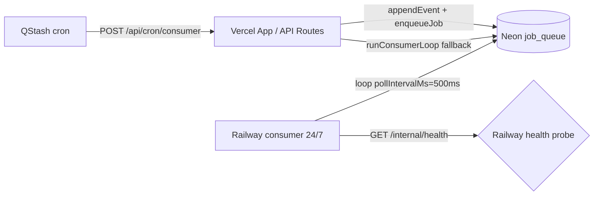

# Consumer Railway — operación y despliegue

Worker dedicado en Railway que ejecuta el consumer 24/7 para drenar la
`job_queue` de Neon con latencia de segundos en lugar de los minutos del cron
QStash. Convive de forma segura con el cron actual de Vercel
(`/api/cron/consumer`) gracias a `FOR UPDATE SKIP LOCKED` en la cola.

> Patrón calcado del `image-worker` Railway. Ver [docs/image-worker-railway.md](image-worker-railway.md) para una referencia idéntica de cuándo aplicar el modelo "worker dedicado en Railway".

## Cuándo usarlo

- Latencia operativa percibida superior a 1-2 minutos en cadenas de jobs
  (ej. alta de propiedad → notificación WhatsApp al comercial).
- El cron de Vercel queda lento o se acerca al límite de duración (`maxDuration = 300`).
- Necesitas el SLA <5 min para `LEAD_INGESTADO` con score crítico.
- Quieres reducir la cadencia QStash sin perder throughput.

Si no aplica ninguno de los anteriores, el cron de Vercel basta.

## Qué procesa este worker

El servicio Railway se ejecuta con `CONSUMER_RAILWAY_MODE=true` y solo toma
jobs del subset `RAILWAY_CONSUMER_JOB_TYPES` (definido en
[lib/workers/consumer/types.ts](../lib/workers/consumer/types.ts)).
Excluye explícitamente:

- `IMPORT_STATEFOX_PORTAL_IMAGES` → ya lo procesa el `image-worker` Railway.
- `MARKET_*` → ya los procesan los crons dedicados `/api/cron/market/*`.

El cron QStash de Vercel (`/api/cron/consumer`) sigue tomando todos los tipos
canónicos (`ALL_CONSUMER_JOB_TYPES`) como red de seguridad: si Railway se
cae, el cron drena la cola con la latencia antigua. Sin pérdida de datos.

## Variables de entorno

Mismas que las API Routes de Vercel (los handlers son idénticos), más las
específicas del proceso:

```
# Activación del modo Railway (también puede pasarse vía CLI flags)
CONSUMER_ALWAYS_ON=true
CONSUMER_RAILWAY_MODE=true
PORT=8080

# Tunables (opcionales)
CONSUMER_MAX_CYCLES=600
CONSUMER_IDLE_MS=1000
CONSUMER_POLL_INTERVAL_MS=500

# Conexión y servicios externos (espejo de Vercel)
DATABASE_URL=postgresql://...neon.tech/...
WHATSAPP_ACCESS_TOKEN=...
WHATSAPP_PHONE_NUMBER_ID=...
OPENAI_API_KEY=...
INMOVILLA_API_TOKEN=...
STATEFOX_BEARER_TOKEN=...
CLOUDINARY_CLOUD_NAME=...
CLOUDINARY_API_KEY=...
CLOUDINARY_API_SECRET=...
NEXT_PUBLIC_APP_URL=https://...
CRON_SECRET=...

# Si el consumer Railway delega imágenes Statefox al image-worker Railway
STATEFOX_IMAGE_WORKER_URL=https://image-worker.up.railway.app
STATEFOX_IMAGE_WORKER_SECRET=...
```

Comprobación previa al despliegue: `npm run consumer:validate` (ver siguiente sección).

## Validación pre-deploy

```bash
npm run consumer:validate
```

El script [scripts/consumer-validate.ts](../scripts/consumer-validate.ts)
verifica en lectura pura (no toca jobs ni eventos):

| Check | Qué valida |
|-------|------------|
| Variables de entorno | Todas las críticas presentes (sólo OPCIONAL puede faltar) |
| Conexión Neon | `SELECT 1` con timeout 5s |
| Stats de cola | Totales por status, jobs `PENDING` por tipo, marca cuáles caen fuera del subset Railway |
| Coherencia handlers | Cada tipo de `RAILWAY_CONSUMER_JOB_TYPES` tiene handler registrado |

Códigos de salida: `0` OK · `1` algún FAIL · `2` excepción.

Ejecutarlo con el `.env` de producción cargado antes de cada deploy
significativo a Railway.

## Despliegue Railway

1. Crear un servicio nuevo en Railway apuntando a este repositorio.
2. Configurar `Dockerfile.consumer` como Dockerfile path.
3. Asignar las variables de entorno listadas arriba.
4. Health check: `GET /internal/health` en el puerto `PORT` (default 8080).
5. Recursos sugeridos: **0.5 vCPU / 512 MB RAM**. El consumer es ligero
   (sin Playwright/Chromium); con 1 instancia es suficiente para volumen
   actual (ver `docs/workers.md` línea 21).
6. Tras el primer arranque, validar:
   - `GET /internal/health` responde `200` con `status: "ok"`.
   - `GET /api/workers/status` (con auth) en Vercel muestra
     `consumer.lastSuccessAt` actualizado en los últimos minutos.

## Plan de rollout

1. **Día 0 — Despliegue silencioso**
   - Subir worker a Railway con env vars completas.
   - Validar `GET /internal/health` desde fuera.
   - **No tocar el cron QStash de Vercel**: sigue siendo el procesador real durante el día 0.
2. **Día 1 — Encender consumo**
   - El proceso Railway empieza a competir por jobs (`FOR UPDATE SKIP LOCKED` evita colisiones).
   - Bajar la frecuencia QStash de cada 5 min a cada 15 min como red de seguridad.
   - Monitorizar `consumer.lastSuccessAt` en `/api/workers/status` y latencia end-to-end con un evento real (alta de propiedad → tiempo hasta WhatsApp al comercial).
3. **Día 2-7 — Throughput estable**
   - Si todo está sano, considerar bajar QStash a 30 min o 1 h (solo safety net).
   - Documentar latencia observada y ajustar `CONSUMER_POLL_INTERVAL_MS` si conviene (más bajo = más responsivo, más coste de queries vacías).

## Reversa inmediata

En cualquier momento:

- Desactivar el servicio Railway desde el dashboard.
- El cron QStash de Vercel sigue drenando la cola con la latencia antigua.
- Sin redeploy, sin pérdida de datos, sin migración.

## Health endpoint

`GET /internal/health` devuelve:

```json
{
  "status": "ok",
  "railwayMode": true,
  "uptimeMs": 3600000,
  "lastLoopFinishedAt": "2026-05-17T12:00:00.000Z",
  "totalProcessed": 1234,
  "totalFailed": 2,
  "loopsRun": 482,
  "currentlyRunning": false,
  "jobTypes": 38
}
```

Durante shutdown limpio (`SIGTERM`) cambia a `status: "shutting_down"` y
deja de aceptar nuevas conexiones HTTP, pero el loop activo termina su
ciclo antes de salir (timeout duro de 15s).

## Troubleshooting

| Síntoma | Diagnóstico |
|---------|-------------|
| `consumer.lastSuccessAt` no avanza en `/api/workers/status` | Worker caído o sin permisos de DB. Revisar logs Railway, probar `npm run consumer:validate` con las mismas env vars. |
| Cola crece (`PENDING` aumenta sin parar) | Consumer no está procesando. Validar `GET /internal/health.currentlyRunning`. Si `false` durante minutos, posible deadlock en algún handler — revisar logs. |
| `Tipos en RAILWAY_CONSUMER_JOB_TYPES sin job handler` | Se añadió un tipo en `ALL_CONSUMER_JOB_TYPES` pero no se registró su handler. Ver `lib/workers/consumer/job-handlers.ts`. |
| Redeploys frecuentes por OOM | Subir RAM a 1 GB o reducir `CONSUMER_MAX_CYCLES` a 200-300 (drena en lotes más pequeños). |
| Jobs duplicados procesados | No debería pasar. La cola usa `FOR UPDATE SKIP LOCKED` + `idempotencyKey`. Si pasa, abrir incidencia y revisar `lib/job-queue/job-queue.ts`. |
| `UNAUTHORIZED` al llamar a image-worker desde un handler | `STATEFOX_IMAGE_WORKER_SECRET` distinto entre Railway consumer y Railway image-worker. |

## Coexistencia con cron QStash de Vercel



`FOR UPDATE SKIP LOCKED` garantiza que ambos consumers (Vercel cron y
Railway worker) tomen jobs distintos sin colisiones, incluso ejecutándose
simultáneamente. Cada instancia genera un `workerId` único por arranque.

## Referencias

- [docs/workers.md](workers.md) — arquitectura general de workers.
- [docs/image-worker-railway.md](image-worker-railway.md) — patrón gemelo.
- [scripts/run-consumer.ts](../scripts/run-consumer.ts) — entrypoint always-on.
- [scripts/consumer-validate.ts](../scripts/consumer-validate.ts) — precheck.
- [Dockerfile.consumer](../Dockerfile.consumer) — imagen Railway.
- [lib/workers/consumer/types.ts](../lib/workers/consumer/types.ts) — `RAILWAY_CONSUMER_JOB_TYPES`.
