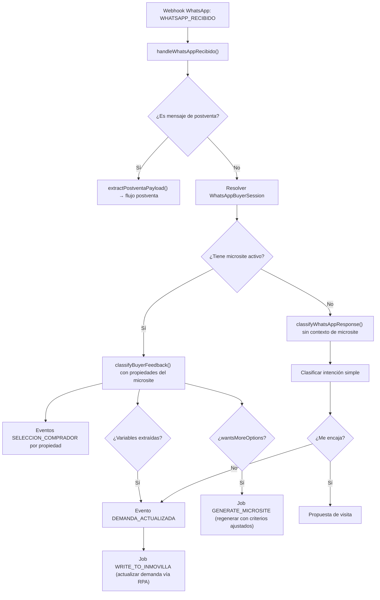

# Agente NLU de Descubrimiento de Requerimientos del Comprador

> Documento técnico de un flujo implementado que no tiene documento original en `docs-originales/`. Alineado con el código real en `lib/agents/nlu-graph.ts` y `lib/workers/consumer/whatsapp-nlu-handler.ts`.

---

## Contexto de Negocio

Cuando un comprador responde a un mensaje de WhatsApp (match de propiedad, microsite, o conversación abierta), el sistema necesita:

1. **Interpretar texto libre** en lenguaje natural ("No me cuadra, es caro", "Quiero otra zona", "Con terraza")
2. **Extraer variables estructuradas** de demanda (precio, zona, metros, extras)
3. **Clasificar sentimiento por propiedad** (ME_INTERESA / NO_ME_ENCAJA)
4. **Detectar intención** de ver más opciones (`wantsMoreOptions`)
5. **Actualizar la demanda** en Inmovilla vía Egestion Worker

---

## Arquitectura Técnica

### Grafo LangGraph (`nlu-graph.ts`, 251 líneas)

El grafo expone dos funciones públicas:

| Función | Input | Output | Uso |
|---|---|---|---|
| `classifyWhatsAppResponse()` | Mensaje de texto | Intención + variables extraídas | Respuestas a match de propiedad |
| `classifyBuyerFeedback()` | Mensaje + propiedades del microsite + historial | `BuyerFeedbackOutput` completo | Feedback contextual sobre microsite |

### `classifyBuyerFeedback` — Output Estructurado

```typescript
interface BuyerFeedbackOutput {
  intention: "interested" | "not_interested" | "wants_changes" | "wants_more" | "ambiguous";
  propertyFeedback: Array<{
    propertyId: string;
    sentiment: "ME_INTERESA" | "NO_ME_ENCAJA";
    reason?: string;
  }>;
  extractedVariables: {
    precioMax?: number;
    precioMin?: number;
    zona?: string;
    metros?: number;
    habitaciones?: number;
    extras?: string[];
  };
  wantsMoreOptions: boolean;
  summary: string;
}
```

### Flujo en el Consumer (`whatsapp-nlu-handler.ts`, 525 líneas)



### Sesión de Comprador (`WhatsAppBuyerSession`)

Tabla Prisma que mantiene el contexto conversacional:

| Campo | Función |
|---|---|
| `waId` | Número WhatsApp del comprador (unique) |
| `demandId` | Demanda vinculada |
| `selectionId` | Microsite activo (si existe) |
| `turnCount` | Turnos de conversación |
| `summary` | Resumen acumulado del historial |

Permite que el NLU tenga **contexto multi-turno**: sabe qué propiedades se mostraron, qué dijo antes el comprador, y cuál es la demanda subyacente.

### Archivos Clave

| Archivo | Líneas | Función |
|---|---|---|
| `lib/agents/nlu-graph.ts` | 251 | Grafo LangGraph con 2 funciones NLU |
| `lib/workers/consumer/whatsapp-nlu-handler.ts` | 525 | Consumer completo: routing postventa/NLU, resolución de sesión, eventos |
| `lib/whatsapp/webhook.ts` | 140 | Parseo y verificación del webhook de Meta |
| `lib/whatsapp/send.ts` | 1082 | Envío de mensajes y plantillas (match, microsite, pricing, firma, postventa) |
| `lib/whatsapp/client.ts` | 93 | Cliente HTTP tipado para WhatsApp Cloud API |

### Diferencia clave vs documento original del flujo base

El README documenta los módulos 2-3 (notificación al comprador y ajuste de demanda) como flujos lineales simples. La implementación real añade:
- **NLU contextual** con historial conversacional y propiedades mostradas
- **Resolución de demanda** desde sesión WhatsApp, no solo desde evento
- **Routing inteligente** entre flujo de microsite, flujo de match directo, y flujo de postventa
- **Multi-turno**: el comprador puede refinar su demanda iterativamente sin intervención humana
