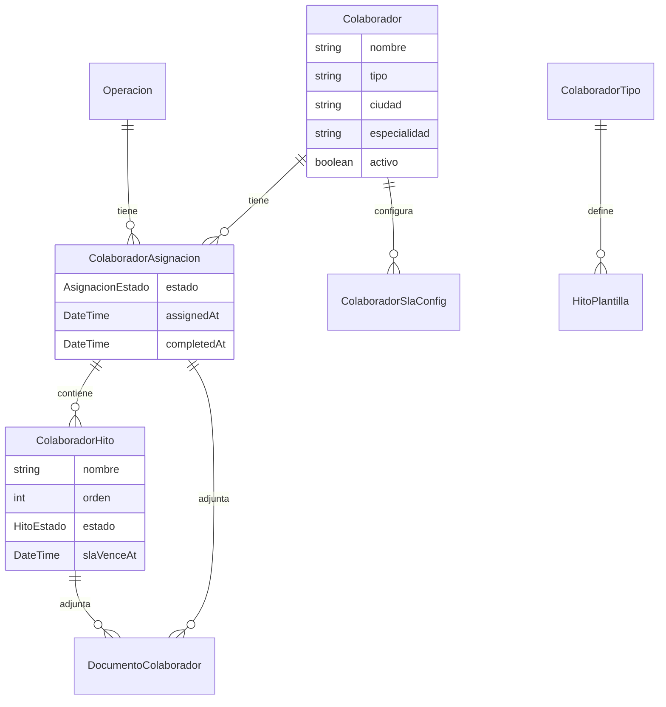
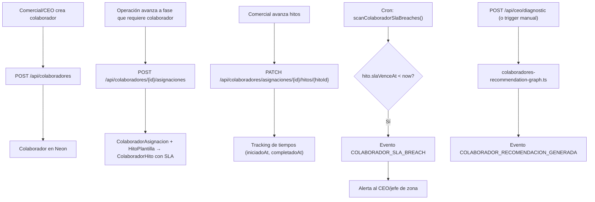

# Sistema de Control de Colaboradores Externos

> Documento técnico alineado con la implementación real (M11). Contraste contra el documento original `docs-originales/colaboradores-externos.md`.

---

## Análisis de Brechas: Original vs Implementación

### Brecha 1 — No existe entidad "Colaborador" en Inmovilla

**Doc original:** "Definir colaboradores como entidades del CRM" (Paso 1).

**Realidad técnica:** Inmovilla no modela hitos operativos de bancos, abogados ni tasadores. No hay entidad "colaborador" en su modelo de datos ni en su API REST. Todo el flujo de colaboradores vive **100% en Neon**:
- `Colaborador` — entidad propia con tipo, ciudad, especialidad, contacto
- `ColaboradorTipo` — catálogo de tipos con hitos plantilla
- `ColaboradorAsignacion` — vínculo colaborador ↔ operación
- `ColaboradorHito` — tracking de progreso con SLAs
- `DocumentoColaborador` — documentos subidos a Cloudinary
- `ColaboradorSlaConfig` — SLAs personalizados por colaborador

No hay datos de colaboradores que reconciliar desde Inmovilla.

### Brecha 2 — Gestión interna, no acceso del colaborador

**Doc original:** Implica "ningún colaborador trabaja fuera del sistema" como si el colaborador interactuara directamente.

**Realidad técnica:** Los colaboradores externos **no acceden al sistema directamente**. Toda la gestión la realiza el **equipo interno** (Comercial / CEO) desde el dashboard de Next.js:
- Registrar colaboradores
- Asignar a operaciones
- Subir documentos en nombre de los colaboradores
- Avanzar hitos y cambiar estados
- Revisar ranking y métricas

### Brecha 3 — Clasificación implementada con reglas A/B/C

**Doc original:** 4 perfiles (Partner estratégico, Funcional, Lento, Crítico).

**Realidad técnica:** `classify.ts` implementa **3 clasificaciones** (A, B, C) basadas en métricas configurables:
- **A (Partner estratégico):** cumplimiento SLA alto + operaciones desbloqueadas
- **B (Funcional):** cumple sin destacar
- **C (Lento/Crítico):** genera retrasos o bloqueos

Configurable vía env vars (`CLASSIFY_*`). Cada clasificación tiene badge visual en la UI.

### Brecha 4 — Recomendaciones IA con LangGraph implementadas

**Doc original:** "El sistema genera recomendaciones para el CEO" (conceptual).

**Realidad técnica:** `lib/agents/colaboradores-recommendation-graph.ts` genera recomendaciones con structured output Zod:
- Persiste como evento `COLABORADOR_RECOMENDACION_GENERADA`
- Orquestado por `recommendation-generator.ts`
- Schema: `ColaboradoresRecommendationSchema` con items por colaborador, acciones sugeridas, confidence
- 429 líneas de tests (`recommendation.test.ts`)

### Brecha 5 — Scanner de SLA implementado

**Doc original:** "alertas automáticas cuando banco supera SLA" (conceptual).

**Realidad técnica:** `sla-scanner.ts` implementa escaneo periódico de hitos con `slaVenceAt` expirado → eventos `COLABORADOR_SLA_BREACH`. Cada hito tiene `slaDias` (configurado por tipo de colaborador en `ColaboradorSlaConfig`) y `slaVenceAt` calculado.

---

## Arquitectura Técnica Implementada

### Modelo de Datos (Schema Prisma)

### Flujo de Datos

### Rutas API

| Ruta | Método | Función |
|---|---|---|
| `/api/colaboradores` | GET, POST | Listar/crear colaboradores |
| `/api/colaboradores/dashboard` | GET | Dashboard con KPIs |
| `/api/colaboradores/[id]` | GET, PATCH, DELETE | CRUD unitario |
| `/api/colaboradores/[id]/asignaciones` | GET, POST | Asignaciones del colaborador |
| `/api/colaboradores/asignaciones/[id]` | PATCH, DELETE | Gestionar asignación |
| `/api/colaboradores/asignaciones/[id]/hitos/[hitoId]` | PATCH | Avanzar hito |
| `/api/colaboradores/asignaciones/[id]/documentos` | GET, POST | Documentos |

### UI

| Página | Ruta | Función |
|---|---|---|
| Listado/gestión | `/platform/colaboradores` | CRUD + vista de todos los colaboradores |
| Detalle | `/platform/colaboradores/[id]` | Asignaciones, hitos (kanban), documentos |
| Dashboard/Ranking | `/platform/colaboradores/ranking` | Ranking por impacto, clasificación A/B/C, KPIs |

### Componentes

| Componente | Función |
|---|---|
| `AsignarDialog` | Crear asignación de colaborador a operación |
| `ClasificacionBadge` | Badge visual A/B/C |
| `ColaboradorForm` | Formulario crear/editar |
| `DocumentoUpload` | Subida de documentos (Cloudinary) |
| `HitoKanban` | Vista kanban de hitos por estado |
| `CollaboratorCard` | Tarjeta en ranking |
| `SlaIndicator` | Indicador visual SLA |
