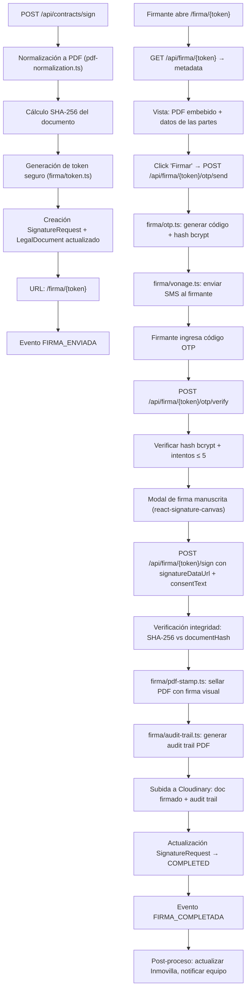

# Sistema de Firma Digital In-House

> Documento técnico del motor de firma electrónica simple construido como parte de Smart Closing (M8). No tiene documento original dedicado en `docs-originales/`.

---

## Contexto

El documento original de Smart Closing sugería DocuSign/Signaturit. La implementación real construyó un sistema de **firma electrónica simple in-house** que no depende de ningún SaaS externo.

---

## Arquitectura Técnica

### Flujo de Firma Completo

### Componentes del Motor

| Componente | Archivo | Función |
|---|---|---|
| **Normalización PDF** | `lib/signaturit/pdf-normalization.ts` | Convierte DOCX a PDF (si necesario) |
| **Token de firma** | `lib/firma/token.ts` | Genera token criptográfico para URL |
| **Motor principal** | `lib/firma/engine.ts` | Orquestador de la lógica de firma |
| **OTP** | `lib/firma/otp.ts` | Generación y verificación de códigos OTP con bcrypt |
| **SMS (Vonage)** | `lib/firma/vonage.ts` | Envío de SMS vía API de Vonage |
| **Sellado PDF** | `lib/firma/pdf-stamp.ts` | Insertar firma visual, sello de timestamp, hash |
| **Audit Trail** | `lib/firma/audit-trail.ts` | Generar PDF de evidencia (IP, UA, timestamps, hashes) |

### Entidades Prisma

| Modelo | Tabla | Campos clave |
|---|---|---|
| `SignatureRequest` | `signature_requests` | `signingToken`, `documentHash`, `status`, `slaDeadline`, `signerIp`, `signerUserAgent`, `consentText`, `signedDocumentHash` |
| `SignatureOtp` | `signature_otps` | `codeHash` (bcrypt), `verified`, `attempts`, `expiresAt` |
| `LegalDocument` | `legal_documents` | `signatureRequestId`, `signedDocumentUrl`, `auditTrailUrl` |

### Seguridad

| Medida | Implementación |
|---|---|
| Integridad del documento | SHA-256 calculado al crear, verificado al firmar |
| Autenticación del firmante | OTP por SMS (Vonage) + máximo 5 intentos |
| Consentimiento explícito | Texto de consentimiento mostrado y firmado |
| Evidencia forense | IP, User-Agent, timestamps registrados |
| No repudio | Firma manuscrita + OTP + hash del documento firmado |
| Protección del endpoint | `SIGNATURIT_SIGN_API_TOKEN` o `CRON_SECRET` |

### Rutas API

| Ruta | Método | Función |
|---|---|---|
| `/api/contracts/sign` | POST | Crear solicitud de firma (genera URL) |
| `/api/firma/{token}` | GET | Metadata para la página de firma |
| `/api/firma/{token}/otp/send` | POST | Enviar OTP por SMS |
| `/api/firma/{token}/otp/verify` | POST | Verificar código OTP |
| `/api/firma/{token}/sign` | POST | Completar firma (signature data + consent) |
| `/api/firma/{token}/decline` | POST | Rechazar firma |

### UI (`/firma/{token}`)

Página pública (sin autenticación de plataforma) con:
- Vista previa del PDF embebida
- Datos de las partes del contrato
- Flujo guiado: revisar → solicitar OTP → ingresar código → firmar en canvas → confirmar
- Botón de rechazo con motivo opcional
- Soporte de modo mock para desarrollo (`?mock=1`)

### SLA y Recordatorios

| Concepto | Valor |
|---|---|
| SLA total | 5 días naturales |
| Recordatorios | Día +1, +3, +5 por WhatsApp |
| Escalado | Tras día +5 → WhatsApp a comercial + gestor |
| Scanner | `lib/signaturit/reminder-scanner.ts` evalúa `slaDeadline` y `lastReminderDay` |

### Tests

| Test | Archivo |
|---|---|
| Reminder scanner | `lib/signaturit/__tests__/reminder-scanner.test.ts` |
| Firma completada handler | `lib/workers/consumer/__tests__/firma-completada-handler.test.ts` |
| Sign API | `app/api/contracts/__tests__/sign.test.ts` |
| UI send-to-signature | `components/legal/smart-closing/__tests__/send-to-signature.test.ts` |
