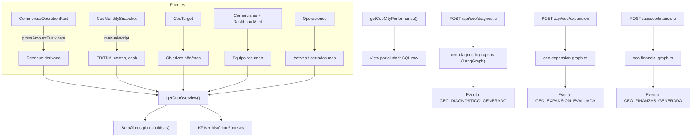

# Sistema de Gobierno Estratégico del CEO

> Documento técnico alineado con la implementación real (M13). Contraste contra el documento original `docs-originales/gobierno-estrategico.md`.

---

## Análisis de Brechas: Original vs Implementación

### Brecha 1 — Datos financieros: híbrido derivados + snapshot manual

**Doc original:** Asume datos financieros automáticos (facturación, EBITDA, cash, costes).

**Realidad técnica:** Inmovilla no expone facturación, comisiones ni costes operativos vía API. El sistema implementa un modelo **híbrido**:
- **Ingresos derivados:** calculados desde `CommercialOperationFact.grossAmountEur × commissionRate` (tasa configurable, default 3%).
- **Snapshot manual:** `CeoMonthlySnapshot` (EBITDA, costes operativos, cash disponible, costes fijos/variables) se alimenta con `scripts/seed-ceo-financials.ts` o entrada manual.
- **Objetivos:** `CeoTarget` por año/mes.

Esto implica que las Capas 1 y 6 (finanzas) dependen parcialmente de entrada manual hasta que se integre un sistema contable.

### Brecha 2 — Capa 3 (Estado Psicológico) NO implementada

**Doc original:** "El sistema agrega nivel de uso del bot, patrones de bloqueo, fatiga por zona, riesgo de burnout."

**Realidad técnica:** No existe módulo de soporte mental implementado en código (ver documento `soporte-mental.md`). La Capa 3 del dashboard CEO queda como **placeholder** en la UI (`/platform/bi/capital-humano` usa datos mock). No hay métricas de bienestar en el schema Prisma ni en el Event Store.

### Brecha 3 — Capa 5 (Expansión Geográfica) usa LangGraph con datos limitados

**Doc original:** "Análisis por ciudad candidata: demanda potencial, ticket medio esperado, coste de implantación, break-even."

**Realidad técnica:** El grafo `ceo-expansion-graph.ts` genera análisis de expansión pero **sin datos externos de mercado por ciudad candidata** (no hay API de demanda potencial ni coste de implantación). Las recomendaciones se basan en:
- Datos internos de rendimiento por ciudad actual (`getCeoCityPerformance()`)
- Heurísticas del LLM sobre umbrales de cash, margen y estabilidad de revenue
- El output sigue el schema Zod `ExpansionEvaluationSchema` con readiness score y recomendaciones

### Brecha 4 — Las 6 Capas están implementadas con profundidad variable

| Capa | Doc Original | Implementación | Estado |
|---|---|---|---|
| 1 — Visión ejecutiva | KPIs globales + semáforos | `getCeoOverview()` + thresholds → semáforos facturación/equipo/expansión/costes | **Funcional** (revenue derivado, financials manuales) |
| 2 — Rendimiento por ciudad | Vista ciudad + comercial | `getCeoCityPerformance()` con SQL raw sobre facts + propiedades + leads | **Funcional** |
| 3 — Estado psicológico | Bot mental + burnout | Sin código. UI usa mock | **No implementado** |
| 4 — Diagnóstico automático | Recomendaciones IA | `ceo-diagnostic-graph.ts` → `DIAGNOSTICO_GENERADO` | **Funcional** |
| 5 — Expansión geográfica | Análisis por ciudad | `ceo-expansion-graph.ts` → `EXPANSION_EVALUADA` | **Funcional** (datos limitados) |
| 6 — Control financiero | Costes + reinversión | `ceo-financial-graph.ts` → `FINANZAS_GENERADA` | **Funcional** (snapshot manual) |

---

## Arquitectura Técnica Implementada

### Flujo de Datos

### Entidades Prisma

| Modelo | Tabla | Función |
|---|---|---|
| `CeoMonthlySnapshot` | `ceo_monthly_snapshots` | Datos financieros mensuales (manual) |
| `CeoTarget` | `ceo_targets` | Objetivos de facturación/EBITDA por año o mes |

Los diagnósticos IA se persisten como eventos en el Event Store (`CEO_DIAGNOSTICO_GENERADO`, `CEO_EXPANSION_EVALUADA`, `CEO_FINANZAS_GENERADA`) con `aggregateType: CEO`.

### Semáforos (reglas en `thresholds.ts`)

| Semáforo | Lógica |
|---|---|
| **Facturación** | Revenue/target: verde ≥80%, amarillo ≥60%, rojo <60% |
| **Equipo** | Alertas/comerciales >50% O carga >90% = rojo; >25% O >75% = amarillo |
| **Expansión** | 3 criterios (cash ≥50k, margen ≥15%, revenue ≥80% target): 3=verde, 2=amarillo, <2=rojo |
| **Costes** | Coste/revenue: verde <60%, amarillo <80%, rojo ≥80% |

### Rutas API

| Ruta | Método | Función |
|---|---|---|
| `/api/ceo/overview` | GET | KPIs, semáforos, histórico, equipo, operaciones |
| `/api/ceo/cities` | GET | Rendimiento por ciudad |
| `/api/ceo/diagnostic` | GET/POST | Último diagnóstico / regenerar |
| `/api/ceo/expansion` | GET/POST | Última evaluación de expansión / regenerar |
| `/api/ceo/financiero` | GET/POST | Último análisis financiero / regenerar |

Todas requieren `session.role === "ceo"`.

### UI (`/platform/bi/`)

| Página | Ruta | Estado |
|---|---|---|
| Visión Ejecutiva | `/platform/bi/vision-ejecutiva` | API real |
| Operativo (ciudades) | `/platform/bi/operativo` | API real |
| Prescriptivo (diagnóstico IA) | `/platform/bi/prescriptivo` | API real + mock fallback |
| Expansión | `/platform/bi/expansion` | API real + mock fallback |
| Reinversión (financiero) | `/platform/bi/reinversion` | API real + mock fallback |
| Capital Humano | `/platform/bi/capital-humano` | Solo mock (módulo mental no implementado) |
