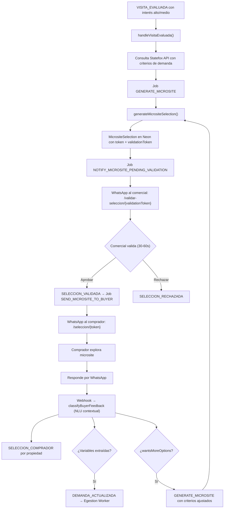

# Microsite de Selección para el Comprador + Feedback Loop

> Documento técnico de un flujo implementado que corresponde a los Módulos 6-8 del README. No tiene documento original dedicado en `docs-originales/`. Referencia ampliada: `docs/microsite-feedback-loop.md`.

---

## Contexto de Negocio

Statefox no ofrece generación de enlaces privados vía API. El sistema construye un **microsite propio** (Next.js) que reemplaza completamente esa dependencia. El comprador recibe un enlace por WhatsApp, explora las propiedades del mercado, y su feedback vuelve al sistema vía WhatsApp (no hay botones de valoración en la web pública).

---

## Arquitectura Técnica

### Flujo End-to-End

### Entidades Prisma

| Modelo | Tabla | Función |
|---|---|---|
| `MicrositeSelection` | `microsite_selections` | Selección curada con propiedades de Statefox |
| `MicrositeSelectionFeedback` | `microsite_selection_feedback` | Feedback por propiedad (ME_INTERESA / NO_ME_ENCAJA) |
| `WhatsAppBuyerSession` | `whatsapp_buyer_sessions` | Sesión conversacional del comprador |

### `MicrositeSelection` — Campos Clave

| Campo | Función |
|---|---|
| `token` | Token público para el comprador (`/seleccion/{token}`) |
| `validationToken` | Token opaco para el comercial (`/validar-seleccion/{validationToken}`) |
| `status` | `PENDING_VALIDATION` → `APPROVED` / `REJECTED` / `EXPIRED` |
| `statefoxQuery` | Parámetros enviados a Statefox API |
| `resultFilters` | Filtros aplicados en memoria |
| `properties` | Lista curada JSON de propiedades |
| `buyerPhone` | Teléfono resuelto desde `demands_current.telefono` |
| `validationDueAt` | SLA de validación comercial (2h desde creación) |
| `escalatedAt` | Si se escaló por incumplimiento de SLA |

### UI del Microsite (público, sin auth)

| Ruta | Función |
|---|---|
| `/seleccion/{token}` | Listado de propiedades curadas con fichas |
| `/seleccion/{token}/propiedad/{propertyId}` | Ficha detalle con carrusel, datos técnicos, navegación |
| `/seleccion/demo` | Vista demo con mock data |

Características:
- Branding Urus Capital
- Fichas con imágenes, precio, metros, zona, extras, certificado energético
- Tracking de views (`firstViewedAt`, `lastViewedAt`, `viewCount`)
- No hay botones de feedback en la web — el feedback es exclusivamente por WhatsApp

### UI de Validación (comercial, interno)

| Ruta | Función |
|---|---|
| `/validar-seleccion/{validationToken}` | Vista comercial con Aprobar / Rechazar |

El comercial ve las mismas propiedades que verá el comprador y puede validar en 30-60 segundos.

### SLA de Validación Comercial

| Concepto | Valor |
|---|---|
| Deadline | 2 horas desde creación |
| Cron | `POST /api/cron/microsite-validation-sla` |
| Escalado | WhatsApp a `MICROSITE_VALIDATION_ESCALATION_TO` + marca `escalatedAt` |

### Archivos Clave

| Archivo | Función |
|---|---|
| `lib/microsite/selection.ts` | Generación y persistencia de selecciones |
| `lib/microsite/buyer-phone.ts` | Resolución del teléfono del comprador |
| `lib/microsite/mock-selection.ts` | Datos demo para UI sin backend |
| `lib/workers/consumer/seleccion-comprador-handler.ts` | Persiste feedback idempotente |
| `lib/workers/consumer/whatsapp-nlu-handler.ts` | NLU contextual con microsite activo |
| `app/seleccion/[token]/page.tsx` | Listado público |
| `app/seleccion/[token]/propiedad/[propertyId]/page.tsx` | Ficha detalle |
| `app/validar-seleccion/[validationToken]/page.tsx` | Validación comercial |
