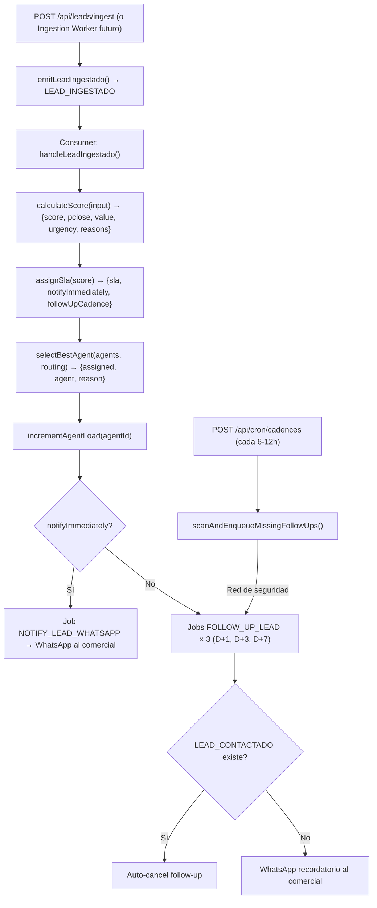

# Motor de Decisión para la Gestión y Priorización de Leads

> Documento técnico alineado con la implementación real (M3). Contraste contra el documento original `docs-originales/decision-gestion-priorizacion-del-it.md`.

---

## Análisis de Brechas: Original vs Implementación

### Brecha 1 — "Lead" no es una entidad en Inmovilla

**Doc original:** Habla de "Lead/Conversación" como entidad del CRM.

**Realidad técnica:** En Inmovilla no existe una entidad "Lead". Lo que el sector llama lead se materializa como un **Contacto** (persona, accesible vía API REST) + una **Demanda** (búsqueda activa con polígono geoespacial, solo vía RPA legacy). El sistema crea su propia entidad de lead en Neon mediante el evento `LEAD_INGESTADO` con un `aggregateId` generado (`lead-{nanoid}`).

### Brecha 2 — Scoring implementado por reglas, no por IA (MVP)

**Doc original:** Describe IA avanzada para clasificación como primera opción.

**Realidad técnica:** Se implementó primero el **scoring por reglas** (exactamente como el doc sugiere en "Paso 2"), siguiendo la fórmula documentada:

```
Score = 0.55 × Pclose + 0.30 × Value + 0.15 × Urgency
```

Implementado en `lib/scoring/calculate-score.ts` con puntos configurados en `lib/scoring/rules.ts`. Los puntos están alineados al 100% con la tabla del doc original:

| Criterio (comprador) | Doc Original | Código (`rules.ts`) |
|---|---|---|
| Preaprobación hipotecaria | +25 | `PREAPROBACION: 25` |
| Presupuesto definido | +15 | `PRESUPUESTO: 15` |
| Plazo ≤ 30 días | +20 | `PLAZO_30_DIAS: 20` |
| Mensaje con detalles | +10 | `MENSAJE_DETALLES: 10` |
| Referido | +15 | `REFERIDO: 15` |
| "Solo estoy mirando" | −20 | `SOLO_MIRANDO: -20` |

LangGraph se usa para **NLU de texto libre** (clasificación del mensaje de WhatsApp → extracción de variables), no para el scoring en sí.

### Brecha 3 — SLA implementado con 4 niveles exactos

**Doc original:** Score ≥80 → <5min, 60–79 → <30min, 40–59 → <2h, <40 → cadencia automática.

**Realidad técnica:** Implementado exactamente en `lib/sla/assign-sla.ts`:

| Nivel | Score | SLA | `notifyImmediately` | `followUpCadence` |
|---|---|---|---|---|
| `CRITICAL` | ≥80 | <5min | `true` | — |
| `HIGH` | 60–79 | <30min | `true` | — |
| `MEDIUM` | 40–59 | <2h | `true` | — |
| `LOW` | <40 | Cadencia | `false` | D+1, D+3, D+7 |

### Brecha 4 — Routing por ciudad + capacidad + conversión (no especialidad full)

**Doc original:** "filtra por ciudad → especialidad → carga ponderada × conversión histórica".

**Realidad técnica:** `selectBestAgent()` en `lib/routing/select-agent.ts`:
1. Filtra por `ciudad` + `activo: true` + `cargaActual < cargaMaxima`
2. Score = 60% capacidad disponible + 40% tasa de conversión + bonus +0.1 si `especialidad` coincide
3. Si no hay agente disponible: `assigned: false` con razón explícita

La tabla `Comercial` de Prisma tiene: `ciudad`, `especialidad`, `cargaActual`, `cargaMaxima`, `tasaConversion`.

### Brecha 5 — Cadencias implementadas con D+1/D+3/D+7 + cron de seguridad

**Doc original:** "Cadencias automáticas D+1, D+3, D+7".

**Realidad técnica:** Implementado como jobs `FOLLOW_UP_LEAD` con `availableAt` escalonado. Auto-cancelación si existe `LEAD_CONTACTADO`. Cron de seguridad `POST /api/cron/cadences` para cubrir edge cases. Documentado en `docs/workers/lead-scoring-flow.md`.

### Brecha 6 — "Aprendizaje (Capa F)" no implementado aún

**Doc original:** "Cada lead que cierre/no cierre alimenta el modelo" con recalibración de pesos.

**Realidad técnica:** Los datos de cierre se persisten en `CommercialOperationFact` y los de scoring en `CommercialLeadFact`, pero **no existe un pipeline de recalibración automática de pesos**. Los pesos del scoring (0.55/0.30/0.15) son constantes. Está contemplado en el roadmap.

---

## Arquitectura Técnica Implementada

### Flujo End-to-End



### Entidades Prisma Involucradas

| Modelo | Uso en Lead Scoring |
|---|---|
| `Comercial` | Pool de agentes para routing (ciudad, carga, conversión) |
| `CommercialLeadFact` | Fact materializado con score, SLA, asignación, contacto |
| `Event` | `LEAD_INGESTADO`, `LEAD_SCORED`, `LEAD_CONTACTADO` |
| `JobQueue` | `NOTIFY_LEAD_WHATSAPP`, `FOLLOW_UP_LEAD` |

### Archivos Clave

| Archivo | Función |
|---|---|
| `lib/scoring/rules.ts` | Puntos MVP y rangos de normalización |
| `lib/scoring/calculate-score.ts` | `calculateScore()` — fórmula ponderada |
| `lib/sla/assign-sla.ts` | Mapping score → SLA + cadencia |
| `lib/routing/select-agent.ts` | `selectBestAgent()` — capacidad × conversión |
| `lib/routing/agent-repo.ts` | `getActiveAgentsByCity()` — consulta Prisma |
| `lib/leads/ingest.ts` | `emitLeadIngestado()` — evento + job |
| `lib/leads/follow-up-checker.ts` | Verificación de contacto para cadencias |
| `lib/leads/cadence-scanner.ts` | Red de seguridad para follow-ups |
| `lib/workers/consumer/lead-scoring-handler.ts` | Handler completo del pipeline |
| `app/api/leads/ingest/route.ts` | API de ingesta manual |
| `docs/workers/lead-scoring-flow.md` | Documentación detallada del flujo |
