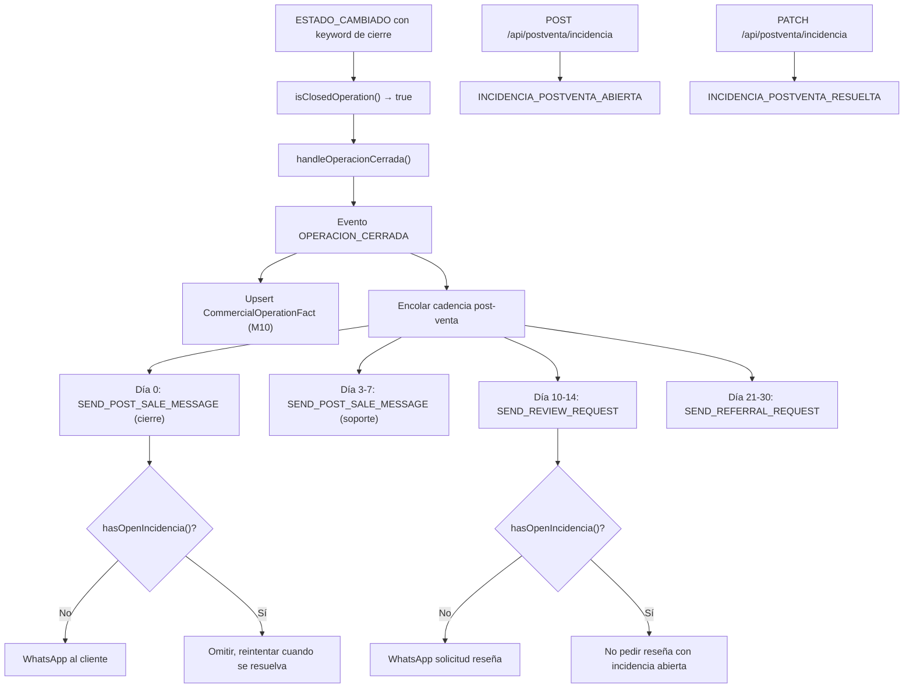

# Automatización Post-Venta

> Documento técnico alineado con la implementación real (M9). Contraste contra el documento original `docs-originales/post-venta.md`.

---

## Análisis de Brechas: Original vs Implementación

### Brecha 1 — Evento disparador: detección automática desde Event Store

**Doc original:** "Estado CRM = Operación Cerrada / Firma realizada" como trigger directo del CRM.

**Realidad técnica:** El `Ingestion Worker` detecta cambios de estado en Inmovilla, emite `ESTADO_CAMBIADO`. El handler `closed-operation.ts` usa keywords (`CLOSED_OPERATION_KEYWORDS`: "vendido", "cerrada", "firmada", etc.) para identificar `OPERACION_CERRADA`. Esto dispara `handleOperacionCerrada()` que encola toda la cadencia post-venta.

Adicionalmente, la detección de cierre también alimenta `CommercialOperationFact` (M10) y puede disparar `GENERATE_CONTRACT_DRAFT` si la operación pasa por Reserva/Arras (M8).

### Brecha 2 — Dos sistemas de cadencia coexisten

**Realidad técnica:** Existen **dos implementaciones de cadencia post-venta** que operan en paralelo:

1. **`lib/post-sale/`** — Sistema original con fases: `OPERACION_CERRADA` → cadencia con jobs `SEND_POST_SALE_MESSAGE`, `SEND_REVIEW_REQUEST`, `SEND_REFERRAL_REQUEST`, `SEND_REVIEW_REMINDER`
2. **`lib/postventa/`** — Sistema alternativo con `START_POSTVENTA_CADENCE` → `SEND_POSTVENTA_MESSAGE` con steps secuenciales

Ambos comparten el canal WhatsApp Cloud API y la lógica de bloqueo por incidencias.

### Brecha 3 — Las 5 capas temporales están implementadas

| Capa | Doc Original | Implementación |
|---|---|---|
| **1 — Cierre (Día 0)** | Agradecimiento + email resumen | `SEND_POST_SALE_MESSAGE` fase `cierre_inmediato` → WhatsApp personalizado |
| **2 — Soporte (Día 3-7)** | "¿Todo OK?" + mini-guía | `SEND_POST_SALE_MESSAGE` fase `soporte_temprano` → WhatsApp con enlace guía (`/platform/postventa/guia`) |
| **3 — Reputación (Día 10-14)** | Solicitud de reseña | `SEND_REVIEW_REQUEST` → WhatsApp con link Google Reviews |
| **4 — Referidos (Día 21-30)** | Activación referidos | `SEND_REFERRAL_REQUEST` → WhatsApp con link `/referidos/{propertyCode}` |
| **5 — Re-captación (90-180d)** | Segmentación a largo plazo | Fechas de felicitación |

### Brecha 4 — Sistema de incidencias implementado

**Doc original:** "Si indica problema → se pausa el flujo".

**Realidad técnica:** `hasOpenIncidencia()` en `send-message-handler.ts` verifica antes de cada envío si existe un evento `INCIDENCIA_POSTVENTA_ABIERTA` sin `INCIDENCIA_POSTVENTA_RESUELTA`. Si hay incidencia abierta, el envío se omite. API en `POST/PATCH /api/postventa/incidencia`.

### Brecha 5 — Referidos con modelo propio en Prisma

**Realidad técnica:** Entidad `Referral` en Prisma con ciclo de vida:
- `PENDIENTE_ASIGNACION` → `ASIGNADO` → `CONTACTADO` | `DESCARTADO`
- Formulario público en `/referidos/{propertyCode}`
- Eventos: `REFERIDO_CAPTURADO`, `REFERIDO_ASIGNADO`, `REFERIDO_SOLICITUD_ENVIADA`
- Vinculado a `Comercial` para asignación

### Brecha 6 — Herramientas: WhatsApp directo, no email marketing

**Doc original:** Menciona genéricamente "mensajes y emails".

**Realidad técnica:** Todo el canal post-venta es **WhatsApp Cloud API** (integración directa con Meta). No hay integración de email marketing. Las plantillas deben estar aprobadas en Meta Business Manager.

---

## Arquitectura Técnica Implementada

### Flujo de Datos

### Entidades Prisma

| Modelo | Tabla | Función |
|---|---|---|
| `Referral` | `referrals` | Referidos captados post-venta |
| `Operacion` | `operaciones` | Ancla de la operación formal |

El resto se gestiona con eventos del Event Store:

| Evento | Función |
|---|---|
| `OPERACION_CERRADA` | Disparador de toda la cadencia |
| `INCIDENCIA_POSTVENTA_ABIERTA` | Pausa la cadencia |
| `INCIDENCIA_POSTVENTA_RESUELTA` | Reanuda la cadencia |
| `RESENA_SOLICITADA` | Tracking de solicitud de reseña |
| `RESENA_RECIBIDA` | Reseña completada |
| `RECORDATORIO_RESENA_ENVIADO` | Recordatorio de reseña |
| `REFERIDO_CAPTURADO` | Referido registrado |
| `REFERIDO_ASIGNADO` | Referido asignado a comercial |

### Archivos Clave

| Archivo | Función |
|---|---|
| `lib/post-sale/cadence.ts` | Definición de fases y etiquetas |
| `lib/post-sale/closed-operation.ts` | Detección de cierre por keywords |
| `lib/post-sale/post-sale-handler.ts` | Orquestador: encola fases |
| `lib/post-sale/cadence-scanner.ts` | Scanner de cadencias faltantes |
| `lib/postventa/start-cadence-handler.ts` | Cadencia alternativa por steps |
| `lib/postventa/send-message-handler.ts` | Envío con verificación de incidencia |
| `lib/workers/consumer/post-sale-job-handler.ts` | Consumer: 4 handlers (mensaje, reseña, referido, recordatorio) |
| `app/api/postventa/incidencia/route.ts` | API de incidencias |
| `app/platform/post-venta/pipeline/page.tsx` | Pipeline visual |
| `app/platform/post-venta/referidos/page.tsx` | Admin de referidos |
| `app/referidos/[propertyCode]/page.tsx` | Formulario público de referido |

### Tests (4 suites, 800+ líneas)

- `closed-operation.test.ts` — Keywords de detección
- `closed-operation-handler.test.ts` — Handler completo
- `review-flow.test.ts` — Flujo de reseñas
- `referral-handler.test.ts` — Flujo de referidos
