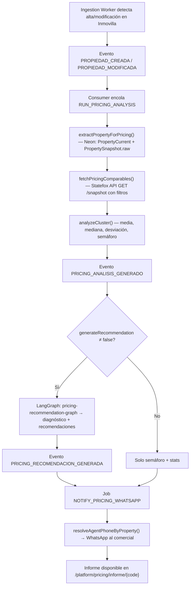

# Motor Inteligente de Pricing y Posicionamiento Inmobiliario

> Documento técnico alineado con la implementación real (M7). Contraste contra el documento original `docs-originales/smart-pricing.md`.

---

## Análisis de Brechas: Original vs Implementación

### Brecha 1 — Statefox NO es un motor de "sync" bidireccional

**Doc original:** "vuelca automáticamente las características a Statefox" (punto 2.1), "Sync automático Inmovilla → Statefox".

**Realidad técnica:** La API de Statefox (`docs/documentacion-api-rest-statefox.md`) es **solo lectura**. No acepta escritura, no tiene POST/PUT, no permite crear búsquedas ni sincronizar propiedades. El sistema consulta `GET /properties` y `GET /snapshot` con filtros y consume los datos estáticamente.

**Resolución:** El motor de pricing consulta Statefox como **fuente de comparables de mercado** usando `fetchPricingComparables()` (`lib/pricing/fetch-comparables.ts`). No hay sincronización Inmovilla → Statefox. Los filtros se traducen desde las variables del inmueble en Neon.

### Brecha 2 — Statefox NO crea "clusters comparativos"

**Doc original:** "Statefox rastrea y crea clusters comparativos" (6.1).

**Realidad técnica:** Statefox devuelve un listado plano de propiedades filtradas. La **creación de clusters, estadísticas y semáforos** la hace el sistema propio en `analyzeCluster()` (`lib/pricing/analyze-cluster.ts`) — cálculo de media, mediana, desviación, segmentación particular/profesional, y semáforo basado en gap porcentual.

### Brecha 3 — Herramientas técnicas: código propio, no Make/Zapier

**Doc original:** Recomienda Make, Zapier, Documint, PDFMonkey.

**Realidad técnica:** Todo el motor está implementado en **TypeScript puro** dentro del monorepo Next.js:
- Orquestador: `runPricingAnalysis()` en `lib/pricing/index.ts`
- IA: `pricing-recommendation-graph.ts` (LangGraph + Zod structured output)
- Workers: `pricing-handler.ts`, `pricing-notify-handler.ts`
- Cron: `reevaluation-scanner.ts` → `POST /api/cron/pricing-reevaluation`

### Brecha 4 — La nota en Inmovilla NO se escribe automáticamente

**Doc original:** "Todo queda registrado en Inmovilla como nota estratégica."

**Realidad técnica:** La API REST de Inmovilla no tiene endpoints de notas en propiedades. El análisis se persiste como eventos en Neon (`PRICING_ANALISIS_GENERADO`, `PRICING_RECOMENDACION_GENERADA`) y se notifica al comercial vía **WhatsApp** (`NOTIFY_PRICING_WHATSAPP`). El informe es accesible en el micro-frontend `/platform/pricing/informe/{code}`.

### Brecha 5 — Disparadores: reevaluación proactiva implementada con protecciones

**Doc original:** Menciona triggers genéricos ("sin leads X días", "muchas visitas sin oferta") sin mecánica.

**Realidad técnica:** El `reevaluation-scanner.ts` implementa dos triggers concretos con protecciones contra sobrecarga:

| Trigger | Condición | Constantes |
|---|---|---|
| `no_leads_reeval` | Propiedad activa ≥14 días sin ningún `MATCH_GENERADO` | `DAYS_WITHOUT_LEADS = 14` |
| `visits_no_offer_reeval` | ≥3 `VISITA_EVALUADA` con `propertyCode` y 0 cambios de estado a oferta | `MIN_VISITS_WITHOUT_OFFER = 3` |

**Protecciones:** cooldown 7 días, máx 100 propiedades/scan, `availableAt` escalonado 30s entre jobs, `idempotencyKey` diaria, sin LangGraph por defecto en lote (`generateRecommendation: false`), `maxPages: 5` (vs 30 por defecto).

---

## Arquitectura Técnica Implementada

### Flujo de Datos

### Entidades Prisma

El motor de pricing **no tiene tablas propias** — persiste todo en el Event Store:

| Evento | Payload clave |
|---|---|
| `PRICING_ANALISIS_GENERADO` | `stats.semaforo`, `stats.gapPorcentaje`, `queryMeta`, `comparablesCount` |
| `PRICING_RECOMENDACION_GENERADA` | `accion` (mantener/ajustar_precio/reposicionar), `diagnostico`, `recomendaciones[]`, `precioSugeridoMin/Max`, `confidence` |

Lee de:
- `PropertyCurrent` — datos actuales del inmueble
- `PropertySnapshot.raw` — datos completos de Inmovilla (extras, calidades)
- `Event` — para cooldown y triggers del scanner

### Archivos Clave

| Archivo | Función |
|---|---|
| `lib/pricing/index.ts` | Orquestador principal `runPricingAnalysis()` |
| `lib/pricing/extract-property.ts` | Extrae variables del inmueble desde Neon |
| `lib/pricing/fetch-comparables.ts` | Consulta Statefox API y filtra en memoria |
| `lib/pricing/analyze-cluster.ts` | Estadísticas del cluster y semáforo |
| `lib/pricing/reevaluation-scanner.ts` | Cron de reevaluación proactiva |
| `lib/agents/pricing-recommendation-graph.ts` | Grafo LangGraph para recomendación textual |
| `lib/workers/consumer/pricing-handler.ts` | Job handler `RUN_PRICING_ANALYSIS` |
| `lib/workers/consumer/pricing-notify-handler.ts` | Job handler `NOTIFY_PRICING_WHATSAPP` |
| `app/api/pricing/analyze/route.ts` | `POST` — análisis on-demand |
| `app/api/cron/pricing-reevaluation/route.ts` | `POST` — cron reevaluación |
| `app/platform/pricing/informe/[code]/page.tsx` | UI informe completo (806 líneas) |

### Semáforo (reglas implementadas en LangGraph system prompt)

| Semáforo | Condición | Acción por defecto |
|---|---|---|
| `verde` | Gap absoluto ≤5% | `mantener` |
| `amarillo` | Gap absoluto 5–12% | `ajustar_precio` o `reposicionar` |
| `rojo` | Gap absoluto >12% | `ajustar_precio` con rango |
| `sin_datos` | 0 comparables | Fallback sin LLM |

### Tests (6 suites, 1500+ líneas)

- `analyze-cluster.test.ts` — estadísticas y segmentación
- `extract-property.test.ts` — extracción desde Neon
- `fetch-comparables.test.ts` — filtrado de Statefox
- `recommendation.test.ts` — output del grafo LangGraph
- `reevaluation-scanner.test.ts` — triggers y protecciones
- `pricing-engine.test.ts` — integración end-to-end
