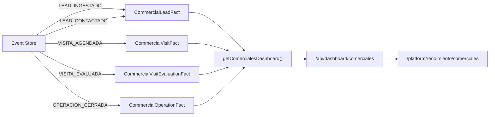

# Dashboard de Rentabilidad por Comercial

> Documento técnico alineado con la implementación real (M10). Contraste contra el documento original `docs-originales/rentabilidad-dashboard.md`.

---

## Análisis de Brechas: Original vs Implementación

### Brecha 1 — "Datos automáticos desde CRM" → parcialmente automático

**Doc original:** "el dashboard se alimenta solo, sin manipulación humana" con datos directos del CRM.

**Realidad técnica:** Los datos se alimentan del **Event Store** en Neon, no directamente del CRM. El `Ingestion Worker` detecta cambios en Inmovilla, emite eventos, y los handlers del consumer materializan **fact tables** (read-model analítico). Limitaciones de la API de Inmovilla:
- No expone "contactos realizados" ni "estado del lead" como campo consultable
- Los leads no son una entidad API nativa — se mapean como Contacto + Demanda
- La facturación es **estimada** (`grossAmountEur × commissionRate`), no real

### Brecha 2 — Capas 3-5 implementadas con datos reales del Event Store

**Doc original:** Describe capas conceptuales sin mecánica técnica.

**Realidad técnica implementada:**

| Capa | Implementación |
|---|---|
| **1 — Captura** | Facts tables: `CommercialLeadFact`, `CommercialVisitFact`, `CommercialVisitEvaluationFact`, `CommercialOperationFact` |
| **2 — Métricas** | SQL raw en `queries.ts`: conversión L→V, V→C, revenue/lead, lost lead rate, avg close days |
| **3 — Dashboard visual** | UI en `/platform/rendimiento/comerciales` (ranking) y `/comerciales/[id]` (detalle + evolución semanal 12 semanas) |
| **4 — Clasificación** | `classify.ts` con 4 perfiles: Top Performer, Productivo Ineficiente, Dependiente Lead Caliente, Bajo Rendimiento |
| **5 — Alertas automáticas** | `alert-scanner.ts`: performance drop (2 semanas), SLA breach (leads, firmas, microsite), team deviation |

### Brecha 3 — Clasificación es matemática con scores normalizados

**Doc original:** Clasificación conceptual sin fórmulas.

**Realidad técnica:** `classifyComercial()` calcula scores para cada perfil usando métricas del comercial vs media del equipo. Cada perfil tiene una función de scoring (ej. `scoreTopPerformer` requiere `conversionLeadToVisit ≥ config.topMinConvLV` Y `conversionVisitToClose ≥ config.topMinConvVC`). Los scores se normalizan y el perfil ganador se asigna con confidence. Configurable vía env vars (`CLASSIFY_MIN_LEADS`, `CLASSIFY_TOP_MIN_CONV_LV`, etc.).

### Brecha 4 — Vista por roles: header simulado, no SSO real

**Doc original:** "cada rol ve solo lo que necesita".

**Realidad técnica:** El control de acceso usa headers simulados en desarrollo (`X-Session-Role`, `X-Session-UserId`). El comercial ve solo su detalle; CEO/jefe ven ranking completo. No hay SSO integrado con Inmovilla — la autenticación es un sistema propio (`lib/auth/`).

---

## Arquitectura Técnica Implementada

### Read-Model Analítico (Facts Tables)

La proyección es **best-effort**: si falla la analítica, no bloquea el flujo principal de negocio.

### KPIs Implementados

| Métrica | Campo SQL | Descripción |
|---|---|---|
| `leadsAssigned` | `COUNT(commercial_lead_facts)` | Leads asignados en rango |
| `leadsContacted` | `COUNT WHERE contactedAt IS NOT NULL` | Leads efectivamente contactados |
| `leadsLostNoFollowUp` | `COUNT WHERE contactedAt IS NULL AND createdAt < cutoff` | Leads perdidos por falta de seguimiento |
| `visits` | `COUNT(commercial_visit_facts)` | Visitas agendadas |
| `closings` | `COUNT(commercial_operation_facts)` | Cierres |
| `grossVolumeEur` | `SUM(grossAmountEur)` | Volumen bruto |
| `estimatedRevenueEur` | `grossVolumeEur × commissionRate` | Revenue estimado |
| `avgCloseDays` | `AVG(daysToClose)` | Días promedio hasta cierre |
| `conversionLeadToVisit` | `visits / leadsAssigned` | Ratio lead→visita |
| `conversionVisitToClose` | `closings / visits` | Ratio visita→cierre |
| `revenuePerLeadAssignedEur` | `estimatedRevenueEur / leadsAssigned` | Revenue por lead |
| `lostLeadRate` | `leadsLost / leadsAssigned` | Tasa de pérdida |

### Clasificación Automática

| Perfil | Criterio (resumido) |
|---|---|
| `top_performer` | Conversión L→V y V→C por encima de umbrales + revenue alto |
| `productivo_ineficiente` | Alta actividad (leads, visitas) pero baja conversión a cierre |
| `dependiente_lead_caliente` | Sesgo de lead scoring alto (P75 score > 1.5× media) + baja conversión en leads medianos |
| `bajo_rendimiento` | Todas las métricas por debajo de la media del equipo |

Persistido en `CommercialClassification` con `profileScores` (JSON) y `metricsSnapshot`.

### Alertas del Dashboard

| Tipo | Severidad | Condición |
|---|---|---|
| `performance_drop` | `warning`/`critical` | Caída de closings o revenue ≥2 semanas consecutivas |
| `sla_breach_lead` | `critical` | Lead sin contacto tras umbral de horas |
| `sla_breach_firma` | `warning` | Firma pendiente pasado SLA |
| `sla_breach_microsite` | `warning` | Validación de microsite expirada |
| `team_deviation` | `warning` | Métrica del comercial >2σ por debajo de media equipo |

Scanner: `alert-scanner.ts` → `DashboardAlert` en BD → `/api/dashboard/alerts`.

### Archivos Clave

| Archivo | Función |
|---|---|
| `lib/dashboard/comercial/queries.ts` | SQL raw para ranking y detalle con serie semanal |
| `lib/dashboard/comercial/facts.ts` | Upsert de facts desde eventos |
| `lib/dashboard/comercial/classify.ts` | Clasificación por perfiles |
| `lib/dashboard/comercial/alert-scanner.ts` | Escáner de alertas |
| `app/api/dashboard/comerciales/route.ts` | GET ranking + clasificación |
| `app/api/dashboard/comercial/[id]/route.ts` | GET detalle comercial |
| `app/api/dashboard/alerts/route.ts` | GET alertas con filtros |
| `app/platform/rendimiento/comerciales/page.tsx` | UI ranking (416 líneas) |
| `app/platform/rendimiento/comerciales/[id]/page.tsx` | UI detalle (379 líneas) |
| `app/platform/rendimiento/alertas/page.tsx` | UI feed de alertas |
