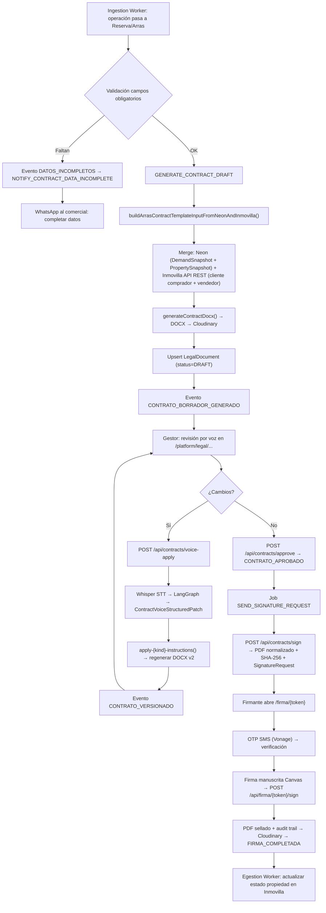

# Smart Closing — Contratos Autorrellenables, Revisión por Voz y Firma Digital

> Documento técnico alineado con la implementación real (M8). Contraste contra el documento original `docs-originales/urus-smart-closing.md`.

---

## Análisis de Brechas: Original vs Implementación

### Brecha 1 — Sin Make/Zapier/Documint: todo es código TypeScript

**Doc original:** Recomienda Make, Zapier, Documint, Plumsail, PDFMonkey, Google Docs.

**Realidad técnica:** Motor de plantillas **programático en TypeScript** usando la librería `docx`. Builders dedicados por tipo de contrato:
- `lib/contracts/docx/builders/arras.ts` — Contrato de arras
- `lib/contracts/docx/builders/senal-compra.ts` — Señal de compra
- `lib/contracts/docx/builders/oferta-firme.ts` — Oferta en firme

Cada builder recibe un `ContractTemplateInput` tipado y genera un `Document` con bloques condicionales, variables y anexos dinámicos.

### Brecha 2 — Firma digital in-house, no DocuSign/Signaturit SaaS

**Doc original:** "DocuSign / Dropbox Sign / Signaturit (muy habitual en España)".

**Realidad técnica:** Sistema de firma electrónica simple **construido in-house**:
- Hash SHA-256 del documento PDF
- Token seguro de enlace (`lib/firma/token.ts`)
- **OTP por SMS** vía Vonage antes de firmar (`lib/firma/otp.ts`, `lib/firma/vonage.ts`)
- Firma manuscrita en lienzo HTML Canvas (`react-signature-canvas`)
- Sellado PDF con pista de auditoría (`lib/firma/pdf-stamp.ts`, `lib/firma/audit-trail.ts`)
- Página pública: `/firma/{token}`
- No depende de ningún SaaS de firma de terceros

### Brecha 3 — Archivado en Cloudinary/Neon, no en Inmovilla

**Doc original:** "se archiva y se actualiza Inmovilla con estados y documentos", "adjuntar en Inmovilla".

**Realidad técnica:** La API REST de Inmovilla (`docs/documentacion-api-rest-inmovilla.md`) **no tiene endpoints de gestión documental** — no permite adjuntar PDFs a propiedades, clientes ni propietarios. Los documentos se almacenan en **Cloudinary** con metadatos en Neon (`LegalDocument`, `SignatureRequest`). El estado de la propiedad sí se actualiza en Inmovilla vía `Egestion Worker` (`PUT /propiedades/` con `estadoficha`).

### Brecha 4 — Control de versiones en Neon, no en Drive/SharePoint

**Doc original:** "Drive/SharePoint + naming estándar".

**Realidad técnica:** Versionado en Neon con evento `CONTRATO_VERSIONADO` y tabla `legal_documents`. Naming estándar generado por `lib/contracts/naming.ts`: `OP-{año}-{id}_{kind}_v{version}.{ext}`. Cada versión tiene diff de cambios (`lib/contracts/versioning/diff-payload.ts`).

### Brecha 5 — STT es OpenAI Whisper, intérprete es LangGraph con Zod

**Doc original:** Menciona "OpenAI STT o Google/Azure" y un LLM genérico para interpretar.

**Realidad técnica:**
- **STT:** OpenAI Whisper API (llamada desde API Route)
- **Intérprete:** `lib/agents/contract-instruction-graph.ts` — grafo LangGraph con structured output Zod (`ContractVoiceStructuredPatch` en `contract-instruction-types.ts`)
- **Aplicación:** funciones específicas por tipo: `apply-arras-instructions.ts`, `apply-senal-instructions.ts`, `apply-oferta-instructions.ts`
- **Regeneración:** `interpretVoiceAndRegenerateDocx()` en `lib/contracts/voice/interpret-and-regenerate.ts`

---

## Arquitectura Técnica Implementada

### Flujo de Datos Completo

### Entidades Prisma

| Modelo | Tabla | Función |
|---|---|---|
| `LegalDocument` | `legal_documents` | Proyección del ciclo contractual (borrador → firmado) |
| `LegalDocumentParty` | `legal_document_parties` | Partes del contrato (comprador, vendedor, agencia) |
| `SignatureRequest` | `signature_requests` | Solicitud de firma con SLA, OTP, token |
| `SignatureOtp` | `signature_otps` | Códigos OTP para verificación SMS |

### Eventos del Ciclo Contractual

| Evento | Trigger |
|---|---|
| `DATOS_INCOMPLETOS` | Faltan campos obligatorios para generar contrato |
| `CONTRATO_BORRADOR_GENERADO` | Borrador v1 creado y subido a Cloudinary |
| `CONTRATO_VERSIONADO` | Gestor aplica cambios por voz → nueva versión |
| `CONTRATO_APROBADO` | Gestor confirma "OK para firma" |
| `FIRMA_ENVIADA` | Solicitud de firma creada con URL |
| `FIRMA_COMPLETADA` | Firmante completa el proceso (OTP + firma) |
| `FIRMA_RECHAZADA` | Firmante declina |
| `FIRMA_RECORDATORIO_ENVIADO` | Recordatorio WhatsApp al firmante |
| `FIRMA_SLA_ESCALADO` | 5 días sin firma → escalado a comercial y gestor |

### SLA de Firma

| Concepto | Valor |
|---|---|
| SLA completa | 5 días naturales |
| Recordatorios | Día +1, +3, +5 |
| Escalado | Tras día +5 → WhatsApp a comercial + gestor |
| Canal recordatorios | WhatsApp Cloud API (plantillas aprobadas Meta) |

### Tests (22 archivos de test)

Incluyen: generación E2E, integración smart-closing, naming, extracción de payload, validación de incompletitud, diff de versiones, aplicación de instrucciones de voz, builders DOCX (arras/señal/oferta), flatten para display, path edit, voice session, reminder scanner, firma completada, sign API, UI send-to-signature.
