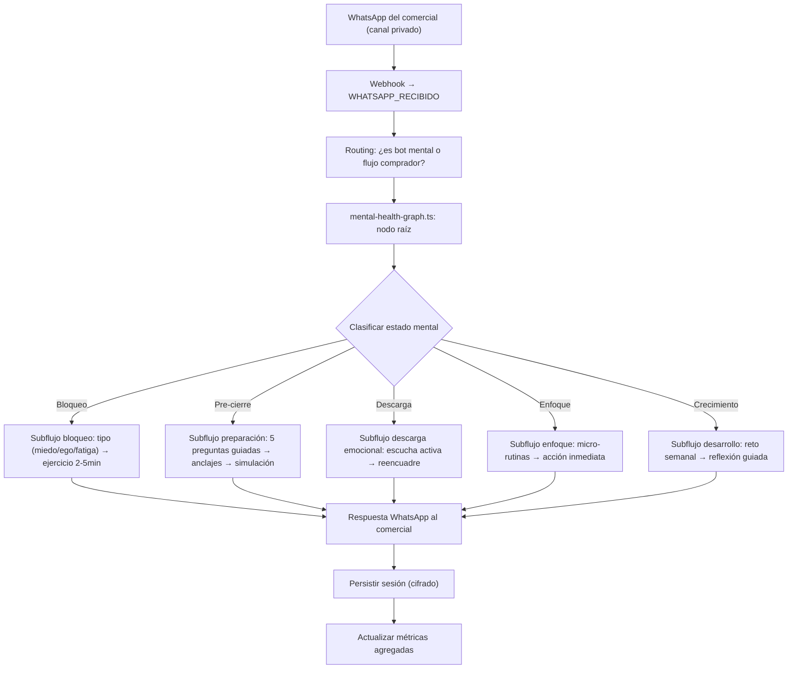

# Sistema de Soporte Mental y Alto Rendimiento para Comerciales (M12)

> Documento técnico alineado con `docs/plan.md` (Sprint 3, Semana 5) y el documento original `docs-originales/soporte-mental.md`. Estado: **planificado, no implementado en código**.

---

## Análisis de Brechas: Original vs Plan vs Implementación

### Estado actual: Código NO existe — roadmap lo planifica en Sprint 3

El plan (`docs/plan.md`) define M12 como módulo del **Sprint 3 (Semanas 5-6)**, con 2 días de implementación (Días 25-26) y dependencias de M4 (WhatsApp Cloud API) y LangGraph. El repositorio actual está en la fase de Sprint 2 (módulos avanzados de negocio). M12 aún no se ha codificado.

### Brecha 1 — Doc original propone herramientas no-code; plan define código puro

**Doc original:** Describe conceptualmente un "bot" sin definir stack técnico.

**Plan (plan.md):** Define explícitamente:
- **Grafo LangGraph** con subflujos de bloqueo, preparación, simulación, descarga, enfoque, crecimiento
- **WhatsApp Business API** como canal privado
- **Integración CRM** contextual (sin invadir): el bot sabe si hay cierres pendientes, si perdió operación, si está en racha
- **Cadencias automáticas** de desarrollo continuo vía WhatsApp

### Brecha 2 — Las 5 capas del doc original están mapeadas 1:1 en el plan

| Capa Original | Plan (Día 25-26) | Estado |
|---|---|---|
| 1 — Bot 24/7 | Grafo LangGraph → WhatsApp canal privado (Día 25 PM) | Pendiente |
| 2 — Diagnóstico mental | Nodo raíz: clasificación estado mental (tipo bloqueo, energía, foco) (Día 25 AM) | Pendiente |
| 3 — Intervención | Subflujos: preparación pre-cierre + bloqueo (Día 25 PM) | Pendiente |
| 4 — Desarrollo continuo | Micro-ejercicios, retos semanales, cadencia WhatsApp (Día 26 AM) | Pendiente |
| 5 — Feedback estratégico | Métricas agregadas sin exponer conversaciones → alertas CEO (Día 26 AM) | Pendiente |

### Brecha 3 — Decisiones técnicas pendientes (confirmadas por el equipo)

| Decisión | Estado |
|---|---|
| Canal WhatsApp: ¿mismo número o separado? | **A definir** — el plan dice "canal privado", la implementación determinará si es mismo WABA con routing o número separado |
| Confidencialidad: cifrado en reposo u otro | **A definir** — candidato: cifrado en reposo (Neon soporta encryption at rest), o cifrado a nivel de columna para las conversaciones |
| Métricas agregadas aceptables para CEO | **A definir** — el plan especifica "uso del sistema, patrones agregados, alertas de riesgo operativo" sin detalle de qué métricas exactas |
| Proactividad basada en datos de rendimiento | **A definir** — el plan menciona "el bot sabe si hoy tiene cierres" pero no define el trigger exacto |

---

## Arquitectura Planificada (según `plan.md` + patrones del repo)

### Grafo LangGraph — Diseño del Día 25

Siguiendo el patrón de `nlu-graph.ts` y `ceo-diagnostic-graph.ts`:



### Modelo de Datos Prisma (inferido, siguiendo patrones)

```prisma
model MentalHealthSession {
  id              String   @id @default(cuid())
  comercialId     String
  waId            String
  flujo           String   // "bloqueo" | "preparacion" | "simulacion" | "descarga" | "enfoque" | "crecimiento"
  subtipoBloqueo  String?  // "miedo" | "inseguridad" | "presion" | "ego" | "fatiga"
  nivelEnergia    Int?     // 1-5
  focoDispercion  String?  // "centrado" | "disperso" | "erratico"
  ejercicioOfrecido  String?
  ejercicioCompletado Boolean @default(false)
  turnCount       Int      @default(0)
  summary         String   @default("")  // resumen de la conversación (cifrado candidato)
  createdAt       DateTime @default(now())
  updatedAt       DateTime @updatedAt

  @@index([comercialId, createdAt])
  @@map("mental_health_sessions")
}

model MentalHealthAlert {
  id              String    @id @default(cuid())
  comercialId     String
  comercialNombre String    @default("")
  type            String    // "burnout_risk" | "energy_drop" | "recurrent_block" | "overload"
  severity        String    // "low" | "medium" | "high"
  message         String
  details         Json      @default("{}")
  notifiedAt      DateTime?
  resolvedAt      DateTime?
  createdAt       DateTime  @default(now())

  @@index([comercialId, createdAt])
  @@index([type, severity])
  @@map("mental_health_alerts")
}
```

### Eventos del Event Store (inferidos)

| Evento | Descripción |
|---|---|
| `MENTAL_SESION_INICIADA` | Comercial inicia conversación con el bot |
| `MENTAL_DIAGNOSTICO_GENERADO` | Clasificación del estado mental completada |
| `MENTAL_EJERCICIO_COMPLETADO` | Comercial completa ejercicio propuesto |
| `MENTAL_ALERTA_GENERADA` | Detección de riesgo operativo por patrones |

### Integración con Dashboard CEO (Capa 3)

El plan define que la Capa 3 del Gobierno CEO consume datos agregados del bot mental. Con el modelo propuesto:

```typescript
// lib/dashboard/ceo/mental-health-queries.ts (inferido)
async function getMentalHealthOverview(): Promise<{
  usageLast30Days: number;           // sesiones totales (sin detalle)
  comercialesActivos: number;        // comerciales que usaron el bot
  bloqueosRecurrentes: number;       // alertas de tipo "recurrent_block"
  riesgoBurnout: number;             // alertas de tipo "burnout_risk"
  energiaMediaEquipo: number;        // media de nivelEnergia (agregado)
  patronesPorZona: Array<{           // agrupado por ciudad
    ciudad: string;
    sesiones: number;
    alertas: number;
  }>;
}>;
```

Esto alimentaría `/platform/bi/capital-humano` (actualmente con datos mock).

### Cadencias de Desarrollo Continuo (Día 26)

Siguiendo el patrón de cadencias post-venta:

| Programa | Frecuencia | Contenido |
|---|---|---|
| Mentalidad alto ticket | Semanal | Micro-ejercicio + reflexión guiada |
| Gestión del rechazo | Semanal | Simulación de objeción + reencuadre |
| Identidad de closer | Quincenal | Autoevaluación + reto |
| Disciplina emocional | Semanal | Ejercicio de enfoque 2min |
| Desapego del resultado | Quincenal | Reflexión guiada |

Jobs `SEND_MENTAL_DEVELOPMENT_MESSAGE` con `availableAt` configurado por programa, usando cadencia scanner similar a `cadence-scanner.ts` de post-venta.

### Archivos a Crear (siguiendo convenciones del repo)

| Archivo | Función |
|---|---|
| `lib/agents/mental-health-graph.ts` | Grafo LangGraph principal con subflujos |
| `lib/agents/mental-health-types.ts` | Tipos Zod para structured output |
| `lib/mental-health/session.ts` | Gestión de sesiones |
| `lib/mental-health/alert-scanner.ts` | Detección de patrones → alertas |
| `lib/mental-health/development-cadence.ts` | Cadencias de desarrollo continuo |
| `lib/workers/consumer/mental-health-handler.ts` | Consumer de mensajes del bot |
| `lib/dashboard/ceo/mental-health-queries.ts` | Queries agregadas para CEO Capa 3 |
| `app/api/mental-health/...` | Rutas API |

### Confidencialidad — Opciones Técnicas (a definir)

| Opción | Pros | Contras |
|---|---|---|
| **Cifrado en reposo (Neon default)** | Sin cambio de código, protege ante acceso físico a disco | No protege ante queries SQL con credenciales válidas |
| **Cifrado a nivel de columna** | Protege `summary` y contenido conversacional incluso en queries | Requiere encrypt/decrypt en aplicación, complica búsquedas |
| **Base de datos separada** | Aislamiento total de datos sensibles | Mayor complejidad operativa, otro connection string |
| **Row-level security + roles** | Granular, nativo PostgreSQL | Complejo de mantener con Prisma |

La recomendación inicial (alineada con el patrón del repo de simplicidad operativa) sería **cifrado en reposo (ya disponible en Neon) + cifrado a nivel de columna para `summary`** usando una clave en env var (`MENTAL_HEALTH_ENCRYPTION_KEY`). Las métricas agregadas (`nivelEnergia`, `flujo`, `subtipoBloqueo`) no se cifran para permitir queries analíticas.

---

## Cronograma (del plan)

| Día | Foco | Entregables |
|---|---|---|
| **25 (Lun S5)** | Grafo LangGraph + subflujos + conexión WhatsApp | Grafo documentado, grafo base, preparación pre-cierre, bloqueo, WhatsApp conectado |
| **26 (Mar S5)** | Desarrollo continuo + feedback CEO + contexto CRM | Cadencias, reporting agregado, integración CRM contextual |
| **30 (Sáb S5)** | Demo | Bot en vivo: "estoy bloqueado" → respuesta personalizada |

**Branch:** `feat/M12-bot-mental`
**Dependencias:** M4 (WhatsApp Cloud API ✅), LangGraph (✅ — ya usado en pricing, NLU, CEO, contratos)
