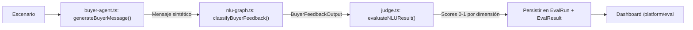

# Suite de Evaluación NLU (AI-to-AI)

> Documento técnico de un sistema implementado sin documento original en `docs-originales/`. Referencia técnica: `docs/nlu-eval-suite.md`.

---

## Propósito

Validar y medir la calidad del agente NLU (`classifyBuyerFeedback`) **sin depender de pruebas manuales**. El sistema usa un patrón **AI-to-AI**: un agente sintético simula al comprador, el NLU real procesa el mensaje, y un juez LLM evalúa si la salida es correcta.

---

## Arquitectura

### Pipeline de Evaluación



### Componentes

| Componente | Archivo | Función |
|---|---|---|
| **Escenarios** | `lib/eval/scenarios/*.ts` | Casos de prueba con expectativas |
| **Personas** | `lib/eval/personas.ts` | Perfiles sintéticos de comprador (7 personas) |
| **Agente comprador** | `lib/eval/buyer-agent.ts` | LLM que genera mensaje "realista" dado escenario + persona |
| **NLU bajo test** | `lib/agents/nlu-graph.ts` | `classifyBuyerFeedback()` — el sistema real |
| **Juez** | `lib/eval/judge.ts` | LLM que puntúa la salida NLU |
| **Orquestador** | `lib/eval/orchestrator.ts` | Ejecuta N escenarios y resume resultados |

### Categorías de Escenarios

| Categoría | Archivo | Qué evalúa |
|---|---|---|
| `property-resolution` | `property-resolution.ts` | Resolución correcta de propiedad mencionada |
| `sentiment-accuracy` | `sentiment-accuracy.ts` | ME_INTERESA vs NO_ME_ENCAJA correcto |
| `variable-extraction` | `variable-extraction.ts` | Extracción de precio, zona, metros, extras |
| `wants-more` | `wants-more.ts` | Detección de "quiero más opciones" |
| `ambiguity` | `ambiguity.ts` | Manejo de referencias ambiguas |
| `multi-turn` | `multi-turn.ts` | Coherencia en conversaciones multi-turno |

### Dimensiones de Evaluación (Juez)

| Dimensión | Score 0-1 | Descripción |
|---|---|---|
| `propertyResolutionScore` | 0-1 | ¿Identificó la propiedad correcta? |
| `sentimentAccuracyScore` | 0-1 | ¿Clasificó correctamente el sentimiento? |
| `variableExtractionScore` | 0-1 | ¿Extrajo las variables esperadas? |
| `intentionScore` | 0-1 | ¿Intención general correcta? |
| `wantsMoreScore` | 0-1 | ¿Detectó correctamente si quiere más opciones? |
| `hallucinationPenalty` | 0-1 | Penalización por fabricar datos |
| `overallScore` | 0-1 | Promedio ponderado |

### Entidades Prisma

| Modelo | Tabla | Función |
|---|---|---|
| `EvalRun` | `eval_runs` | Ejecución de un batch de evaluación |
| `EvalResult` | `eval_results` | Resultado por escenario con scores |

### Ejecución

```bash
npm run eval:nlu    # Ejecuta todos los escenarios
```

Script: `scripts/run-nlu-eval.ts` → `runEvaluation()` con opciones:
- Filtros por categoría o persona
- Modelo y temperatura configurables
- Persistencia en Neon
- Resumen con scores promedio por categoría

### Dashboard UI (`/platform/eval`)

Interfaz visual con:
- `EvalResultsTable` — tabla de resultados por escenario
- `EvalKpiCard` — KPIs de scores/latencia
- `EvalCategoryChart` — gráfico de barras por categoría

### Archivos

| Archivo | Líneas |
|---|---|
| `lib/eval/orchestrator.ts` | 248 |
| `lib/eval/buyer-agent.ts` | 69 |
| `lib/eval/judge.ts` | 170 |
| `lib/eval/personas.ts` | 97 |
| `lib/eval/types.ts` | 109 |
| `lib/eval/scenarios/index.ts` | 27 |
| `lib/eval/scenarios/mock-properties.ts` | 55 |
| `lib/eval/scenarios/property-resolution.ts` | 83 |
| `lib/eval/scenarios/sentiment-accuracy.ts` | 76 |
| `lib/eval/scenarios/variable-extraction.ts` | 72 |
| `lib/eval/scenarios/wants-more.ts` | 60 |
| `lib/eval/scenarios/ambiguity.ts` | 61 |
| `lib/eval/scenarios/multi-turn.ts` | 59 |
