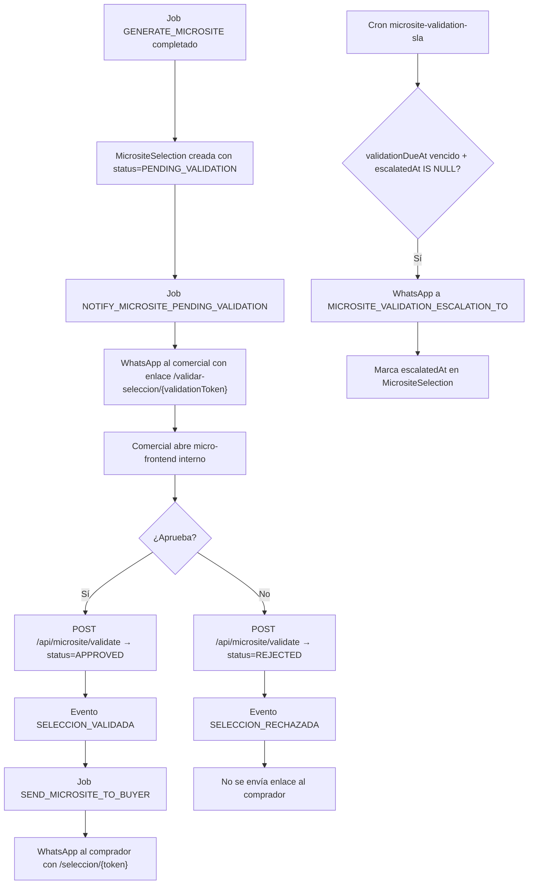

# Flujo de Validación del Comercial (Pre-envío de Microsite)

> Documento técnico del Módulo 7 del README. Flujo implementado que asegura que el comercial revisa y aprueba la selección de propiedades antes de enviarla al comprador.

---

## Propósito

Evitar que el comprador reciba propiedades inadecuadas. El comercial tiene la última palabra antes del envío, con un SLA de 2 horas para no bloquear el flujo.

---

## Flujo Técnico

### Tokens Duales

| Token | Destinatario | Ruta | Función |
|---|---|---|---|
| `token` | Comprador | `/seleccion/{token}` | Ver propiedades curadas |
| `validationToken` | Comercial | `/validar-seleccion/{validationToken}` | Aprobar/rechazar selección |

Son tokens independientes generados al crear la selección. El comprador **nunca** recibe el enlace hasta que `status = APPROVED`.

### SLA

| Parámetro | Valor |
|---|---|
| Deadline | `validationDueAt = createdAt + 2h` (`MICROSITE_VALIDATION_SLA_MS`) |
| Escalado | Cron `POST /api/cron/microsite-validation-sla` con `CRON_SECRET` |
| Destino escalado | Env var `MICROSITE_VALIDATION_ESCALATION_TO` (teléfono WhatsApp) |

### Resolución del Teléfono del Comprador

Para enviar el microsite al comprador, se necesita su teléfono. Se resuelve con `resolveBuyerPhoneForDemand()`:
1. `demands_current.telefono` (campo poblado por ingesta)
2. `demand_snapshots.raw` (datos originales de Inmovilla con posibles campos de teléfono)

El teléfono se normaliza a formato E.164 y se persiste en `MicrositeSelection.buyerPhone`.

### Variables de Entorno

| Variable | Función |
|---|---|
| `NEXT_PUBLIC_APP_URL` | URL base para enlaces absolutos en WhatsApp |
| `MICROSITE_VALIDATION_ESCALATION_TO` | Teléfono para escalado de SLA |
| `CRON_SECRET` | Autenticación del cron-job |
