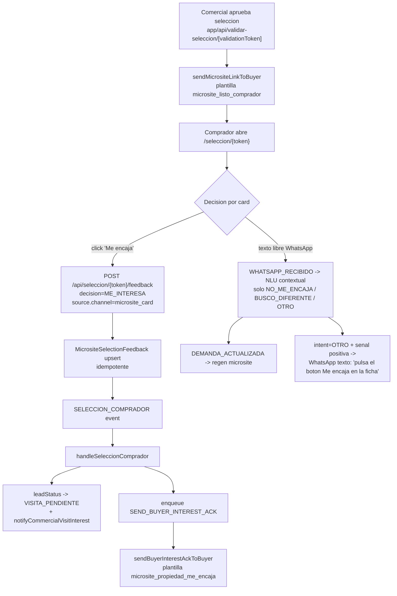

# Flujo "Me encaja" en el micrositio (M6)

Este documento describe el canal canonico mediante el cual el comprador
expresa interes en una propiedad concreta del micrositio: el boton **"Me
encaja"** que aparece en cada ficha. Sustituye a la inferencia previa por
NLU sobre WhatsApp (que ya no emite `ME_ENCAJA` / `ME_INTERESA`).

## Diagrama



## Reglas cardinales

1. **El boton "Me encaja" en la ficha del micrositio es el unico canal
   canonico para registrar interes positivo.** No se infiere desde texto
   libre.
2. **Un click = exactamente un acuse al comprador y un paquete al
   comercial.** Reintentos, doble click y refresco no duplican mensajes.
3. **Idempotencia hard**: el segundo click sobre la misma propiedad
   recibe HTTP 409 y no genera nuevo evento ni job. El badge "Ya elegida"
   persiste tras recarga gracias a `MicrositeSelectionFeedback`.
4. **Flujo `MATCH_GENERADO` de cartera interna**
   (`lib/matching/send-match-whatsapp.ts`) no se ve afectado: usa su
   propia plantilla `match` y enlace a `/matching/cruces`.

## Plantillas de WhatsApp (Meta)

| Plantilla | Categoria | Lenguaje | Variables del cuerpo |
|-----------|-----------|----------|----------------------|
| `microsite_listo_comprador` | UTILITY | `es_ES` | `{{1}}` = nombre comprador, `{{2}}` = URL del micrositio |
| `microsite_propiedad_me_encaja` | UTILITY | `es_ES` | `{{1}}` = nombre comprador, `{{2}}` = titulo de la propiedad |

Scripts de creacion:

```bash
npm run whatsapp:template:create:microsite-listo-comprador
npm run whatsapp:template:create:microsite-propiedad-me-encaja
```

Tras lanzarlos hay que esperar a que Meta apruebe la plantilla. Mientras
tanto el resto del refactor puede integrarse y testearse con
`DEMO_UI=true` (sin envio real a Meta).

## Componentes

| Archivo | Funcion |
|---------|---------|
| `components/seleccion/property-card.tsx` | Tarjeta de propiedad con boton "Me encaja" (Client Component) |
| `components/seleccion/me-encaja-button.tsx` | Boton reutilizable en la pagina de detalle |
| `app/seleccion/[token]/page.tsx` | Carga `alreadyInterestedIds` (set de `propertyId` con `ME_INTERESA`) desde `MicrositeSelectionFeedback` y lo pasa a cada `PropertyCard` |
| `app/seleccion/[token]/propiedad/[propertyId]/page.tsx` | Carga el flag `alreadyInterested` para la propiedad y monta `MeEncajaButton` junto al precio |
| `app/api/seleccion/[token]/feedback/route.ts` | Endpoint POST que emite `SELECCION_COMPRADOR` con `source.channel="microsite_card"` y devuelve 409 si ya existe `ME_INTERESA` |
| `lib/workers/consumer/seleccion-comprador-handler.ts` | Tras `notifyCommercialVisitInterest`, encola `SEND_BUYER_INTEREST_ACK` cuando `decision === "ME_INTERESA"` y `channel === "microsite_card"` |
| `lib/workers/consumer/buyer-interest-ack-handler.ts` | Handler de `SEND_BUYER_INTEREST_ACK`: carga `MicrositeSelection`, dedup contra `WHATSAPP_ENVIADO`+`kind=buyer_interest_ack`, envia la plantilla via `sendBuyerInterestAckToBuyer` |
| `lib/whatsapp/send.ts` | `sendMicrositeLinkToBuyer` (plantilla nueva) y `sendBuyerInterestAckToBuyer` (acuse) |

## Idempotencia (capas)

| Capa | Mecanismo |
|------|-----------|
| Frontend | El boton conmuta a estado `recorded` y se sustituye por un badge "Ya elegida" tras la respuesta. El estado inicial viene del server (`alreadyInterested` precomputado), evitando parpadeos. |
| API HTTP | `MicrositeSelectionFeedback` con clave compuesta `(selectionId, propertyId)`. Si ya existe `ME_INTERESA`, la API devuelve **HTTP 409** y no emite `SELECCION_COMPRADOR` nuevo. |
| Cola de jobs | `idempotencyKey = send_buyer_interest_ack:{event.id}`: si el mismo `SELECCION_COMPRADOR` se reprocesa, el job se desduplica. |
| Handler del job | Antes de enviar la plantilla, `handleSendBuyerInterestAck` busca un `WHATSAPP_ENVIADO` con `kind="buyer_interest_ack"` + mismo `selectionId+propertyId`. Si existe, se saltan los reintentos. |

## Comportamiento del NLU ante interes positivo en texto libre

`lib/agents/nlu-graph.ts` y `lib/agents/types.ts` han eliminado
`ME_ENCAJA` del tipo `IntentionWhatsApp` y `ME_INTERESA` del tipo
`PropertyFeedbackItem.sentiment`. Cuando el comprador escribe algo como
"me encaja la del centro" o "me gusta la segunda":

- El NLU devuelve `intention=OTRO`, `propertyFeedback=[]` y
  `reasoning` explicando que debe usar el boton.
- `whatsapp-nlu-handler.ts` detecta la senal positiva con
  `containsPositiveInterestSignal` y, si no se ha mandado el mismo
  recordatorio en las ultimas 12 horas, responde por WhatsApp pidiendo
  al comprador que pulse el boton "Me encaja" en la ficha de la
  propiedad correspondiente.

Esto evita que un mensaje ambiguo genere un acuse falso o un paquete de
visita al comercial sin trazabilidad clara.

## Variables de entorno

```env
WHATSAPP_TEMPLATE_MICROSITE_LISTO_COMPRADOR=microsite_listo_comprador
WHATSAPP_TEMPLATE_MICROSITE_PROPIEDAD_ME_ENCAJA=microsite_propiedad_me_encaja
```

Ambos valores tienen default razonable en `lib/whatsapp/send.ts`; las
variables existen para poder override sin tocar codigo (por ejemplo,
para apuntar a una plantilla de pruebas en staging).

## Esquema Prisma / migracion

El refactor anyade el valor `SEND_BUYER_INTEREST_ACK` al enum `JobType`:

- `prisma/schema.prisma`: nueva entrada en `enum JobType`.
- `prisma/migrations/20260511195000_add_send_buyer_interest_ack_job_type/migration.sql`:
  `ALTER TYPE "JobType" ADD VALUE 'SEND_BUYER_INTEREST_ACK';` (con guard
  para entornos donde ya exista).

## Tests

| Test | Foco |
|------|------|
| `lib/workers/consumer/__tests__/microsite-card-me-encaja-flow.test.ts` | E2E del boton: POST a la API -> SELECCION_COMPRADOR -> SEND_BUYER_INTEREST_ACK encolado -> notifyCommercialVisitInterest invocado -> doble click responde 409 sin duplicar eventos ni jobs |
| `lib/workers/consumer/__tests__/microsite-flow-e2e.test.ts` | Escenario 4 reescrito para usar `source.channel="microsite_card"`; escenario 6 con `intention=OTRO` (ya no `ME_ENCAJA`) |
| `lib/workers/consumer/__tests__/feedback-loop-e2e.test.ts` | Contrato NLU actualizado: solo `NO_ME_ENCAJA` con `sentiment=NO_ME_ENCAJA` |
| `lib/eval/scenarios/*.ts` | Scenarios actualizados: cuando el comprador expresa interes positivo, el expected `intention` es `OTRO` y `propertyFeedback=[]` |

```bash
# Tests E2E (requieren DATABASE_URL apuntando a Neon)
npm test -- microsite-card-me-encaja-flow
npm test -- microsite-flow-e2e
npm test -- feedback-loop-e2e
```

## Lo que NO cambia con este refactor

- `lib/matching/send-match-whatsapp.ts` (match interno de cartera): sigue
  usando plantilla `match` y enlace a `/matching/cruces`.
- `notifyCommercialVisitInterest`: ya cumplia los requisitos y se reutiliza
  tal cual.
- Egestion a Inmovilla: este refactor es 100% Urus.

## Referencias

- `docs/microsite-feedback-loop.md`: vista general del bucle de feedback.
- `docs/guia-comerciales-microsite.md`: perspectiva del comercial.
- `docs/plan.md`: posicionamiento del refactor en la roadmap.
