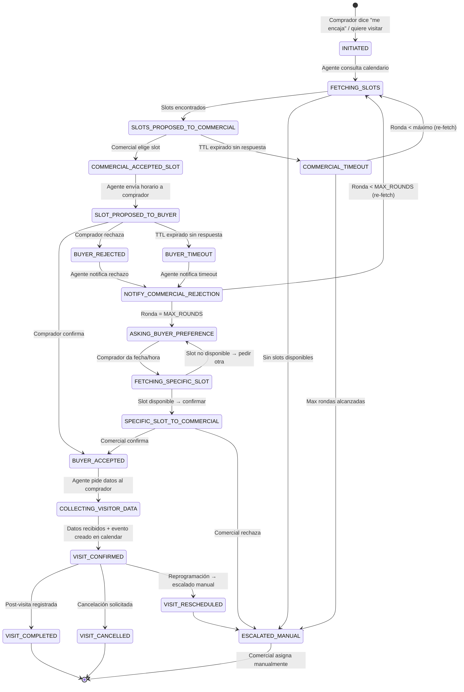
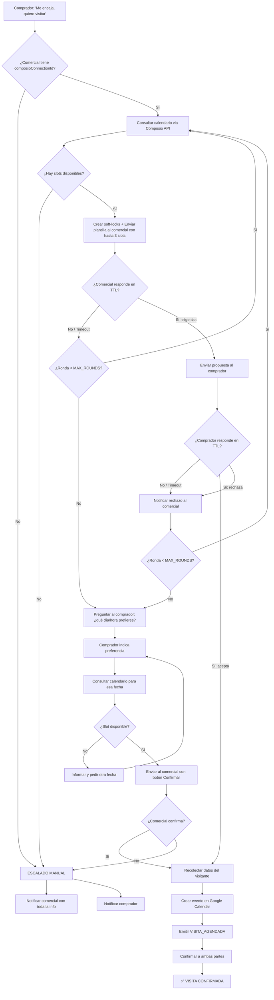

# Sistema de Agendamiento de Visitas — Diseño Detallado

> **Versión:** 1.0
> **Fecha:** Abril 2026
> **Módulo:** M4 — Visitas (rediseño completo)

---

## Tabla de Contenidos

1. [Resumen Ejecutivo](#resumen-ejecutivo)
2. [Actores y Canales](#actores-y-canales)
3. [State Machine — Ciclo de Vida de una Visita](#state-machine--ciclo-de-vida-de-una-visita)
4. [Flujo Principal de Agendamiento](#flujo-principal-de-agendamiento)
5. [Modelo de Datos](#modelo-de-datos)
6. [Composio Multi-Tenant — Onboarding y Calendario](#composio-multi-tenant--onboarding-y-calendario)
7. [Disponibilidad Efectiva — Reglas de Negocio](#disponibilidad-efectiva--reglas-de-negocio)
8. [Concurrencia — Locking y Reserva Temporal](#concurrencia--locking-y-reserva-temporal)
9. [Rondas de Negociación con TTL](#rondas-de-negociación-con-ttl)
10. [Escalado a Asignación Manual](#escalado-a-asignación-manual)
11. [Propiedad como Recurso con Capacidad Limitada](#propiedad-como-recurso-con-capacidad-limitada)
12. [Cancelación y Reprogramación](#cancelación-y-reprogramación)
13. [Estrategia Composio — API Directa vs Agente IA](#estrategia-composio--api-directa-vs-agente-ia)
14. [Plantillas WhatsApp](#plantillas-whatsapp)
15. [Eventos y Jobs](#eventos-y-jobs)
16. [Diagrama de Flujo End-to-End](#diagrama-de-flujo-end-to-end)
17. [Decisiones de Diseño Propuestas](#decisiones-de-diseño-propuestas)

---

## Resumen Ejecutivo

El sistema de agendamiento de visitas se rediseña como un flujo 100% WhatsApp con tres actores: **Comprador**, **Agente LangGraph** (orquestador) y **Comercial**. Elimina los micro-frontends de agenda y post-visita como punto de entrada, delegando toda la interacción a WhatsApp con el agente como mediador inteligente.

El agente consulta el calendario del comercial asignado a la propiedad vía Composio (con `ConnectionId` por comercial), encuentra slots disponibles aplicando reglas de negocio (horario laboral español, buffer de desplazamiento, capacidad de la propiedad), y orquesta una negociación acotada entre comercial y comprador hasta lograr un acuerdo o escalar a asignación manual.

### Cambios fundamentales respecto al sistema anterior

| Aspecto | Antes | Ahora |
|---|---|---|
| Canal de agenda | Micro-frontend web | 100% WhatsApp |
| Interacción | Comprador ↔ Formulario | Comprador ↔ Agente ↔ Comercial |
| Calendario | Un solo `COMPOSIO_USER_ID` global | `ConnectionId` por comercial en DB |
| Disponibilidad | Slot libre en calendar = disponible | Horario laboral + buffer + propiedad |
| Negociación | No existía | Bucle acotado con TTL y escalado |
| Concurrencia | Sin control | Soft-lock con TTL por slot |
| Propiedad | Sin modelar como recurso | Capacidad de visitas simultáneas |

---

## Actores y Canales

```
┌──────────────┐      WhatsApp       ┌──────────────────┐      WhatsApp       ┌──────────────┐
│  COMPRADOR   │ ◄──────────────────► │  AGENTE LANGGRAPH │ ◄──────────────────► │  COMERCIAL   │
│  (visitante) │                      │  (orquestador)    │                      │  (asignado)  │
└──────────────┘                      └──────────────────┘                      └──────────────┘
                                              │
                                    ┌─────────┼─────────┐
                                    ▼         ▼         ▼
                              Google Cal   Neon DB   Composio
                              (lectura/    (estado,  (OAuth,
                               escritura)  locks)    tokens)
```

**Comprador:** Interactúa exclusivamente por WhatsApp. Recibe propuestas de horario, confirma o rechaza, y al final proporciona sus datos para la visita.

**Agente LangGraph:** Nodo central. Consulta calendarios, presenta opciones, interpreta respuestas, gestiona estado, aplica reglas de negocio, y escala cuando corresponde.

**Comercial:** Recibe mensajes de plantilla con datos de la visita propuesta y selecciona horarios mediante botones interactivos de WhatsApp. Solo el comercial asignado a la propiedad recibe la solicitud.

---

## State Machine — Ciclo de Vida de una Visita

Cada solicitud de visita se modela como una máquina de estados explícita persistida en `VisitSchedulingSession` (Neon).



### Estados y responsabilidades

| Estado | Quién actúa | Acción |
|---|---|---|
| `INITIATED` | Sistema | Se crea la sesión, se identifica comercial asignado |
| `FETCHING_SLOTS` | Agente | Consulta Composio API → calendario del comercial + reglas de negocio |
| `SLOTS_PROPOSED_TO_COMMERCIAL` | Comercial | Recibe template con slots + datos propiedad/comprador, elige uno |
| `COMMERCIAL_ACCEPTED_SLOT` | Agente | Registra selección, libera locks de los demás slots |
| `SLOT_PROPOSED_TO_BUYER` | Comprador | Recibe horario propuesto, confirma o rechaza |
| `BUYER_ACCEPTED` | Agente | Transita a recolección de datos |
| `BUYER_REJECTED` | Agente | Incrementa ronda, notifica al comercial |
| `ASKING_BUYER_PREFERENCE` | Comprador | Tras agotar rondas automáticas, dice qué día/hora le va bien |
| `FETCHING_SPECIFIC_SLOT` | Agente | Valida si ese slot está libre en el calendario |
| `SPECIFIC_SLOT_TO_COMMERCIAL` | Comercial | Recibe botón de confirmar/rechazar para la fecha del comprador |
| `COLLECTING_VISITOR_DATA` | Comprador | Proporciona nombre, teléfono de contacto, nº personas |
| `VISIT_CONFIRMED` | Sistema | Crea evento en Google Calendar vía Composio, emite evento en Neon |
| `ESCALATED_MANUAL` | Comercial | Recibe toda la información y asigna manualmente |

---

## Flujo Principal de Agendamiento

### Fase 1 — Activación (Comprador → Agente)

1. El comprador responde "me encaja" (o similar) a una propuesta de propiedad.
2. El NLU de LangGraph clasifica la intención como `QUIERE_VISITAR`.
3. El agente identifica:
   - **Propiedad** (del contexto de la conversación / `WhatsAppBuyerSession`).
   - **Comercial asignado** (de `PropertyCurrent.comercialAsignado` o tabla de routing).
   - **ConnectionId de Composio** (de `Comercial.composioConnectionId`).
4. Se crea `VisitSchedulingSession` en estado `INITIATED`.
5. Si el comercial no tiene `composioConnectionId` → estado `ESCALATED_MANUAL` inmediato con notificación al comercial de que debe conectar su calendario.

### Fase 2 — Búsqueda de Disponibilidad (Agente → Composio)

1. El agente consulta el calendario del comercial usando la **API de Composio directamente** (sin agente LLM, llamada determinista).
2. Parámetros de la consulta:
   - **Rango:** próximos 5 días laborables.
   - **Horario laboral:** lunes a sábado, 09:00–14:00 y 16:00–20:00 (Europe/Madrid).
   - **Duración del slot:** 1 hora.
   - **Buffer entre visitas:** 30 minutos.
3. Filtra slots ocupados y aplica:
   - **Soft-locks** activos (de otras negociaciones en curso).
   - **Visitas ya confirmadas** para la misma propiedad (capacidad máxima de la propiedad).
4. Si hay ≥1 slot disponible → selecciona hasta 3 mejores candidatos → transita a `SLOTS_PROPOSED_TO_COMMERCIAL`.
5. Si no hay slots → `ESCALATED_MANUAL` con contexto al comercial y al comprador.

### Fase 3 — Propuesta al Comercial (Agente → Comercial)

1. Envía **mensaje de plantilla** al comercial con:
   - Nombre y teléfono del comprador interesado.
   - Referencia y dirección de la propiedad.
   - Precio y características principales.
   - Hasta 3 opciones de horario con botones interactivos.
2. Se crean **soft-locks** (TTL = 2 horas) para los slots propuestos.
3. Se inicia **TTL de respuesta** del comercial: 2 horas.
4. Si el comercial no responde en el TTL:
   - Se liberan los soft-locks.
   - Si quedan rondas → re-fetch y nueva propuesta.
   - Si no quedan rondas → `ESCALATED_MANUAL`.

### Fase 4 — Propuesta al Comprador (Agente → Comprador)

1. Comercial selecciona un slot → agente envía mensaje al comprador:
   - "Tu visita a [propiedad] está propuesta para el [día] de [hora_inicio] a [hora_fin]. ¿Te viene bien?"
   - Botones: **Sí, me va bien** / **No, no puedo**
2. Se mantiene el soft-lock del slot aceptado por el comercial. Se liberan los otros.
3. **TTL de respuesta** del comprador: 4 horas.

### Fase 5a — Comprador Acepta → Recolección de Datos

1. El agente pide al comprador:
   - Nombre completo (si no está en sesión).
   - Teléfono de contacto para el día de la visita.
   - Número de personas que asistirán (opcional).
2. Con los datos, el agente:
   - Crea el evento en Google Calendar del comercial vía Composio API.
   - Emite `VISITA_AGENDADA` en Neon.
   - Confirma a ambas partes con mensaje de resumen.

### Fase 5b — Comprador Rechaza → Nueva Ronda

1. Se libera el soft-lock del slot.
2. Se incrementa el contador de ronda.
3. Se notifica al comercial: "El comprador [nombre] no puede el [fecha/hora]. Selecciona otro horario."
4. Se re-consulta el calendario (los slots anteriores pueden haber cambiado) → Fase 2.

### Fase 6 — Rondas Agotadas → Pregunta Explícita al Comprador

Tras `MAX_ROUNDS` (3) rondas sin acuerdo:

1. El agente pregunta explícitamente al comprador: "¿Qué día y horario te vendría mejor para visitar la propiedad?"
2. El comprador responde con fecha/hora (texto libre, NLU extrae la fecha).
3. El agente consulta el calendario para ese slot específico:
   - **Disponible:** envía al comercial un mensaje con la fecha solicitada por el comprador + botón **Confirmar**.
   - **No disponible:** informa al comprador y pide otra fecha.
4. Si el comercial confirma → Fase 5a (recolección de datos).
5. Si el comercial rechaza → `ESCALATED_MANUAL` inmediato.

### Fase 7 — Escalado Manual

Cuando se llega a `ESCALATED_MANUAL`:

1. **Al comercial:** mensaje con toda la información recopilada (comprador, propiedad, horarios intentados, preferencia del comprador si la dio) para que asigne manualmente.
2. **Al comprador:** "No hemos podido encontrar un horario automáticamente. Tu comercial [nombre] se pondrá en contacto contigo directamente para agendar la visita."
3. El comercial puede usar los micro-frontends existentes (`/platform/agenda/[demandId]`) para crear la visita manualmente una vez acuerden por su cuenta.

---

## Modelo de Datos

### Nuevas entidades

```prisma
enum VisitSessionState {
  INITIATED
  FETCHING_SLOTS
  SLOTS_PROPOSED_TO_COMMERCIAL
  COMMERCIAL_ACCEPTED_SLOT
  SLOT_PROPOSED_TO_BUYER
  BUYER_ACCEPTED
  BUYER_REJECTED
  ASKING_BUYER_PREFERENCE
  FETCHING_SPECIFIC_SLOT
  SPECIFIC_SLOT_TO_COMMERCIAL
  COLLECTING_VISITOR_DATA
  VISIT_CONFIRMED
  VISIT_COMPLETED
  VISIT_CANCELLED
  VISIT_RESCHEDULED
  ESCALATED_MANUAL
}

model VisitSchedulingSession {
  id                  String            @id @default(cuid())
  demandId            String
  propertyCode        String
  comercialId         String
  buyerWaId           String
  comercialWaId       String

  state               VisitSessionState @default(INITIATED)
  currentRound        Int               @default(0)
  maxRounds           Int               @default(3)

  // Slot aceptado por ambas partes (null hasta confirmación)
  confirmedSlotStart  DateTime?
  confirmedSlotEnd    DateTime?

  // Datos del visitante (recolectados al final)
  visitorName         String?
  visitorPhone        String?
  visitorCount        Int?

  // Resultado
  calendarEventId     String?
  calendarLink        String?
  escalationReason    String?

  // Metadatos de la última propuesta
  lastProposedSlots   Json?
  lastCommercialMsgId String?
  lastBuyerMsgId      String?
  buyerPreferredDate  String?

  // TTLs y timestamps
  currentStepDeadline DateTime?
  createdAt           DateTime          @default(now())
  updatedAt           DateTime          @updatedAt
  completedAt         DateTime?

  @@index([demandId])
  @@index([buyerWaId, state])
  @@index([comercialWaId, state])
  @@index([propertyCode, state])
  @@map("visit_scheduling_sessions")
}
```

### Soft-lock de slots

```prisma
model VisitSlotLock {
  id            String   @id @default(cuid())
  comercialId   String
  propertyCode  String?
  slotStart     DateTime
  slotEnd       DateTime
  sessionId     String
  expiresAt     DateTime
  released      Boolean  @default(false)
  createdAt     DateTime @default(now())

  @@unique([comercialId, slotStart, slotEnd, released])
  @@index([comercialId, expiresAt])
  @@index([propertyCode, slotStart, slotEnd])
  @@map("visit_slot_locks")
}
```

### Visitas confirmadas por propiedad (recurso limitado)

```prisma
model PropertyVisitSlot {
  id            String   @id @default(cuid())
  propertyCode  String
  slotStart     DateTime
  slotEnd       DateTime
  sessionId     String
  comercialId   String
  cancelled     Boolean  @default(false)
  createdAt     DateTime @default(now())

  @@unique([propertyCode, slotStart, slotEnd, cancelled])
  @@index([propertyCode, slotStart])
  @@map("property_visit_slots")
}
```

### Modificación al modelo `Comercial` existente

```prisma
model Comercial {
  // ... campos existentes ...
  composioConnectionId  String?
  composioConnectedAt   DateTime?
  calendarProvider      String?    @default("google")
  waId                  String?    // Número de WhatsApp del comercial
}
```

---

## Composio Multi-Tenant — Onboarding y Calendario

### Estado actual

Hoy existe un único `COMPOSIO_USER_ID` global usado para:
- `get-inmovilla-2fa-code.ts` (leer códigos 2FA de Gmail).
- `create-calendar-event.ts` (crear eventos en Google Calendar).

Ambos usan el patrón: `new Composio({ apiKey }) → composio.create(userId) → session.tools() → Agent(gpt-4o)`.

### Cambio necesario

Cada comercial necesita su propia conexión de Google Calendar en Composio. El `userId` de Composio pasa a ser **específico por comercial** y se persiste como `composioConnectionId`.

### Flujo de Onboarding

```
┌──────────────────────────────────────────────────────────────┐
│  1. CEO/Admin accede a /platform/configuracion/comerciales   │
│  2. Clica "Conectar calendario" en la fila del comercial     │
│  3. Frontend llama POST /api/composio/connect                │
│     - Genera un userId único: "comercial_{comercialId}"      │
│     - Composio devuelve URL de OAuth consent                 │
│  4. Se envía la URL al comercial por WhatsApp (template)     │
│  5. Comercial abre link → autoriza Google Calendar           │
│  6. Composio callback → POST /api/composio/callback          │
│     - Persiste connectionId en Comercial.composioConnectionId│
│     - Marca Comercial.composioConnectedAt = now()            │
│  7. Sistema confirma al comercial por WhatsApp               │
└──────────────────────────────────────────────────────────────┘
```

### API Routes

**`POST /api/composio/connect`**
- Body: `{ comercialId: string }`
- Genera el `userId` para Composio: `comercial_{comercialId}`.
- Inicia el flujo OAuth de Composio para Google Calendar.
- Devuelve: `{ redirectUrl: string }`.

**`POST /api/composio/callback`**
- Recibe el callback de Composio tras autorización.
- Persiste `composioConnectionId` en `Comercial`.
- Emite evento `COMPOSIO_CALENDAR_CONNECTED` (auditoría).

### Monitoreo de salud de conexiones

Un **cron semanal** verifica que cada `composioConnectionId` activo puede leer el calendario:
- Si falla → marcar `composioConnectedAt = null` y notificar al comercial para reconectar.
- Si el token de refresh caduca → mismo flujo de reconexión.

---

## Disponibilidad Efectiva — Reglas de Negocio

No basta con que un slot esté "libre" en Google Calendar. La disponibilidad efectiva cruza múltiples restricciones:

### 1. Horario laboral español

```typescript
const WORKING_HOURS = {
  days: [1, 2, 3, 4, 5, 6], // Lunes (1) a Sábado (6)
  blocks: [
    { start: "09:00", end: "14:00" },
    { start: "16:00", end: "20:00" },
  ],
  timezone: "Europe/Madrid",
};

const VISIT_DURATION_MIN = 60;
const BUFFER_BETWEEN_VISITS_MIN = 30;
```

**Sábado:** se aplica el mismo horario. Si un comercial específico no trabaja sábados, se modela como bloqueo en su calendario personal.

### 2. Cálculo de slots disponibles

```
Para cada día laborable en los próximos 5 días:
  Para cada bloque horario del día:
    Generar slots de 1h con step de 30min (09:00, 09:30, 10:00...)
    Filtrar:
      ✗ Slots que colisionan con eventos del calendario (free/busy)
      ✗ Slots con soft-lock activo (de otras negociaciones)
      ✗ Slots donde la propiedad ya tiene max visitas simultáneas
      ✗ Slots que no dejan buffer de 30min respecto a visitas adyacentes
    Resultado: slots efectivamente disponibles
```

### 3. Heurística de selección (top 3)

Cuando hay más de 3 slots disponibles, se priorizan:
- **Proximidad temporal** (los más cercanos primero).
- **Distribución** (evitar proponer 3 slots del mismo día).
- **Horario preferente** (mañana > tarde para primera propuesta).

---

## Concurrencia — Locking y Reserva Temporal

### Problema

Si N compradores solicitan visita al mismo comercial simultáneamente, cada flujo independiente ve los mismos slots libres. Sin control, se produce doble/triple booking.

### Solución: Soft-lock con TTL

1. Cuando el agente propone slots al comercial, **crea un `VisitSlotLock`** por cada slot propuesto:
   - `expiresAt = now() + 2h` (TTL de respuesta del comercial).
   - `sessionId` = la sesión de negociación que lo creó.

2. Otros flujos, al consultar disponibilidad, **excluyen slots con locks no expirados y no liberados**.

3. Los locks se liberan cuando:
   - El comercial **elige** un slot → se liberan los otros 2.
   - El **TTL expira** sin respuesta → se liberan todos.
   - La sesión transita a `ESCALATED_MANUAL` o `VISIT_CANCELLED`.

### Escritura atómica

La confirmación final (ambas partes de acuerdo) usa una transacción Prisma:

```typescript
await prisma.$transaction(async (tx) => {
  // 1. Verificar que el lock sigue activo y no expirado
  const lock = await tx.visitSlotLock.findFirst({
    where: {
      sessionId,
      slotStart: confirmedStart,
      released: false,
      expiresAt: { gt: new Date() },
    },
  });
  if (!lock) throw new SlotNoLongerAvailableError();

  // 2. Verificar que la propiedad no excede capacidad
  const concurrent = await tx.propertyVisitSlot.count({
    where: {
      propertyCode,
      slotStart: { lt: confirmedEnd },
      slotEnd: { gt: confirmedStart },
      cancelled: false,
    },
  });
  if (concurrent >= MAX_CONCURRENT_VISITS) throw new PropertyFullError();

  // 3. Crear el slot de propiedad
  await tx.propertyVisitSlot.create({ data: { ... } });

  // 4. Actualizar la sesión
  await tx.visitSchedulingSession.update({
    where: { id: sessionId },
    data: {
      state: "VISIT_CONFIRMED",
      confirmedSlotStart: confirmedStart,
      confirmedSlotEnd: confirmedEnd,
    },
  });

  // 5. Liberar todos los locks de esta sesión
  await tx.visitSlotLock.updateMany({
    where: { sessionId },
    data: { released: true },
  });
});
```

### Limpieza de locks expirados

Un cron cada 15 minutos marca como `released: true` los locks cuyo `expiresAt < now()`. Esto es una red de seguridad; la lógica de consulta ya filtra por `expiresAt` para no depender del cron.

---

## Rondas de Negociación con TTL

### Parámetros

| Parámetro | Valor | Configurable |
|---|---|---|
| `MAX_ROUNDS` | 3 | Sí (env `VISIT_MAX_ROUNDS`) |
| `COMMERCIAL_RESPONSE_TTL` | 2 horas | Sí (env `VISIT_COMMERCIAL_TTL_HOURS`) |
| `BUYER_RESPONSE_TTL` | 4 horas | Sí (env `VISIT_BUYER_TTL_HOURS`) |
| `SLOT_LOCK_TTL` | 2 horas | Ligado al commercial TTL |
| `BUYER_PREFERENCE_TTL` | 6 horas | Sí (env `VISIT_BUYER_PREF_TTL_HOURS`) |

### Ronda = un ciclo completo

```
RONDA N:
  1. Agente consulta calendario (re-fetch fresco)
  2. Agente propone slots al comercial (+ soft-locks)
  3. Comercial elige slot (o timeout)
  4. Agente propone al comprador (o timeout → RONDA N+1)
  5. Comprador acepta (→ FIN) o rechaza (→ RONDA N+1)
```

Cada ronda hace un **re-fetch** del calendario. Nunca se reutilizan slots de una consulta anterior (pueden haber cambiado por latencia de WhatsApp).

### Timeouts

Los TTL se gestionan mediante jobs en la `JobQueue`:

1. Al proponer al comercial → se encola un job `VISIT_CHECK_COMMERCIAL_TIMEOUT` con `availableAt = now() + TTL`.
2. Si el comercial responde antes del TTL → el job se cancela (idempotency key).
3. Si el job se ejecuta → la sesión transita según la lógica de rondas.

Mismo patrón para el timeout del comprador.

---

## Escalado a Asignación Manual

### Triggers de escalado

| Condición | Trigger |
|---|---|
| Sin slots disponibles en el calendario | Inmediato al detectar |
| Comercial sin `composioConnectionId` | Inmediato al iniciar |
| `MAX_ROUNDS` agotadas + comercial rechaza fecha del comprador | Tras rechazo |
| Comercial no responde en `MAX_ROUNDS` timeouts consecutivos | Tras último timeout |

### Información enviada al comercial en escalado

El mensaje de escalado incluye todo el contexto para que el comercial pueda resolver en una llamada:

- Nombre y teléfono del comprador.
- Referencia de la propiedad con dirección.
- Horarios que se intentaron (y por qué no funcionaron).
- Preferencia de horario del comprador (si la dio).
- Enlace al micro-frontend de agenda (`/platform/agenda/{demandId}`) para registrar la visita cuando la acuerde.

### Información enviada al comprador en escalado

Mensaje empático: "No hemos podido encontrar un horario que os cuadre a ambos automáticamente. Tu comercial **[nombre]** se pondrá en contacto contigo en las próximas horas para acordar la visita."

---

## Propiedad como Recurso con Capacidad Limitada

### Concepto

Una propiedad no puede recibir infinitas visitas simultáneas. Factores limitantes: el propietario puede no estar, solo hay una llave, el espacio no permite múltiples grupos a la vez.

### Modelado

`PropertyVisitSlot` registra todas las visitas confirmadas para una propiedad. Antes de confirmar un nuevo slot, se verifica:

```typescript
const MAX_CONCURRENT_VISITS_PER_PROPERTY = 1;

const overlapping = await prisma.propertyVisitSlot.count({
  where: {
    propertyCode,
    slotStart: { lt: proposedEnd },
    slotEnd: { gt: proposedStart },
    cancelled: false,
  },
});

if (overlapping >= MAX_CONCURRENT_VISITS_PER_PROPERTY) {
  // Slot no disponible para esta propiedad
}
```

### Configurabilidad

`MAX_CONCURRENT_VISITS_PER_PROPERTY` = 1 por defecto. Se podría extender a configuración por propiedad (ej: un local comercial grande admite 2 grupos simultáneos), pero el MVP arranca con 1.

### Interacción con el locking

Cuando el agente consulta slots disponibles, además de verificar el calendario del comercial y los soft-locks, también verifica `PropertyVisitSlot` para esa propiedad. Un slot puede estar libre en el calendario del comercial pero bloqueado en la propiedad porque otro comprador (con otro comercial) ya tiene visita confirmada.

---

## Cancelación y Reprogramación

### Principio: Escalado inmediato al comercial

No se implementa un flujo automatizado de reprogramación. La cancelación/reprogramación se escala para que el comercial decida.

### Cancelación

1. **Comprador escribe** "quiero cancelar la visita" (o similar).
2. NLU detecta intención `CANCELAR_VISITA` + identifica la sesión activa.
3. Sistema:
   - Marca `VisitSchedulingSession.state = VISIT_CANCELLED`.
   - Elimina el evento de Google Calendar vía Composio API.
   - Libera el `PropertyVisitSlot`.
   - Notifica al comercial: "[Comprador] ha cancelado la visita del [fecha]."
4. Confirma al comprador: "Tu visita ha sido cancelada."

### Reprogramación

1. **Comprador o comercial** solicitan cambio de fecha.
2. Sistema:
   - Marca `VisitSchedulingSession.state = VISIT_RESCHEDULED`.
   - Envía al comercial toda la información + enlace al micro-frontend de agenda para que registre la nueva fecha cuando la acuerde directamente con el comprador.
   - Informa al comprador: "Tu comercial [nombre] te contactará para acordar un nuevo horario."
3. El anterior evento de calendario se cancela automáticamente.

### Detección de contexto

El NLU debe poder distinguir entre mensajes de la negociación de visita y otros mensajes del comprador. Se usa `VisitSchedulingSession` con estado activo como contexto:

```typescript
const activeSession = await prisma.visitSchedulingSession.findFirst({
  where: {
    buyerWaId: waId,
    state: { notIn: ["VISIT_COMPLETED", "VISIT_CANCELLED", "ESCALATED_MANUAL"] },
  },
  orderBy: { createdAt: "desc" },
});
```

Si hay sesión activa, el mensaje del comprador se procesa dentro de ese flujo. Si no, se procesa como conversación general.

---

## Estrategia Composio — API Directa vs Agente IA

### Decisión de diseño

Los primeros 3 intentos de interacción con el calendario usan la **API de Composio directamente** (llamada HTTP determinista). Si las 3 llamadas fallan, se escala a un **agente de IA** (gpt-4o + Composio tools) como fallback.

### API Directa (intento 1–3)

```typescript
async function getFreeBusy(
  composioConnectionId: string,
  timeMin: string,
  timeMax: string,
): Promise<FreeBusySlot[]> {
  const composio = new Composio({ apiKey: process.env.COMPOSIO_API_KEY });
  const session = await composio.create(composioConnectionId);

  // Llamada directa a la acción de Google Calendar sin agente LLM
  const result = await session.executeAction("GOOGLE_CALENDAR_FREE_BUSY_QUERY", {
    timeMin,
    timeMax,
    timeZone: "Europe/Madrid",
  });

  return parseFreeBusyResponse(result);
}
```

Ventajas:
- **Determinista:** misma entrada → misma salida.
- **Rápido:** ~200-500ms vs 3-8s del agente LLM.
- **Barato:** 0 tokens LLM consumidos.

### Fallback: Agente IA (intento 4+)

Si la API directa falla (token expirado, formato inesperado, error de Composio), se usa el agente como último recurso. Si el agente también falla, el sistema pide la información directamente al comprador en texto libre:

```
Agente → Comprador: "Estamos teniendo dificultades para consultar la agenda.
¿Podrías indicarme qué día y horario te vendría bien para la visita?"
```

Con esa información se envía directamente al comercial para confirmación manual.

### Jerarquía de fallback

```
1. Composio API directa (3 intentos con retry)
     ↓ falla
2. Agente IA + Composio tools (1 intento)
     ↓ falla
3. Preguntar al comprador fecha preferida → enviar al comercial → flujo semi-manual
```

---

## Plantillas WhatsApp

Todas las plantillas deben ser aprobadas por Meta antes del go-live. Categoría: `UTILITY`, idioma: `es_ES`.

### Al Comercial

**`visita_propuesta_slots`** — Propuesta de horarios al comercial

> Hola {{1}}, tienes una solicitud de visita:
>
> 🏠 **Propiedad:** {{2}}
> 📍 **Dirección:** {{3}}
> 💰 **Precio:** {{4}}
> 👤 **Interesado:** {{5}}
> 📱 **Teléfono:** {{6}}
>
> Horarios disponibles en tu calendario:

Botones interactivos (hasta 3):
- `{{slot_1_label}}` (ej: "Mar 15 Abr · 10:00–11:00")
- `{{slot_2_label}}`
- `{{slot_3_label}}`

Variables: {{1}} nombre comercial, {{2}} referencia propiedad, {{3}} dirección, {{4}} precio formateado, {{5}} nombre comprador, {{6}} teléfono comprador.

---

**`visita_rechazo_comprador`** — Comprador rechazó el horario

> {{1}}, el comprador {{2}} no puede asistir el {{3}}.
> Te enviamos nuevas opciones en breve.

---

**`visita_confirmar_fecha_comprador`** — Comprador propone fecha específica

> {{1}}, el comprador {{2}} ha solicitado visitar {{3}} el **{{4}}**.
> ¿Puedes confirmar?

Botones:
- ✅ Confirmar
- ❌ No puedo

---

**`visita_escalado_manual`** — Escalado a asignación manual

> {{1}}, no se ha podido agendar automáticamente la visita a {{2}} con el comprador {{3}} ({{4}}).
>
> Horarios intentados: {{5}}
> Preferencia del comprador: {{6}}
>
> Por favor, contacta directamente al comprador para acordar la visita.

---

**`visita_confirmada_comercial`** — Confirmación al comercial

> ✅ Visita confirmada:
> 🏠 {{1}} · {{2}}
> 👤 {{3}} · {{4}}
> 📅 {{5}} · {{6}}–{{7}}
>
> El evento ya está en tu calendario.

---

### Al Comprador

**`visita_propuesta_horario`** — Horario propuesto al comprador

> ¡Hola {{1}}! Tenemos disponibilidad para visitar {{2}}:
>
> 📅 **{{3}}**
> 🕐 **{{4}} – {{5}}**
>
> ¿Te viene bien?

Botones:
- ✅ Sí, me va bien
- ❌ No puedo

---

**`visita_pedir_preferencia`** — Tras agotar rondas, pedir fecha

> {{1}}, no hemos podido encontrar un horario que os cuadre. ¿Podrías indicarme qué **día y hora** te vendría mejor para visitar {{2}}?

---

**`visita_confirmada_comprador`** — Confirmación al comprador

> ✅ ¡Tu visita está confirmada!
> 🏠 {{1}}
> 📅 {{2}} · {{3}}–{{4}}
> 👤 Tu comercial: {{5}} ({{6}})
>
> ¡Nos vemos!

---

**`visita_escalado_comprador`** — Escalado al comprador

> {{1}}, no hemos podido agendar automáticamente tu visita a {{2}}. Tu comercial **{{3}}** se pondrá en contacto contigo en las próximas horas para acordar un horario.

---

**`visita_cancelada_comprador`** — Confirmación de cancelación

> Tu visita a {{1}} del {{2}} ha sido cancelada. Si quieres reagendar, avísanos.

---

### Onboarding de Calendario

**`composio_conectar_calendario`** — Solicitar conexión de calendario al comercial

> Hola {{1}}, para poder gestionar automáticamente tus visitas necesitamos acceso a tu calendario de Google.
>
> Pulsa aquí para conectarlo: {{2}}
>
> Solo tardará un minuto.

---

## Eventos y Jobs

### Nuevos EventTypes

```
VISITA_SOLICITADA        — Comprador expresa interés en visitar
VISITA_SLOTS_PROPUESTOS  — Agente envió opciones al comercial
VISITA_SLOT_SELECCIONADO — Comercial eligió un slot
VISITA_PROPUESTA_ENVIADA — Agente envió propuesta al comprador
VISITA_COMPRADOR_ACEPTO  — Comprador confirmó
VISITA_COMPRADOR_RECHAZO — Comprador rechazó
VISITA_DATOS_RECOPILADOS — Comprador proporcionó datos
VISITA_ESCALADA_MANUAL   — Escalado a asignación manual
VISITA_CANCELADA         — Visita cancelada
VISITA_REPROGRAMADA      — Solicitud de reprogramación
```

Los existentes `VISITA_AGENDADA` y `VISITA_EVALUADA` se mantienen para el momento de confirmación final y post-visita respectivamente.

### Nuevos JobTypes

```
VISIT_FETCH_SLOTS                — Consultar calendario via Composio
VISIT_PROPOSE_TO_COMMERCIAL      — Enviar plantilla al comercial
VISIT_PROPOSE_TO_BUYER           — Enviar propuesta al comprador
VISIT_CHECK_COMMERCIAL_TIMEOUT   — Verificar timeout de comercial
VISIT_CHECK_BUYER_TIMEOUT        — Verificar timeout de comprador
VISIT_CREATE_CALENDAR_EVENT      — Crear evento en Google Calendar
VISIT_CANCEL_CALENDAR_EVENT      — Cancelar evento en Google Calendar
VISIT_CLEANUP_EXPIRED_LOCKS      — Limpiar soft-locks expirados
VISIT_CHECK_COMPOSIO_HEALTH      — Verificar salud de conexiones Composio
```

---

## Diagrama de Flujo End-to-End



---

## Decisiones de Diseño Propuestas

Los siguientes puntos no tenían respuesta explícita y se propone una resolución fundamentada:

### 1. ¿Cómo distingue el NLU si un mensaje del comprador pertenece al flujo de visita o es otra conversación?

**Propuesta:** Contexto por sesión activa. Si `VisitSchedulingSession` existe con `state` activo para ese `buyerWaId`, el mensaje se rutea al handler de visitas primero. El handler de visitas intenta interpretar el mensaje en su contexto; si no tiene sentido (ej: "¿Cuánto cuesta otro piso?"), lo devuelve al handler general con un flag `not_visit_related: true`. Esto evita que una conversación de visita "secuestre" todos los mensajes del comprador.

### 2. ¿Qué pasa si el comprador quiere visitar múltiples propiedades a la vez?

**Propuesta:** Se permite **una sesión de visita activa por propiedad**. Si el comprador dice "me encaja" para una segunda propiedad mientras tiene una negociación en curso con la primera, se crea una segunda `VisitSchedulingSession` independiente. Los soft-locks del comercial se comparten (un slot bloqueado para la propiedad A también bloquea al comercial para la propiedad B si es el mismo comercial). Límite: máximo 3 sesiones activas simultáneas por comprador.

### 3. ¿Qué pasa si el comprador responde algo ambiguo al horario propuesto (ni sí ni no)?

**Propuesta:** El NLU de LangGraph clasifica la respuesta en `ACEPTA`, `RECHAZA` o `AMBIGUO`. Si es `AMBIGUO`, el agente re-pregunta con un mensaje directo: "¿Puedes el [día] a las [hora]? Responde Sí o No." Si tras 2 re-intentos sigue ambiguo, se trata como `RECHAZA` y se avanza la ronda.

### 4. ¿Qué formato usan los botones interactivos de WhatsApp para los slots?

**Propuesta:** Se usan **Interactive Messages con Reply Buttons** (máx. 3 botones) para los slots al comercial. Para el comprador se usan también Reply Buttons (2 opciones: Sí/No). La API de WhatsApp Cloud soporta hasta 3 botones por mensaje interactivo. Si hay más de 3 slots, se presentan los 3 mejores y se añade texto: "Si necesitas ver más horarios, escribe 'más opciones'."

### 5. ¿Cómo se gestiona la ventana de 24h de WhatsApp en una negociación multi-día?

**Propuesta:** Toda comunicación business-initiated usa **mensajes de plantilla** (aprobados por Meta). Las plantillas ya están diseñadas arriba para cada paso del flujo. Solo las respuestas dentro de la ventana de 24h pueden ser texto libre (para recolección de datos, preferencias de fecha, etc.). Si la ventana se cierra antes de recolectar datos, se envía un template invitando al comprador a responder para reabrir la conversación.

### 6. ¿Se mantiene el micro-frontend de post-visita o también pasa a WhatsApp?

**Propuesta:** El flujo de **post-visita** (evaluación de interés tras la visita) se mantiene como estaba: micro-frontend web (`/platform/post-visita/[demandId]`). El comercial accede desde su teléfono tras la visita. Es una interacción interna del equipo, no una comunicación con el comprador, y el formulario web es más eficiente que una conversación por WhatsApp para datos estructurados (alto/medio/bajo + notas). El handler `VISITA_EVALUADA` no cambia.

### 7. ¿Cuántos días hacia adelante se buscan slots?

**Propuesta:** 5 días laborables (equivalente a ~1 semana calendario). Si no hay slots en 5 días laborables, se escala a manual. Configurable vía `VISIT_LOOKAHEAD_BUSINESS_DAYS`.

### 8. ¿Qué pasa si hay un error al crear el evento en el calendario tras la confirmación de ambas partes?

**Propuesta:** Se reintenta 3 veces con backoff exponencial. Si falla, la visita se marca como confirmada en Neon (la cita es real) pero con `calendarEventId = null` y `calendarSuccess = false`. Se notifica al comercial: "La visita está confirmada pero no pudimos agregarla a tu calendario. Recuerda: [fecha] [hora] con [comprador] en [propiedad]." Se crea una tarea interna para reintentar la creación del evento.
